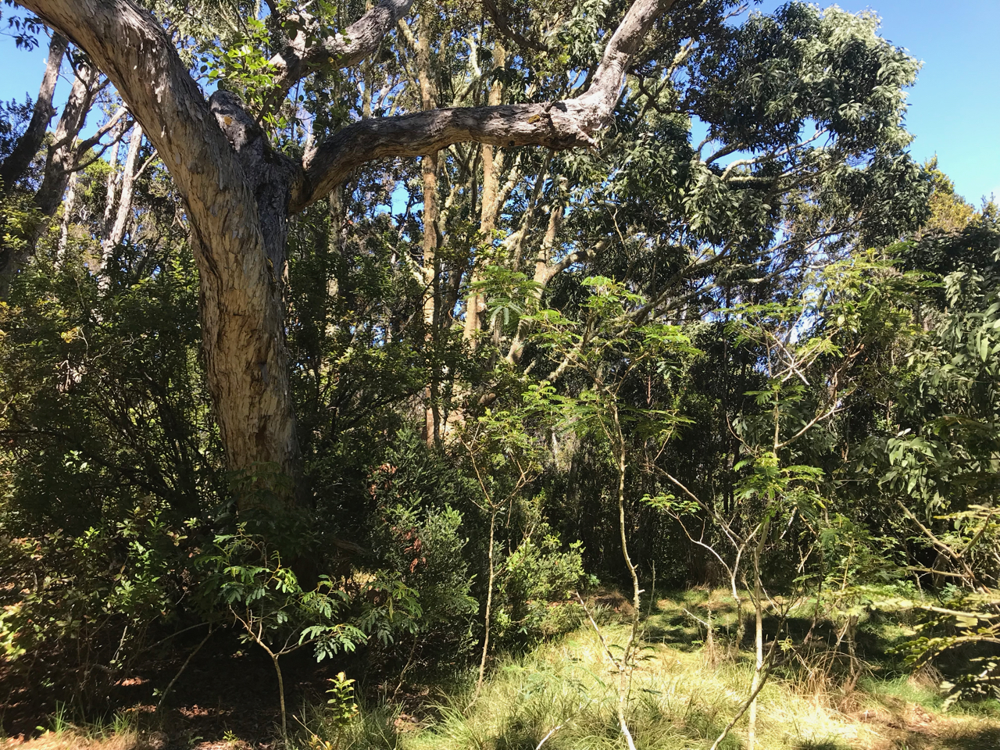

## Project background  
  
Reforestation is an important practice in ameliorating the negative effects of deforestation; yet, reforestaton alone may not reassemble the same ecological communities or functions as primary forests. In particular, plants, which structure forest food webs, rely on intimate associations with symbiotic microbes such as root-inhabiting mycorrhizal fungi. Here, we leverage a large-scale reforestation project on Hawai‘i Island in the Hakalau Forest National Wildlife Refuge (hereafter, 'Hakalau') underway for over three decades to assess whether arbuscular mycorrhizal (AM) fungal communities have concurrently been restored. The reference ecosystem for this restoration project is a remnant montane native Hawaiian forest that provides critical habitat for endangered birds. We sampled soils from 12 plots within remnant and restored forest patches and characterized AM fungal communities using high throughput Illumina MiSeq DNA sequencing.  
  
  

<center>
  
{ width=50%} 
  
  
</center>  
  
  
```{r setup chunk, setup, warning=FALSE, message=FALSE, fig.align='center', include=FALSE}
require("knitr")
knitr::opts_chunk$set(warning=FALSE, message=FALSE, fig.align='center')

### load packages
if (!require("pacman")) install.packages("pacman"); library(pacman) # for rapid install if not in library
if (!require("BiocManager")) install.packages("BiocManager") # for bioinformatic packages
if (!require("devtools")) install.packages("devtools") # for developement tools
if (!require("stringi")) install.packages("stringi")

devtools::install_github('oswaldosantos/ggsn')
devtools::install_github("vqv/ggbiplot")
#devtools::install_github("zdk123/SpiecEasi")


pacman::p_load("ade4", "multtest","phyloseq", "car", "igraph", "cowplot", "SpiecEasi", "rhdf5","ggplot2","colorspace","stringi", "geosphere",  "ggmap", "dplyr", "ggbiplot", "graphics", "gridExtra", "geosphere", "sf", "sp", "gstat", "raster", "spData", "tmap", "leaflet", "mapview", "shiny", "fossil", "RgoogleMaps", "plyr", "ggsn", "vegan", "multcomp", "dplyr", "grid", "scales", "gridExtra", "emmeans", "multcompView", "ggpubr", "Rmisc", "purrr", "RVAideMemoire", "RColorBrewer", "vegan")


### Fast Melt code function for quick taxa summary 

fast_melt = function(physeq,
                     includeSampleVars = character(),
                     omitZero = FALSE){
    require("phyloseq")
    require("data.table")
    # supports "naked" otu_table as `physeq` input.
    otutab = as(otu_table(physeq), "matrix")
    if(!taxa_are_rows(physeq)){otutab <- t(otutab)}
    otudt = data.table(otutab, keep.rownames = TRUE)
    setnames(otudt, "rn", "TaxaID")
    # Enforce character TaxaID key
    otudt[, TaxaIDchar := as.character(TaxaID)]
    otudt[, TaxaID := NULL]
    setnames(otudt, "TaxaIDchar", "TaxaID")
    # Melt count table
    mdt = melt.data.table(otudt, 
                          id.vars = "TaxaID",
                          variable.name = "SampleID",
                          value.name = "count")
    if(omitZero){
        # Omit zeroes and negative numbers
        mdt <- mdt[count > 0]
    }
    # Omit NAs
    mdt <- mdt[!is.na(count)]
    # Calculate relative abundance
    mdt[, RelativeAbundance := count / sum(count), by = SampleID]
    if(!is.null(tax_table(physeq, errorIfNULL = FALSE))){
        # If there is a tax_table, join with it. Otherwise, skip this join.
        taxdt = data.table(as(tax_table(physeq, errorIfNULL = TRUE), "matrix"), keep.rownames = TRUE)
        setnames(taxdt, "rn", "TaxaID")
        # Enforce character TaxaID key
        taxdt[, TaxaIDchar := as.character(TaxaID)]
        taxdt[, TaxaID := NULL]
        setnames(taxdt, "TaxaIDchar", "TaxaID")
        # Join with tax table
        setkey(taxdt, "TaxaID")
        setkey(mdt, "TaxaID")
        mdt <- taxdt[mdt]
    }
    # includeSampleVars = c("DaysSinceExperimentStart", "SampleType")
    # includeSampleVars = character()
    # includeSampleVars = c()
    # includeSampleVars = c("aksjdflkas") 
    wh.svars = which(sample_variables(physeq) %in% includeSampleVars)
    if( length(wh.svars) > 0 ){
        # Only attempt to include sample variables if there is at least one present in object
        sdf = as(sample_data(physeq), "data.frame")[, wh.svars, drop = FALSE]
        sdt = data.table(sdf, keep.rownames = TRUE)
        setnames(sdt, "rn", "SampleID")
        # Join with long table
        setkey(sdt, "SampleID")
        setkey(mdt, "SampleID")
        mdt <- sdt[mdt]
    }
    setkey(mdt, "TaxaID")
    return(mdt)
}

summarize_taxa = function(physeq, Rank, GroupBy = NULL){
    require("phyloseq")
    require("data.table")
    Rank <- Rank[1]
    if(!Rank %in% rank_names(physeq)){
        message("The argument to `Rank` was:\n", Rank,
                "\nBut it was not found among taxonomic ranks:\n",
                paste0(rank_names(physeq), collapse = ", "), "\n",
                "Please check the list shown above and try again.")
    }
    if(!is.null(GroupBy)){
        GroupBy <- GroupBy[1]
        if(!GroupBy %in% sample_variables(physeq)){
            message("The argument to `GroupBy` was:\n", GroupBy,
                    "\nBut it was not found among sample variables:\n",
                    paste0(sample_variables(physeq), collapse = ", "), "\n",
                    "Please check the list shown above and try again.")
        }
    }
    # Start with fast melt
    mdt = fast_melt(physeq)
    if(!is.null(GroupBy)){
        # Add the variable indicated in `GroupBy`, if provided.
        sdt = data.table(SampleID = sample_names(physeq),
                         var1 = get_variable(physeq, GroupBy))
        setnames(sdt, "var1", GroupBy)
        # Join
        setkey(sdt, SampleID)
        setkey(mdt, SampleID)
        mdt <- sdt[mdt]
    }
    # Summarize
    if(!is.null(GroupBy)){
        summarydt = mdt[, list(meanRA = mean(RelativeAbundance),
                               sdRA = sd(RelativeAbundance),
                               minRA = min(RelativeAbundance),
                               maxRA = max(RelativeAbundance)),
                        by = c(Rank, GroupBy)]
    } else {
        Nsamples = nsamples(physeq)
        # No GroupBy argument, can be more precise with the mean, sd, etc.
        summarydt = mdt[, list(meanRA = sum(RelativeAbundance) / Nsamples,
                               sdRA = sd(c(RelativeAbundance, numeric(Nsamples - .N))),
                               minRA = ifelse(test = .N < Nsamples,
                                              yes = 0L, 
                                              no = min(RelativeAbundance)),
                               maxRA = max(RelativeAbundance)),
                        by = c(Rank)]
    }
    return(summarydt)
}

plot_taxa_summary = function(physeq, Rank, GroupBy = NULL){
    require("phyloseq")
    require("data.table")
    require("ggplot2")
    # Get taxa summary table 
    dt1 = summarize_taxa(physeq, Rank = Rank, GroupBy = GroupBy)
    # Set factor appropriately for plotting
    RankCol = which(colnames(dt1) == Rank)
    setorder(dt1, -meanRA)
    dt1[, RankFac := factor(dt1[[Rank]], 
                            levels = rev(dt1[[Rank]]))]
    dt1[, ebarMax := max(c(0, min(meanRA + sdRA))), by = eval(Rank)]
    dt1[, ebarMin := max(c(0, min(meanRA - sdRA))), by = eval(Rank)]
    # Set zeroes to one-tenth the smallest value
    ebarMinFloor = dt1[(ebarMin > 0), min(ebarMin)]
    ebarMinFloor <- ebarMinFloor / 10
    dt1[(ebarMin == 0), ebarMin := ebarMinFloor]
    
    pRank = ggplot(dt1, aes(x = meanRA, y = RankFac)) +
        scale_x_log10() +
        xlab("Mean Relative Abundance") +
        ylab(Rank) +
        theme_bw()
    if(!is.null(GroupBy)){
        # pRank <- pRank + facet_wrap(facets = as.formula(paste("~", GroupBy)))
        pRank <- pRank + geom_point(mapping = aes_string(colour = GroupBy),
                                    size = 5)
    } else {
        # Don't include error bars for faceted version
        pRank <- pRank + geom_errorbarh(aes(xmax = ebarMax,
                                            xmin = ebarMin))
    }
    return(pRank)
}
################
```

## Site maps  
Genearate maps of the Hawaiian archipelago, Hakalau National Forest Reserve, and the two habitat types with sampling plots. There are 12 plots total, 6 in the remnant and 6 in the restored forest within 2 transects.
```{r, site maps, fig.show='hide'}
##########################
####   Hawaii Map     ####
##########################

# Load API key (confidential)
API.key<-read.csv("data/API_Egan.csv")
API.key<-API.key[1,1] # in this csv there is 1 column "API" with the API code below it in cell 1,1.

register_google(key=API.key) # register the API
hi_map<-get_map(location=c(-157,20.5),zoom=7,maptype="satellite",color="color")
hi_map_for_man <- ggmap(hi_map) +
  geom_point(aes(x = -155.320, y = 19.83), pch=23,colour="black",fill="red", size = 2, stroke=0.5) +
  xlab("Longitude") + ylab("Latitude") +
  scale_y_continuous(limits=c(18.8, 22.2))+
  scale_x_continuous(limits=c(-160.2, -154)) +
  theme(axis.text=element_text(colour="black",size=8)) +
  theme(axis.title=element_text(colour="black",size=8)) +
  ggsn::scalebar(x.min=-160.2, x.max=-154, y.min=18.8, y.max=22.2, dist=50, dist_unit="km", transform=TRUE,
                 st.bottom=FALSE, st.size=2, box.fill=c("gray50", "white"), model="WGS84",st.color="white", border.size=0.5)

plot(hi_map_for_man)
ggsave("figures/execute code/Fig S1a. hi_map.pdf", width= 5,height=3, plot=hi_map_for_man)


##########################
####   Forest Plots   ####
##########################
hakalau_map_zoom <-get_map(location=c(-155.320,19.83), zoom=14, maptype="satellite", color="color")

haka_metadata <-read.csv("data/haka_soil_metadata.csv", header=TRUE, row.names=1)

sampling_plots <- ggmap(hakalau_map_zoom) + 
  geom_point(data=haka_metadata,aes(x=lon,y=lat,fill=HabitatType),pch=21, stroke=0.3,colour="white",size=3) +
  scale_fill_manual(values=c("#88A550","#336B87")) +
  theme(legend.position="top", legend.text=element_text(size=6),legend.title = element_text(size=8), legend.key=element_blank()) +
  xlab("Longitude") + ylab("Latitude") +
  scale_y_continuous(limits=c(19.81, 19.84)) +
  scale_x_continuous(limits=c(-155.328, -155.295)) +
  theme(axis.text=element_text(colour="black",size=8)) +
  theme(axis.title=element_text(colour="black",size=8)) +
  ggsn::scalebar(x.min=-155.345, x.max=-155.295, y.min=19.81, y.max=19.84, dist=0.5, dist_unit="km",
                 transform=TRUE, st.bottom=FALSE, st.size=2, box.fill=c("gray50", "white"), 
                 model="WGS84",st.color="white", border.size=0.5) 

plot(sampling_plots)
ggsave("figures/execute code/Fig S1b. Sampling_plots.pdf", width= 6, height=5, plot=sampling_plots)

```

```{r, hawaii and hakalau figure, fig.dim=c(4,6), fig.cap="**Figure S1.** **(A)** Site map showing Hawai‘i Island in the Hawaiian archipelago and **(B)** sample plots in remnant and restored areas of Hakalau forest on the eastern slope of Mauna Kea."}
plot_grid(hi_map_for_man,sampling_plots, labels = "AUTO", ncol = 1, rel_heights = c(1,1.8))
```
  
  
## Ecology  
Intact remnant forest canopies of Hakalau are dominated by A. koa and M. polymorpha, and are vital habitats for critically endangered native Hawaiian bird species. Restoration of pastureland parcels began in 1987 with the planting of native A. koa seedlings (~ 390,000) over a 3-year period, along with other native woody species outplanted in the late-1990s.  

### Plant community heat map  
Surveyed sites and heat maps showing plant community presence/absence across plots used in this study (AK and RO 1-6) and larger surveys across these habitat types in Hakalau. 
```{r, heat map ecology, results='hide', fig.dim=c(6,6), fig.cap="**Figure S2.**  Heat map of plot surveys and plant species presence/absence within remnant (RO) and restored (AK) forest habitats."}

# read in data file
## ***** !NOTE! ***** data here is qualitative for rapid assessments and should not be viewed as standardized, rigourous collection of plant community percent cover data. Code below filters data and changes the % cover to presence absence

veg <- read.csv("data/ecology data/Hakalau_Veg.csv", header = T, stringsAsFactors = F, na.strings = "")

# read in corrected plot names
new_names <- read.csv("data/ecology data/NH_New_Name_WP.csv", header = T, stringsAsFactors = F)

# read in cleaned data file
trimmed_data <- read.csv("data/haka_big_transect_data_trimmed.csv",header = T)
haka_data <- trimmed_data %>% filter(NewHabType %in% c("Koa + Understory", "Remnant ohia forest", "Koa + Grass"))


# Clean up ----------------------------------------------------------------

# Fix column names of vegetation data
 veg[1,]  -> colnames(veg)
 veg[2:nrow(veg),]-> veg

#separate site metadata as EnvData
veg[1:12] %>% apply(2,as.factor) %>% as.data.frame() -> EnvData

# set rownames to site ID (WAYPOINT)
row.names(EnvData) <- EnvData$WAYPOINT

# separate out the count data and percent data from vegetation survey
  veg_column_names <- colnames(veg)
  ## count and precent separate out as odds and even columns
  count_cols <- veg_column_names[grepl("_#", veg_column_names)]
  perc_cols   <- veg_column_names[grepl("_%", veg_column_names)]
  
  ## clean count data
  veg[count_cols]-> count_data
  count_data[is.na(count_data)] <-0
  count_data[count_data=="x"]   <- 1
  count_data <- apply(count_data, 2, as.integer) %>% as.data.frame()
  
  row.names(count_data) <- veg$WAYPOINT
  
  ## clean percent data
  veg[perc_cols] -> perc_data
  perc_data[is.na(perc_data)] <-0
  perc_data <- apply(perc_data, 2, as.integer) %>% as.data.frame()
  
  ## combine count and percent data as presence absence
  pa_data <- Reduce("+", list(count_data,perc_data))
  pa_data[pa_data > 0] <- 1
  
  pa_data <- pa_data[colSums(pa_data)>0]
  colnames(pa_data) <- sub("_#","",colnames(pa_data))
  pa_data$WAYPOINT <- veg$WAYPOINT
  pa_data$FOCAL <- veg$FOCALGROUP
  
  ## subset presence absence data to the same plots as the other graphs (haka data)
  pa_data <- pa_data[pa_data$WAYPOINT %in% haka_data$WAYPOINT,]
  
  # remove a couple of understory species
  pa_data <- pa_data %>% dplyr::select(-PASMOL, -MYOSAN)
  
  # order by Focal group and set levels for Waypoints
  pa_data <- arrange(pa_data, FOCAL)
  pa_data$WAYPOINT <- factor(pa_data$WAYPOINT, levels = pa_data$WAYPOINT)
  
  # run a clustering algorithm to arrange plants nicely
  plant.order <- colnames(pa_data)[c(hclust(dist(t(pa_data[1:14])))$order)]
  
  ## give simple names to each site
  pa_data <- left_join(pa_data, new_names[2:3], by = c("WAYPOINT" = "Name_OLD"))
 
  n_AK <- length(pa_data$FOCAL[pa_data$FOCAL == "AK"])
  n_RO <- length(pa_data$FOCAL[pa_data$FOCAL == "RO"])
  
pa_data <- pa_data %>% mutate(clean_name = ifelse(is.na(Name_New),paste(FOCAL, "Survey", c(1:n_AK,1:n_RO) ), Name_New))

pa_data <- pa_data %>% mutate(bold = ifelse(WAYPOINT %in% new_names$Name_OLD,"bold","plain") )
  

# heatmap of fleshy fruit for all sites -----------------------------------
# all surveyed sites with expanded community
# gather into long format for ggplot
pa_data_long <- pa_data %>% tidyr::gather(key = Host_Abb, value = pres_ab, 1:14)
  
# Add a column for the different fills in the heatmap
pa_data_long <- pa_data_long %>% mutate(PresAbs_levels =
                    ifelse(pa_data_long$FOCAL == "AK" & pa_data_long$pres_ab == 1, "Present (AK)",
                    ifelse(pa_data_long$FOCAL == "RO" & pa_data_long$pres_ab == 1, "Present (RO)", "Absent")))

  # reorder to match clustering algorithm
pa_data_long$Host_Abb <- factor(pa_data_long$Host_Abb, levels = plant.order)

# filter out non-mycorrhizal plants
pa_data_long <- pa_data_long %>% filter(!(Host_Abb %in% c("LEPTAM","VACSPP","FERN","TFERN")))
pa_data_long<-droplevels(pa_data_long)

# generate a vector of bold and plain names for the heatmap
pa_data$clean_name %>% sort() -> y_axis_names
y_axis_names <- gsub(".. .*","plain",y_axis_names)
y_axis_names <- gsub("[RA].*","bold",y_axis_names)

# write out table of plant names and abbreviations
plant_key<- data.frame(plant_species = c("Cheirodendron trigynum",
                             "Coprosma spp.",
                             "Ilex anomala",
                             "Myrsine lessertiana",
                             "Phyllostegia brevidens",
                             "Clermontia lindsayana",
                             "Rubus argutus",
                             "Rubus hawaiensis",
                             "Metrosideros polymorpha",
                             "Acacia koa"
                             ), plant_abbreviation = colnames(pa_data)[c(1:3,5:9,11:12)])

write.csv(plant_key, "output/fleshy_fruited_plant_names.csv")

######################
## Make Plot!

# re-order species alphabetically
pa_data_long$Host_Abb<-factor(pa_data_long$Host_Abb, levels=c("AKOA", "CHETRI", "CLELIN", "COPSPP", "ILEANO", 
                                                              "MP", "MYRLES", "PHYBRE", "RUBARG", "RUBHAW"))


pa_data_long$Host_Abb.names<-pa_data_long$Host_Abb
pa_data_long$Host_Abb.names<- revalue(pa_data_long$Host_Abb.names,
                                      c("AKOA"="Acacia koa", 
                                        "CHETRI"="Cheirodendron trigynum",
                                        "CLELIN"="Clermontia lindsayana",
                                        "COPSPP"="Coprosma spp.",
                                        "ILEANO"="Ilex anomala  ",
                                        "MP"="Metrosideros polymorpha ",
                                        "MYRLES"="Myrsine lessertiana ",
                                        "PHYBRE"="Phyllostegia brevidens ",
                                        "RUBARG"="Rubus argutus",
                                        "RUBHAW"="Rubus hawaiensis"))


pa_data_long$clean_name<-as.factor(pa_data_long$clean_name)

#reorder
pa_data_long$clean_name<-factor(pa_data_long$clean_name, 
      levels=c("AK1", "AK2", "AK3", "AK4","AK5", "AK6", 
               "AK Survey 1", "AK Survey 2", "AK Survey 3", "AK Survey 4", "AK Survey 5",  
               "AK Survey 6", "AK Survey 7", "AK Survey 8", "AK Survey 9", "AK Survey 10",
               "AK Survey 11", "AK Survey 12", "AK Survey 14", "AK Survey 15",
               "AK Survey 16", "AK Survey 17", "AK Survey 18", "AK Survey 19", "AK Survey 20",
               "AK Survey 23", "AK Survey 24", "AK Survey 26", "AK Survey 27", "AK Survey 30", 
               "RO1", "RO2", "RO3",  "RO4", "RO5", "RO6", 
               "RO Survey 1", "RO Survey 5", "RO Survey 6", "RO Survey 8", "RO Survey 9", "RO Survey 10", 
               "RO Survey 12", "RO Survey 13", "RO Survey 14", "RO Survey 15", "RO Survey 16", 
               "RO Survey 17", "RO Survey 18", "RO Survey 20", "RO Survey 21", "RO Survey 22",
               "RO Survey 23", "RO Survey 24", "RO Survey 25"))
        
p1 <- ggplot(pa_data_long, aes(Host_Abb.names, clean_name)) +
        geom_tile(aes(fill = PresAbs_levels)) +
        scale_fill_manual(values = c("white", "gray", "black"))+
        labs(x= "Plant Species", y= "Plot", fill = "Presence In Plot") +
  theme_classic() +
        theme(axis.text.x = element_text(face="italic", angle = 45, hjust = 1),
        axis.text.y = element_text(size=6))
p1
ggsave("figures/execute code/Fig S2. surveyed_heatmap.pdf",width = 6, height = 6)                    
```
  
### Qualitative DBH scores  
DBH scores come from assessing focal trees in a plot and categorically describing the focal tree as small, medium, or large DBH. These data are rapid surveys meant to describe the sizes of trees across many plots. 
```{r, dbh, results='hide', fig.dim=c(5,4), fig.cap="**Figure S3.** Qualitative scores (small [S], medium [M], large [L]) for canopy focal tree diameter at breast height (dbh) in remnant and restored plots in Hakalau forest. "}
# Qualitative DBH % ----------------------------------------------------------

dbh_data <- haka_data %>% group_by(FOCALGROUP, DBH) %>% dplyr::summarise(count= n())
colnames(dbh_data)[1] <- "Focal.Group"
dbh_data$DBH<-factor(dbh_data$DBH, levels=c("S", "M", "L"))
dbh_data$Focal.Group<-factor(dbh_data$Focal.Group, levels=c("RO", "AK"))

p2 <-ggplot(dbh_data, aes(fill= Focal.Group, x = DBH, y = count)) +
      geom_bar(position = "dodge", stat = "identity", color = "black") +
      scale_fill_manual(values = c("white", "black")) +
      labs(x = "Tree dbh (qualitative score)", y = "Focal Trees Surveyed") + theme_classic()

p2
ggsave(filename = "figures/execute code/Fig S3. Qualitative_dbh.pdf", width = 5, height = 5)
```

## Soil environment  
A subset of soil samples (n=20-28 per plot) were analyzed for organic matter (OM), estimated total nitrogen (N), readily available phosphorus (P) using weak Bray PI values, extractable cations (potassium [K], magnesium [Mg], calcium [Ca], sodium [Na]), hydrogen (H), Sulfate-S (S), pH, and cation exchange capacity (CEC). 

*Soil chemistry parameters for each plot in the remnant and restored forest.*
```{r, soil chemistry, results='hide', fig.show='hide'}

# use soil-ESV data here
otu <- as.matrix(read.csv("data/haka_soil_ESV_table.csv", header = TRUE,row.names = 1))
haka_otu <- t(otu)

# Soil chemistry data
environmental_data <- read.csv("data/haka_chemistry.csv", header=TRUE, row.names=1)
all.equal(rownames(haka_otu), rownames(environmental_data))
rows_to_keep<-rownames(haka_otu)
environmental_data<-environmental_data[rows_to_keep,]
all.equal(rownames(haka_otu), rownames(environmental_data))

colnames(environmental_data)<-c("OM(%)","Total N", "P", "K", "Mg", "Ca", "Na", "S","pH", "H(meq/100g)", 
                                "CEC(meq/100g)", "K+", "Mg+2", "Ca+2", "H+", "Na+")


####################
####################
### summary of soil chemistry to be used in mean +/- SD table and plot level analyses
soil.chem<-environmental_data
colnames(soil.chem)<-c("OM.per","Total.N", "P", "K", "Mg", "Ca", "Na", "S","pH", "H.meq", 
                       "CEC.meq", "K.cat", "Mg.cat", "Ca.cat", "H.cat", "Na.cat")

# add factor levels
soil.chem$sampleID<-as.factor(rownames(soil.chem))
soil.chem$HabitatType <- as.factor(substr(soil.chem$sampleID, 0, 2)) # extract first 2 letters of ID
soil.chem$Plot <- as.factor(substr(soil.chem$sampleID, 0, 3))
soil.chem$Host <- as.factor(substr(soil.chem$sampleID, 4, 5))

# modify factor levels
soil.chem$HabitatType<-as.factor(revalue(soil.chem$HabitatType, c("AK"="Restored Forest", "RO"="Remnant Forest")))

# remove NAs
# don't use 'soil.chem<-na.omit(soil.chem)' because there is one sample with NAs for some not all metrics
soil.chem<-soil.chem[!is.na(soil.chem$P),]

# remove dupicate rows where no additional analyses were run
# these duplicate rows represent "sampling intensity" under the same plant (DNA), but not soil chem reps 
soil.chem.dup.rem<-soil.chem %>% 
  distinct(OM.per, Total.N, P, K, Mg, Ca, Na, S, pH, .keep_all = TRUE)

soil.chem.dup.rem<-soil.chem.dup.rem[, c(18:20, 17, 1:16)]

# write csv
write.csv(soil.chem.dup.rem, "output/soil.chem.dup.rem.csv")

#################################
############### Sample size
# sample size for Plot (13-25)
## table SD
chem.n.plot <- soil.chem.dup.rem %>% 
  group_by(Plot) %>%
  dplyr::summarize(n =n())

# sample size for Habitats (99 RO, 128 AK)
## table SD
chem.n.habitat <- soil.chem.dup.rem %>% 
  group_by(HabitatType) %>%
  dplyr::summarize(n =n())


#################################
# diagnostic plots for soil chemistry
for(i in c(5:20)){
  Y<-soil.chem.dup.rem[,i]
  full<-lm(Y~HabitatType, data=soil.chem.dup.rem, na.action=na.exclude)
  R <- resid(full) #save glm residuals
  op<-par(mfrow = c(2,2), mar=c(5,4,1,2), pty="sq")
  plot(full, add.smooth = FALSE, which=1)
  QQ <- qqnorm(R, main = colnames(soil.chem.dup.rem)[i]) 
  QQline <- qqline(R)
  hist(R, xlab="Residuals", main = colnames(soil.chem.dup.rem)[i])
  plot(soil.chem.dup.rem$HabitatType, R, xlab=colnames(soil.chem.dup.rem)[i], ylab="Residuals")
}


#### Box plots for soil chem parameters.
chem<-soil.chem.dup.rem[,c(1:2,5:20)]
plot_list = list()
for(i in c(3:18)){
  p <-ggplot(chem, aes_string(y=chem[,i], x=chem[,2], group=chem[,2])) +
    ylab(colnames(chem)[i]) +
    xlab("Plot") +
    theme_bw() +
    theme(axis.text.x=element_text(size = 4)) +
    geom_boxplot(col="black", aes(fill=HabitatType), alpha=0.8 , lwd=0.5) + 
    scale_color_manual(name= "Habitat Type", values=c("#88A550", "#336B87")) +
    scale_fill_manual(name= "Habitat Type", values=c("#88A550", "#336B87")) +
    scale_x_discrete(limits=c("RO1", "RO2", "RO3", "RO4", "RO5", "RO6",
                              "AK1", "AK2", "AK3", "AK4", "AK5", "AK6"))
  plot_list[[i]] = p
  print(p)
}

# arrange list plots
soil.chem.plot1<-cowplot::plot_grid(plotlist = plot_list[[2]], plot_list[[3]], plot_list[[4]], plot_list[[5]], plot_list[[6]], plot_list[[7]], plot_list[[8]], plot_list[[9]], plot_list[[10]], plot_list[[11]])

soil.chem.plot2<-cowplot::plot_grid(plotlist= plot_list[[2]], plot_list[[12]], plot_list[[13]], plot_list[[14]], plot_list[[15]], plot_list[[16]], plot_list[[17]], plot_list[[18]])
    
pdf(file="output/soil.chem.plots.pdf", height=8, width=12)
soil.chem.plot1
soil.chem.plot2
dev.off()        


##########################
## data for Table S5
#   means by habitats
soilchem_habitat <- soil.chem.dup.rem[,c(-2:-4)] %>% # just habitat
  group_by(HabitatType) %>%
  dplyr::summarise_each(funs(mean(., na.rm=T), n = sum(!is.na(.)), se = sd(., na.rm=T)/sqrt(sum(!is.na(.)))))

#export
write.csv(soilchem_habitat, "output/soil.chem.habitat.csv")
```

*Statistics*: Tests for differences in soil chem parameters using Welch t-test with unequal variance and generate a summary table of all stats.
```{r, soil chem tests}
##########################
#  means by plots
soilchem_plot <- soil.chem.dup.rem[,c(-1,-3,-4)] %>% # just Plot
  group_by(Plot) %>%
  dplyr::summarise_each(funs(mean(., na.rm=T), n = sum(!is.na(.)), se = sd(., na.rm=T)/sqrt(sum(!is.na(.)))))

soilchem_plot<-as.data.frame(soilchem_plot)
soilchem_plot$HabitatType<-as.factor(rep(c("Restored Forest", "Remnant Forest"),each=6))

################################
### t tests for forest soil chem
################################
# dataframe = 'soilchem_plot' = averages at plot level

# OM -- p-value = 0.0003921
OM<-t.test(subset(soilchem_plot, HabitatType == "Remnant Forest")$OM.per_mean,
       subset(soilchem_plot, HabitatType == "Restored Forest")$OM.per_mean,
       paired=FALSE, var.equal=FALSE)

# Total.N -- p-value = 0.0003909
TN<-t.test(subset(soilchem_plot, HabitatType == "Remnant Forest")$Total.N_mean,
       subset(soilchem_plot, HabitatType == "Restored Forest")$Total.N_mean,
       paired=FALSE, var.equal=FALSE)

# P -- p-value = 0.5392
P<-t.test(subset(soilchem_plot, HabitatType == "Remnant Forest")$P_mean,
       subset(soilchem_plot, HabitatType == "Restored Forest")$P_mean,
       paired=FALSE, var.equal=FALSE)

# K -- p-value = 0.03977
K<-t.test(subset(soilchem_plot, HabitatType == "Remnant Forest")$K_mean,
       subset(soilchem_plot, HabitatType == "Restored Forest")$K_mean,
       paired=FALSE, var.equal=FALSE)

# Mg -- p-value = 0.7262
Mg<-t.test(subset(soilchem_plot, HabitatType == "Remnant Forest")$Mg_mean,
       subset(soilchem_plot, HabitatType == "Restored Forest")$Mg_mean,
       paired=FALSE, var.equal=FALSE)

# Ca -- p-value = 0.6473
Ca<-t.test(subset(soilchem_plot, HabitatType == "Remnant Forest")$Ca_mean,
       subset(soilchem_plot, HabitatType == "Restored Forest")$Ca_mean,
       paired=FALSE, var.equal=FALSE)

# Na -- p-value = 0.4954
Na<-t.test(subset(soilchem_plot, HabitatType == "Remnant Forest")$Na_mean,
       subset(soilchem_plot, HabitatType == "Restored Forest")$Na_mean,
       paired=FALSE, var.equal=FALSE)

# S -- p-value = 1.986e-06
S<-t.test(subset(soilchem_plot, HabitatType == "Remnant Forest")$S_mean,
       subset(soilchem_plot, HabitatType == "Restored Forest")$S_mean,
       paired=FALSE, var.equal=FALSE)

# pH -- p-value = 0.0001515
pH<-t.test(subset(soilchem_plot, HabitatType == "Remnant Forest")$pH_mean,
       subset(soilchem_plot, HabitatType == "Restored Forest")$pH_mean,
       paired=FALSE, var.equal=FALSE)

# H.meq -- p-value = 0.02044
H.meq<-t.test(subset(soilchem_plot, HabitatType == "Remnant Forest")$H.meq_mean,
       subset(soilchem_plot, HabitatType == "Restored Forest")$H.meq_mean,
       paired=FALSE, var.equal=FALSE)

# CEC.meq -- p-value = 0.09223
CEC.meq<-t.test(subset(soilchem_plot, HabitatType == "Remnant Forest")$CEC.meq_mean,
       subset(soilchem_plot, HabitatType == "Restored Forest")$CEC.meq_mean,
       paired=FALSE, var.equal=FALSE)

# K.cat -- p-value = 0.03011
K.cat<-t.test(subset(soilchem_plot, HabitatType == "Remnant Forest")$K.cat_mean,
       subset(soilchem_plot, HabitatType == "Restored Forest")$K.cat_mean,
       paired=FALSE, var.equal=FALSE)

# Mg.cat -- p-value = 0.002985
Mg.cat<-t.test(subset(soilchem_plot, HabitatType == "Remnant Forest")$Mg.cat_mean,
       subset(soilchem_plot, HabitatType == "Restored Forest")$Mg.cat_mean,
       paired=FALSE, var.equal=FALSE)

# Ca.cat -- p-value = 0.003329
Ca.cat<-t.test(subset(soilchem_plot, HabitatType == "Remnant Forest")$Ca.cat_mean,
       subset(soilchem_plot, HabitatType == "Restored Forest")$Ca.cat_mean,
       paired=FALSE, var.equal=FALSE)

# H.cat -- p-value = 0.0001391
H.cat<-t.test(subset(soilchem_plot, HabitatType == "Remnant Forest")$H.cat_mean,
       subset(soilchem_plot, HabitatType == "Restored Forest")$H.cat_mean,
       paired=FALSE, var.equal=FALSE)

# Na.cat -- p-value = 0.03775
Na.cat<-t.test(subset(soilchem_plot, HabitatType == "Remnant Forest")$Na.cat_mean,
       subset(soilchem_plot, HabitatType == "Restored Forest")$Na.cat_mean,
       paired=FALSE, var.equal=FALSE)

# soil chem test df
soil.chem.stat<-as.data.frame(rbind(
  OM[1], TN[1],P[1],K[1], Mg[1], Ca[1], Na[1], S[1], pH[1], H.meq[1], CEC.meq[1], K.cat[1],
  Mg.cat[1], Ca.cat[1], H.cat[1], Na.cat[1]))

soil.chem.p<-as.data.frame(rbind(
  OM[3], TN[3],P[3],K[3], Mg[3], Ca[3], Na[3], S[3], pH[3], H.meq[3], CEC.meq[3], K.cat[3],
  Mg.cat[3], Ca.cat[3], H.cat[3], Na.cat[3]))

#combine
soil.chem.table<-cbind(soil.chem.stat, soil.chem.p)

# add labels
soil.chem.table$Parameter<-as.factor(c("OM", "TN","P","K", "Mg", "Ca", "Na", "S", "pH", "H.meq", 
                                       "CEC.meq", "K.cat", "Mg.cat", "Ca.cat", "H.cat", "Na.cat"))

#rearrange
soil.chem.table<-soil.chem.table[,c(3,1,2)]

#summary of effects
soil.chem.table
```

```{r, sample distance matrix, include=FALSE, results='hide'}
#Distance matrix for each sample, later used in Mantel tests*
  
##############################################################
#### Calculate lat and lon of each sample using geosphere ####
##############################################################

## GPS coordinates were only taken for focal trees (denoted by bearing = 0, and distance = 0 in metadata). 
## Need to calculate lat and lon for all samples to do spatial/metacommunity analysis
p <- as.matrix(cbind(haka_metadata$lon,haka_metadata$lat))
new_lat_lon <- as.data.frame(destPoint(p,haka_metadata$Bearing,haka_metadata$Distance))
colnames(new_lat_lon) <- c("Longitude","Latitude")
rownames(new_lat_lon) <- rownames(haka_metadata)
haka_meta <- cbind(haka_metadata,new_lat_lon)

write.csv(haka_meta, "output/haka_meta_dist.csv")

## PLOT MEAN GPS lat-long
lats<-aggregate(lat~HabitatType+Plot, data=haka_meta, FUN=mean)
longs<-aggregate(lon~HabitatType+Plot, data=haka_meta, FUN=mean)
meta_dist<-cbind(lats, longs[3])
write.csv(meta_dist, "output/meta_dist.csv")


## df to calculate geographic distances between SAMPLES
library(fossil)
haka_gps <- cbind(new_lat_lon)
geog_dists_km<-earth.dist(haka_gps[,1:2],dist=TRUE)
geog_dists_m <- (geog_dists_km * 1000)
geog_dists_m <- as.matrix(geog_dists_m)
rownames(geog_dists_m) <- rownames(haka_meta)
colnames(geog_dists_m)<- t(rownames(haka_meta))

write.csv(geog_dists_m,file="output/haka_dists.csv")

haka_dists <- lower.tri(geog_dists_m)


### df to calculate geographic distances between PLOTS
plot.dist<-as.data.frame(haka_gps)
plot.dist$sampleID<-as.factor(rownames(plot.dist))
plot.dist$HabitatType <- substr(plot.dist$sampleID, 0, 2) # extract first 2 letters of ID
plot.dist$Plot <- substr(plot.dist$sampleID, 0, 3)
plot.dist$Host <- substr(plot.dist$sampleID, 4, 5)
plot.dist<-na.omit(plot.dist)
plot.dist$HabitatType<-revalue(plot.dist$HabitatType, c("AK"="Restored Forest", "RO"="Remnant Forest"))

# make a mean lat-long for each plot (pooling all samples in a plot)
plot.m.lat<-aggregate(Latitude~HabitatType+Plot, data=plot.dist, FUN=mean)
plot.m.long<-aggregate(Longitude~HabitatType+Plot, data=plot.dist, FUN=mean)
plot.m.dist<-cbind(plot.m.lat,plot.m.long[3])
write.csv(plot.m.dist,file="output/plot.m.dist.csv")

# Distance to neighboring plot in m
g_dists_km<-earth.dist(plot.m.dist[,3:4],dist=TRUE)
g_dists_m <- as.matrix(g_dists_km*1000)
rownames(g_dists_m) <- c("AK1", "AK2", "AK3", "AK4", "AK5", "AK6", "RO1", "RO2", "RO3", "RO4", "RO5", "RO6")
colnames(g_dists_m)<- t(plot.m.dist[2])

write.csv(g_dists_m,file="output/haka_plot_dists.csv")

```

## Fungal amplicon, ESVs 
Import and pre-process sequence data. Samples were rarefied to 1,500 sequences per individual soil sample after removing all non-Glomeromycotina and sequences present within PCR negative controls. A filtered ESV table, taxonomy identification file, and metadata file were exported from QIIME for analyses.
```{r, sequence data, results='hide'}
#####################
### SEQUENCE DATA ###
#####################

   ###################################
   ####Import files and pre-process###
   ###################################

#Import files generated in QIIME
otu <- as.matrix(read.csv("data/haka_soil_ESV_table.csv", header = TRUE,row.names = 1))
haka_otu <- t(otu)
taxmat <- as.matrix(read.csv("data/haka_soil_taxonomy.csv", header = TRUE,row.names = 1))
sample <- haka_meta
all.equal(rownames(haka_otu), rownames(sample))

#Subset sample file to contain only the same rows as the otu file. Samples have been filtered out in
#QIIME for various reasons (too few reads, no Glom hits etc.)

#First create a vector of otu file rownames and call it "keep"
rows_to_keep<-rownames(haka_otu)

#Then subset sample file using the keep vector
sample<-sample[rows_to_keep,]
all.equal(rownames(haka_otu), rownames(sample))

#Order host names how you want them to appear in figures
sample$Host<- factor(sample$Host,levels=c("Metrosideros polymorpha", "Acacia koa", "Coprosma rhynchocarpa", 
                                          "Myrsine lessertiana", "Cheirodendron trigynum", "Rubus hawaiiensis", "Grass"),
                     labels=c("Metrosideros polymorpha", "Acacia koa", "Coprosma rhynchocarpa", 
                              "Myrsine lessertiana", "Cheirodendron trigynum", "Rubus hawaiiensis", "Grass"))

#Write subsetted sample data as a dataframe
sampledata = sample_data(data.frame(Transect=sample$Transect, HabitatType=sample$HabitatType,
                                    Plot = sample$Plot, lat = sample$lat, lon = sample$lon, 
                                    TreeID= sample$TreeID, Host= sample$Host, 
                                    Bearing= sample$Bearing, Distance= sample$Distance,
                                    xCoords= sample$xCoords, yCoords= sample$yCoords,
                                    SampleType=sample$SampleType,
                                    OM= sample$OM, N= sample$N, P= sample$P.ppm, K= sample$K.ppm,
                                    Mg= sample$Mg.ppm, Ca= sample$Ca.ppm, Na= sample$Na.ppm, S= sample$S.ppm,
                                    pH= sample$pH,
                                    H= sample$H, CEC= sample$CationExchangeCapacity,
                                    K.cation= sample$K.cation, Mg.cation= sample$Mg.cation,
                                    Ca.cation= sample$Ca.cation, H.cation= sample$H.cation,
                                    Na.cation= sample$Na.cation, Longitude= sample$Longitude, 
                                    Latitude= sample$Latitude, stringsAsFactors = FALSE))

row.names(sampledata) <- row.names(sample)


#Change each file to the phyloseq format
OTU = otu_table(haka_otu, taxa_are_rows = FALSE)
physeq = phyloseq(OTU)
TAX = tax_table(taxmat)
haka_soil_physeq = merge_phyloseq(OTU, sampledata, TAX)

#Create new physeq object working at only the species level taxonomy. Collapses all ESVs identified as the same species
haka_VT_soil_physeq <- tax_glom(haka_soil_physeq,"Species")
ESV_rel_abund <- transform_sample_counts(haka_VT_soil_physeq,function(x)x/sum(x))

#Melt phyloseq object to make a dataframe for ggplot and bipartite
ESV_dataframe<-psmelt(ESV_rel_abund)

```
    
*AM fungal species richness*  
AM fungal species richness was calculated as the sum of unique taxa in each soil sample. The effect of habitat type on AM fungal species richness was tested using a Generalized Linear Model (GLM) with a Poisson distribution and a log link function.
```{r, species richness, fig.dim=c(6,4), fig.cap="**Figure S4.** Species richness (alpha diversity) in replicate plot in remnant and restored forests."}

#####################
#### SPECIES RICH ###
#####################

######################################################### 
###Phyloseq###
#Plots and analyses
par(mgp = c(3, 3, 0))

## By habitat type and plot
spec_rich_hab = plot_richness(haka_VT_soil_physeq, x ="Plot", measures="Observed", color="HabitatType") +
  geom_boxplot(col="black", aes(fill=HabitatType), alpha=0.8 , lwd=0.5) + 
  scale_color_manual(name= "Habitat Type", values=c("#88A550", "#336B87")) +
  scale_fill_manual(name= "Habitat Type", values=c("#88A550", "#336B87")) +
  scale_x_discrete(limits=c("RO1", "RO2", "RO3", "RO4", "RO5", "RO6",
                            "AK1", "AK2", "AK3", "AK4", "AK5", "AK6")) +
  scale_y_continuous(breaks=seq(0,45,by=10),limits=c(0,45)) +
  theme(text=element_text(colour="black",size=10)) + 
  ylab("AM fungal richness") + xlab("Habitat Type Plots") +
  theme(axis.text.x=element_text(angle=0,hjust=0.5, vjust=0.5,colour="black",size=8)) +
  theme(axis.text.y=element_text(colour="black",size=8)) +
  theme(panel.border = element_blank(), panel.grid.major = element_blank(),
        panel.grid.minor = element_blank(), axis.line = element_line(colour = "black"),
        panel.background=element_blank(), legend.key=element_blank()) +
  facet_wrap(~SampleType) +
  theme(strip.text.x=element_blank(),strip.background = element_rect(fill="white")) 

plot(spec_rich_hab)
ggsave("figures/execute code/species_richness_by_plot.pdf", plot = spec_rich_hab, width=6,height=5)
```

```{r, stats for richness, results='hide'}

#########################################################
#########################################################
# export richness from soil data and test for differences
soil_rich<-estimate_richness(haka_VT_soil_physeq, measures="Observed")
Host.rich<-pairwise.wilcox.test(soil_rich$Observed, sample_data(haka_VT_soil_physeq)$Host) # not different
Habitat.rich<-pairwise.wilcox.test(soil_rich$Observed, sample_data(haka_VT_soil_physeq)$Habitat) # not different 

# inspect alpha diversity a bit more
soil_rich$sampleID<-as.factor(rownames(soil_rich))
soil_rich$HabitatType <- substr(soil_rich$sampleID, 0, 2) # extract first 2 letters of ID
soil_rich$Plot <- substr(soil_rich$sampleID, 3, 3)
soil_rich$Host <- substr(soil_rich$sampleID, 4, 5)
soil_rich<-na.omit(soil_rich)
soil_rich$HabitatType<-revalue(soil_rich$HabitatType, c("AK"="Restored Forest", "RO"="Remnant Forest"))

# GLM for soil richness
soil_rich.glm <- glm(Observed ~ HabitatType, data=soil_rich, family = poisson(link="log")) 
# par(mfrow = c(2, 2)); plot(soil_rich.glm)

chi.anova<-anova(soil_rich.glm,test="Chisq")
chi.anova

# how does alpha diverstiy differ among Habitat Types? (18 AK vs. 18 RO)
# soil_rich %>% 
  # group_by(HabitatType) %>%
  # dplyr::summarise(mean = mean(Observed))
```

*AM fungal beta diversity*  
Differences in AM fungal community composition between habitats were examined using the Bray-Curtis dissimilarity index, with variation in AM fungal community composition visualized using nonmetric multidimensional scaling (NMDS).  
```{r, beta diversity, results='hide', fig.dim=c(5.5,4.5), fig.cap="**Figure 1A.** AM fungal communities in remnant and restored forest habitat types within Hakalau Forest assessed by non-metric multidimensional scaling (NMDS) ordination plot"}
######################
### Beta Diversity ###
######################

# OTU table is 'haka_otu'


### Phyloseq ###

# Bray Curtis distance matrix
bc_dist = as.matrix((vegdist(haka_otu, "bray")))


# k = 3 dimensions
set.seed(520)
NMDS = metaMDS(bc_dist, k=3, trymax=100)
NMDS1=NMDS$points[,1]
NMDS2=NMDS$points[,2]
NMDS.plot.df=data.frame(NMDS1=NMDS1,NMDS2=NMDS2, Host=sample$Host, 
                     HabitatType=sample$HabitatType,Plot=sample$Plot)

# colors and groups for plots
NMDS.col<- c("#88A550","#336B87") # colors
Habitats<- NMDS.plot.df$HabitatType # habitat levels
groups.hab<-c("#88A550","#336B87")

### make points semitransparent

# green
col2rgb("#88A550"); grn.60<-rgb(136, 165, 80, max=255, alpha=170)

# blue
col2rgb("#336B87"); blu.60<-rgb(51, 107, 135, max=255, alpha=170)
Hab.col<-c(grn.60, blu.60)


##### ##### ##### ##### 
##### NMDS with vectors
##### ##### ##### ##### 
par(mfrow = c(1, 1))

#Fit environmental vectors to ordination to see which environmental variables are correlated with the ordination
# ions wihtout "+" are in ppm
fit.env <- envfit(NMDS, environmental_data, na.rm=TRUE)

### make plot by habitat with vectors for environment
environm_plot<-ordiplot(NMDS, type="n", main=substitute(paste("")), cex.main=1, display="sites", xlim=c(-0.25, 0.8), cex.lab=0.8, cex.axis=0.8)
abline(h = 0, lty = "dotted")
abline(v = 0, lty = "dotted")
points(NMDS, "sites", cex=0.8, pch=16, col=Hab.col[Habitats])
ordiellipse(NMDS, groups=Habitats, kind="sd", draw="polygon", conf=0.95, alpha=30, col=groups.hab, border=groups.hab)
legend("topright", legend=levels(Habitats), cex=1, pch=16, col=groups.hab, pt.cex=1, bty="n")
par.new=T
plot(fit.env, col="black", p.max=0.05, cex=0.9, lwd=1)

dev.copy(pdf, "figures/execute code/environm.NMDS.pdf", height=5.5, width=6)
dev.off() 
```
  
### Beta diversity PERMANOVA  
Run a PERMANOVA testing for differences in AM fungal community beta diversity, and run a test for beatdispersion to ensure effects observed in PERMANOVA are not driven by changes in data distribution.  
*PERMANOVA*
```{r, PERMANOVA}
### Stats ###
# PERMANOVA for NMDS plot
# Bray PERMANOVA 
haka.bc.adonis <- adonis(bc_dist~HabitatType, data=sample, permutations = 9999)
haka.bc.adonis

dd<-vegdist(haka_otu, method="bray")
```
*test for beta dispersion*
```{r, betadisp}
mod<-betadisper(dd, sample$HabitatType) # multivariate dispersions
anova(mod) # not significant
```
  
Take environmental data, run PCA to compress to a single variable (PC1), and examine relationship between PC1 and NMDS1, as a way to examine beta diversity x environment. Output here are testing NMDS relationship against PC1 and habitat using linear models.
```{r, NMDS PC1 figure, message=FALSE, results='hide',fig.show='hold', fig.dim=c(5,4), fig.cap="**Figure 1B.** AM fungal communities in remnant and restored forest habitat types within Hakalau Forest assessed community NMDS and principal component (PC1) values derived by compressing soil chemistry metrics to a single dimension (i.e., PC1-soil chemistry)."}
# Make environmental data as PC1
######## explore environmental data, use PCA to visualize
############### PCA

df.PCA<-environmental_data
df.PCA$sampleID<-as.factor(rownames(df.PCA))
df.PCA$HabitatType <- substr(df.PCA$sampleID, 0, 2) # extract first 2 letters of ID
df.PCA$Plot <- substr(df.PCA$sampleID, 3, 3)
df.PCA$Host <- substr(df.PCA$sampleID, 4, 5)
df.PCA<-na.omit(df.PCA)
df.PCA$HabitatType<-revalue(df.PCA$HabitatType, c("AK"="Restored Forest", "RO"="Remnant Forest"))

# remove columns unnecessary for final analysis, few factors retained
env.PCA<-df.PCA[ , !names(df.PCA) %in% c("sampleID", "Plot", "Host", "HabitatType")]
Hak.env.PCA <- prcomp(env.PCA, center = TRUE, scale= TRUE) # with HabitatType in dataframe
PC.summary<-(summary(Hak.env.PCA))
ev<-Hak.env.PCA$sdev^2
newdat<-Hak.env.PCA$x[,1:4]
# to see eigenvalues:  plot(Hak.env.PCA, type="lines", main="Hak.env.PCA eigenvalues")


############### PCA and NMDS combine
NMDS.otu<-as.data.frame(NMDS1) # NMDS Bray Curtis of OTUs
PCA.env<-as.data.frame(newdat) # the exported data from PCA of environment
PC.NMD<-merge(PCA.env, NMDS.otu, by = "row.names", all = TRUE) # merge dataframes
PC.NMD<-na.omit(PC.NMD) #drop NA columns that don't correspond
colnames(PC.NMD)[1]<-"sampleID"
PC.NMD$HabitatType <- as.factor(substr(PC.NMD$sampleID, 0, 2)) # extract first 2 letters of ID
PC.NMD$HabitatType<-revalue(PC.NMD$HabitatType, c("AK"="Restored Forest", "RO"="Remnant Forest"))
PC.NMD$HabitatType<- factor(PC.NMD$HabitatType, levels=c("Remnant Forest", "Restored Forest"))
PC.NMD$Plot <- as.factor(substr(PC.NMD$sampleID, 3, 3)) # make plot ID
PC.NMD$Host <- as.factor(substr(PC.NMD$sampleID, 4, 5)) # make host ID


##### ##### ##### ##### ##### ##### 
## Tests for relationship pf PC x NMDS

# full model
mod<-lm(NMDS1~PC1*HabitatType, data=PC.NMD)
print(anova(mod), digits=6)

# test RO/Remnant Forest relationship
RO.PCNMD<-PC.NMD[(PC.NMD$HabitatType=="Remnant Forest"),]
mod.RO<-lm(NMDS1~PC1, data=RO.PCNMD); print(anova(mod.RO), digits=6)

# test AK/Restored Forest relationship
AK.PCNMD<-PC.NMD[(PC.NMD$HabitatType=="Restored Forest"),]
mod.AK<-lm(NMDS1~PC1, data=AK.PCNMD); print(anova(mod.AK), digits=6)


### formatting
BW.back<-theme(panel.grid.major = element_blank(), panel.grid.minor = element_blank(),
               panel.background = element_blank(), axis.line = element_line(colour = "black", size=0.2))

### ### ### ### ### ### 
### plot of NMDS-1 x PC1
PC.NMDS.plot<-ggplot(data=PC.NMD, aes(x=PC1, y=NMDS1, color=HabitatType))+
  geom_point(aes(color=HabitatType), alpha=.7) + 
  scale_color_manual(values=Hab.col) + 
  scale_fill_manual(values=Hab.col) +
  xlab("PC1 (soil chemistry, 43% variance explained)") +
  ylab("NMDS1 (AMF Bray-Curtis)") +
  theme_bw()+
  geom_smooth(aes(color=HabitatType, fill=HabitatType), values=Hab.col, method = "lm", alpha = .2, size=0.6) +
  theme(legend.position="top", legend.title = element_blank(),
        axis.text=element_text(size=6),
        axis.title=element_text(size=10)) +
  BW.back

PC.NMDS.plot
dev.copy(pdf, "figures/execute code/PC.NMD.slopes.pdf", height=3, width=6)
dev.off()
```
  
### Mantel distance decay  
Spatial effects on community dissimilarity were tested using distance between samples in meters and the Bray-Curtis dissimilarity ordination of AM fungi community through Mantel tests using Kendall rank correlation coefficient (r) and 9999 permutations using mantel.rtest in the ade4 package (Dray & Dufour, 2007). Mantel tests were performed at the level of the entire study (pooled across habitat types), within habitat types (remnant or restored forests), and within transects with AM fungi communities in restored forest plots subjected to pairwise tests based on proximity to each of three remnant plots in the same transect.   

*Distance decay relationship for at the level of Hakalau, just Restored, just Remnant*
```{r, community distance relationship, message=FALSE, results='hide', fig.dim=c(6.5,4), fig.cap="**Figure S5.** Distance decay of Bray-Curtis dissimilarity in AM fungal communities in (**A**) pooled Hakalau samples, and those from the (**B**) remant and (**C**) restored forests. Blue lines represent significant relationship (p<0.05) from generalized linear models."}
# distance relationship 

########################
### Spatial Analyses ###
########################

 #####################################################
 ## Mantel tests on distance-dissimilarity patterns ##
 ####################################################

#To run a Mantel test, we will need to generate two distance matrices: one containing spatial 
#distances and one containing Bray-Curtis distances between samples at the given points.  In the 
#spatial distance matrix, entries for pairs of points that are close together are lower than for 
#pairs of points that are far apart.  In the BC matrix, entries for pairs of locations 
#with similar outcomes are lower than for pairs of points with dissimilar outcomes.  We do this 
#using the dist function.  The Mantel test function will require objects of this "distance" class.

######################
# entire dataset
 # metadata = 'haka_meta'
hak_otu<-t(otu) # transpose

# merge to have all data together
Study.dat<-merge(haka_meta, hak_otu, by = "row.names", all = TRUE)
Study.dat<-Study.dat[!is.na(Study.dat[35]),]

#separate dataframes
haka_met_mant<-Study.dat[,c(1:34)] # the meta data
hak_otu<-Study.dat[,c(35:1468)] # OTU data

# geographic distance
dists_km<-earth.dist(haka_met_mant[,31:32], dist=TRUE)
dists_m <- (dists_km * 1000)
dists_m <- as.matrix(dists_m)
rownames(dists_m) <- rownames(haka_met_mant)
colnames(dists_m)<- t(rownames(haka_met_mant))

geomat<-dists_m # rename
dists_m<-as.dist(dists_m) # make distance matrix

study_bc_dist = as.dist((vegdist(hak_otu, "bray"))); study_bc_mat<-as.matrix(vegdist(hak_otu, "bray"))

# mantel
study_mantel_test<-mantel.rtest(dists_m, study_bc_dist, nrepet=9999)
study_mantel_test # significant

# new dataframe
Study.df<-data.frame(Distance=geomat[lower.tri(geomat)],
                  BrayCurtis= study_bc_mat[lower.tri(study_bc_mat)])

##############
#Generate plots for all samples combined
Study_dist_plot<- ggplot(Study.df, aes(x=log(Distance+1), y=BrayCurtis)) +
  geom_point(size=0.8,alpha=0.5) +
  geom_smooth(method = "glm", formula = y~x,
              method.args = list(family = gaussian(link = 'log')), lwd=0.7)+ 
  ggtitle("Hakalau")+ 
  scale_y_continuous(name="Bray-Curtis Dissimilarity",breaks=seq(0,1,0.25),limits=c(0,1)) +
  scale_x_continuous(name="log(Distance (m)+1)",breaks=seq(0,8,2),limits=c(0,8)) +
  theme(plot.title = element_text(size=10, hjust = 0.5),
        axis.text.x=element_text(colour="black",size=7), 
        axis.title.x=element_blank(),
        axis.text.y=element_text(colour="black",size=7),
        axis.title=element_text(colour="black",size=9),
        legend.title=element_text(colour="black",size=7,face="bold"),
        legend.text=element_text(colour="black",size=7),
        panel.border = element_blank(), panel.grid.major = element_blank(),
        panel.grid.minor = element_blank(), axis.line = element_line(colour = "black"),
        panel.background=element_blank())

# Study_dist_plot
### use this later to combine with Habitat-Specific Mantels ###

mantel.mod<-lm(BrayCurtis~log(Distance+1), data=Study.df) # linear model fit, 

#####################
#####################  Separated by sites
#####################

# Subset ESV table and metadata into RO and AK habitat types
RO_meta_data <- subset(haka_meta, HabitatType == "Remnant Forest")

##################### RO

## subset the OTU file to give only RO
ROdat<-t(otu[,grep("^RO", colnames(otu))]) # transposed data with only RO
samples.RO<-sample[grep("^RO", rownames(sample)),] # only rows with "RO"
all.equal(rownames(ROdat), rownames(samples.RO)) # rows match

RO<- merge(RO_meta_data, ROdat, by = "row.names", all = TRUE) # all data merged so that row names match
#drop NAs from samples that have no sequence data
RO<-RO[!is.na(RO[35]),]

RO_meta<-RO[,c(1:34)] # the meta data
RO_otu<-RO[,c(35:1468)] # OTU data

#Calculate geographic distances among sample points on subset data
RO_dists_km<-earth.dist(RO_meta[,31:32], dist=TRUE)
RO_dists_m <- (RO_dists_km * 1000)
RO_dists_m <- as.matrix(RO_dists_m)
rownames(RO_dists_m) <- rownames(RO_meta)
colnames(RO_dists_m)<- t(rownames(RO_meta))

RO_geomat<-RO_dists_m
RO_dists_m<-as.dist(RO_dists_m) # make distance matrix


######################## AK 

## subset the OTU file to give only AK
AK_meta_data <-subset(haka_meta, HabitatType== "Restored Forest")

AKdat<-t(otu[,grep("^AK", colnames(otu))]) # transposed data with only AK
samples.AK<-sample[grep("^AK", rownames(sample)),] # only rows with "AK"
all.equal(rownames(AKdat), rownames(samples.AK)) # rows match

AK<- merge(AK_meta_data, AKdat, by = "row.names", all = TRUE) # all data merged so that row names match
#drop NAs from samples that have no sequence data
AK<-AK[!is.na(AK[35]),]

AK_meta<-AK[,c(1:34)] # the meta data
AK_otu<-AK[,c(35:1468)] # OTU data

AK_dists_km<-earth.dist(AK_meta[,31:32],dist=TRUE)
AK_dists_m <- (AK_dists_km * 1000)
AK_dists_m <- as.matrix(AK_dists_m)
rownames(AK_dists_m) <- rownames(AK_meta)
colnames(AK_dists_m)<- t(rownames(AK_meta))

AK_geomat<-AK_dists_m
AK_dists_m<-as.dist(AK_dists_m) # make distance matrix
######################

#Calculate Bray-Curtis distances on subset data
RO_bc_dist = as.dist((vegdist(RO_otu, "bray"))); RO_bc_mat<-as.matrix(vegdist(RO_otu, "bray"))
AK_bc_dist = as.dist((vegdist(AK_otu, "bray"))); AK_bc_mat<-as.matrix(vegdist(AK_otu, "bray"))


#Use distance matrices to test for a correlation. The test consists of calculating the 
#correlation of the entries in the matrices, then permuting the matrices and calculating the 
#same test statistic under each permutation and comparing the original test statistic to the 
#distribution of test statistics from the permutations to generate a p-value. The number of 
#permutations defines the precision with which the p-value can be calculated.  The function 
#to perform the Mantel test is mantel.rtest and the required arguments are the two distance 
#matrices. The number of permutations used are 9999.

###########
RO_mantel_test<-mantel.rtest(RO_dists_m, RO_bc_dist, nrepet=9999)
RO_mantel_test
RO_df<-data.frame(Distance=RO_geomat[lower.tri(RO_geomat)],
                    BrayCurtis= RO_bc_mat[lower.tri(RO_bc_mat)])
                    #Host=RO_meta$Host)
summary(RO_df)


###########
AK_mantel_test <- mantel.rtest(AK_dists_m, AK_bc_dist,nrepet=9999)
AK_mantel_test
AK_df<-data.frame(Distance=AK_geomat[lower.tri(AK_geomat)],
                    BrayCurtis=AK_bc_mat[lower.tri(AK_bc_mat)])
                    #Host=AK_meta$Host)
summary(AK_df)

############

#Export dataframe, remove NAs, bring dataframe back into R
write.csv(RO_df,file="output/RO_dist_dataframe.csv")
write.csv(AK_df,file="output/AK_dist_dataframe.csv")

RO_dist_df<-read.csv("output/RO_dist_dataframe.csv", header=T, as.is=T)
AK_dist_df<-read.csv("output/AK_dist_dataframe.csv",header=T, as.is=T)


##############
#Generate plots for all elevations combined

##### AK plot
AK_dist_plot<- ggplot(AK_df,aes(x=log(Distance+1),y=BrayCurtis)) +
  geom_point(size=1,alpha=0.5) +
  geom_smooth(method = "glm", formula = y~x,
              method.args = list(family = gaussian(link = 'log')), lwd=0.7) +
  ggtitle("Restored Forest")+ 
  scale_y_continuous(name="Bray-Curtis Dissimilarity",breaks=seq(0,1,0.25),limits=c(0,1)) +
  scale_x_continuous(name="log(Distance (m)+1)",breaks=seq(0,8,2),limits=c(0,8)) +
  theme(plot.title = element_text(size=10, hjust = 0.5),
        axis.text.x=element_text(colour="black",size=7),
        axis.text.y=element_blank(),
        axis.title=element_blank(),
        panel.border = element_blank(), panel.grid.major = element_blank(),
        panel.grid.minor = element_blank(), axis.line = element_line(colour = "black"),
        panel.background=element_blank())


mantel.mod.AK<-lm(BrayCurtis~log(Distance+1), data=AK_df) # linear model fit, 
mantel.mod.AK[1] # coefficients

###############
##### AK plot

# not significant, so no line for RO: trend +
RO_dist_plot<- ggplot(RO_df,aes(x=log(Distance+1), y=BrayCurtis)) +
  geom_point(size=1,alpha=0.5) +
  ggtitle("Remnant Forest")+
  scale_y_continuous(name="Bray-Curtis Dissimilarity",breaks=seq(0,1,0.25),limits=c(0,1)) +
  scale_x_continuous(name="log(Distance (m)+1)",breaks=seq(0,8,2),limits=c(0,8)) +
  theme(plot.title = element_text(size=10, hjust = 0.5),
        axis.title.x=element_blank(), 
        axis.text.x=element_text(colour="black",size=7),
        axis.text.y=element_blank(),
        axis.title=element_blank(),
        panel.border = element_blank(), panel.grid.major = element_blank(),
        panel.grid.minor = element_blank(), axis.line = element_line(colour = "black"),
        panel.background=element_blank())


#####################################################################
# combine 3 mantel plots
dist.plots<-plot_grid(Study_dist_plot, RO_dist_plot, AK_dist_plot,
              nrow = 1, rel_widths = c(1, 0.85, 0.85), labels = c("(A)", "(B)", "(C)"), label_size = 10) 
ggdraw(add_sub(dist.plots, "           log(Distance (m)+1)", hjust = 0.5, y=0.8, size=10))

dev.copy(png, "figures/execute code/All.Hak_RO.AK.distdecay.png",  width= 2000, height=1500, res=300)
dev.off()

```
  
*Distance relationship for each restored forest compared to neighboring remnant forests. This is the distance decay by proximity.* 
```{r, mantel proximity, message=FALSE, results='hide', fig.dim=c(5,4), fig.cap="**Figure S6.**  Mantel test statistic (Kendall rank correlation coefficient [r]) for distance decay of Bray-Curtis dissimilarity in arbuscular mycorrhizal (AM) fungal communities of remnant forests relative to restored forests (AK) among transects in Hakalau forest. Correlation values closer to 1 represent greater dissimilarity in AM fungal communities with distance."}
#####################################################################
#####################################################################
## AK-RO proximity Mantels
#####################################################################
#####################################################################

# entire dataset
haka_meta # metadata
hak_otu<-t(otu) # transpose


#separate dataframes
haka_met_mant<-Study.dat[,c(1:32)] # the meta data
hak_otu<-Study.dat[,c(33:1468)] # OTU data

### distance from plots (coded)
plot.dist # all dist
plot.m.dist # mean dist
plot.m.dist$Transect<-c(8,8,8,9,9,9,8,8,8,9,9,9) #add Transect

# set lat-long to mean value for full dataframe


haka_meta$Lat.mean<-ifelse(haka_meta$Plot=="AK1", plot.m.dist[1,3],
                    ifelse(haka_meta$Plot=="AK2", plot.m.dist[2,3],
                    ifelse(haka_meta$Plot=="AK3", plot.m.dist[3,3],
                    ifelse(haka_meta$Plot=="AK4", plot.m.dist[4,3],
                    ifelse(haka_meta$Plot=="AK5", plot.m.dist[5,3],
                    ifelse(haka_meta$Plot=="AK6", plot.m.dist[6,3],
                    ifelse(haka_meta$Plot=="RO1", plot.m.dist[7,3],
                    ifelse(haka_meta$Plot=="RO2", plot.m.dist[8,3],
                    ifelse(haka_meta$Plot=="RO3", plot.m.dist[9,3],
                    ifelse(haka_meta$Plot=="RO4", plot.m.dist[10,3],
                    ifelse(haka_meta$Plot=="RO5", plot.m.dist[11,3],
                              plot.m.dist[12,3])  # last for RO6
                               ))))))))))

haka_meta$Long.mean<-ifelse(haka_meta$Plot=="AK1", plot.m.dist[1,4],
                     ifelse(haka_meta$Plot=="AK2", plot.m.dist[2,4],
                     ifelse(haka_meta$Plot=="AK3", plot.m.dist[3,4],
                     ifelse(haka_meta$Plot=="AK4", plot.m.dist[4,4],
                     ifelse(haka_meta$Plot=="AK5", plot.m.dist[5,4],
                     ifelse(haka_meta$Plot=="AK6", plot.m.dist[6,4],
                     ifelse(haka_meta$Plot=="RO1", plot.m.dist[7,4],
                     ifelse(haka_meta$Plot=="RO2", plot.m.dist[8,4],
                     ifelse(haka_meta$Plot=="RO3", plot.m.dist[9,4],
                     ifelse(haka_meta$Plot=="RO4", plot.m.dist[10,4],
                     ifelse(haka_meta$Plot=="RO5", plot.m.dist[11,4],
                               plot.m.dist[12,4]) # last for RO6
                               ))))))))))


########## separate distance matrix transect
##### Transect 8

haka_met_mant.T8<-haka_meta[(haka_meta$Transect==8),]

########### separate OTUs accordingly
## subset the OTU file to give only T8 data = AK 1-3 and RO 1-3
# transposed data with only Transect 8
T8dat<-t(otu[, grepl("^AK1", colnames(otu)) | 
               grepl("^AK2", colnames(otu)) |
               grepl("^AK3", colnames(otu)) |
               grepl("^RO1", colnames(otu)) | 
               grepl("^RO2", colnames(otu)) |
               grepl("^RO3", colnames(otu))])

# only rows from T8
samples.T8<-sample[grepl("^AK1", rownames(sample)) |
                     grepl("^AK2", rownames(sample)) |
                     grepl("^AK3", rownames(sample)) |
                     grepl("^RO1", rownames(sample)) |
                     grepl("^RO2", rownames(sample)) |
                     grepl("^RO3", rownames(sample)),]

all.equal(rownames(T8dat), rownames(samples.T8)) # rows match
T8.df<- merge(haka_met_mant.T8, T8dat, by = "row.names", all = TRUE) # all data merged so that row names match
T8.df<-na.omit(T8.df) # remove NAs

T8_meta<-T8.df[,c(1:34)] # the meta data
T8_otu<-T8.df[,c(35:1470)] # OTU data

# Distance to neighboring plots
g_dists_km.T8<- earth.dist(T8_meta[,33:34],dist=TRUE)
g_dists_m.T8<- (g_dists_km.T8 * 1000)
g_dists_m.T8 <- as.matrix(g_dists_m.T8)
rownames(g_dists_m.T8) <- rownames(T8_meta)
colnames(g_dists_m.T8)<- t(rownames(T8_meta))

# rename and make distance matrix
geomat.T8<-g_dists_m.T8
g_dists_m.T8<-as.dist(g_dists_m.T8) 


######## Transect 9
haka_met_mant.T9<-haka_meta[(haka_meta$Transect==9),]

######################################################
# how does each RO compare to each AK within a transect
# Use AK close, AK further, AK furthest 
# compare to close/further/furthest RO
# generate Bray-Curtis dissimiliarity
######################################################

# Transect 9 : North 
# plot distance: W --> E (AK4, AK5, AK6, RO4, RO5, RO6)

# Transect 8 : South 
# plot distance: W --> E (AK1, AK2, AK3, RO1, RO2, RO3)


# T8 dat = transposed OTUs
# sample.T8 = samples
# T8.df = dataframe 
# T8_meta = the meta data
# T8_otu = otus

T8dat<-t(otu[, grepl("^AK1", colnames(otu)) | 
               grepl("^AK2", colnames(otu)) |
               grepl("^AK3", colnames(otu)) |
               grepl("^RO1", colnames(otu)) | 
               grepl("^RO2", colnames(otu)) |
               grepl("^RO3", colnames(otu))])

# only rows from T8
samples.T8<-sample[grepl("^AK1", rownames(sample)) |
                     grepl("^AK2", rownames(sample)) |
                     grepl("^AK3", rownames(sample)) |
                     grepl("^RO1", rownames(sample)) |
                     grepl("^RO2", rownames(sample)) |
                     grepl("^RO3", rownames(sample)),]

all.equal(rownames(T8dat), rownames(samples.T8)) # rows match
T8.df<- merge(haka_met_mant.T8, T8dat, by = "row.names", all = TRUE) # all data merged so that row names match
T8.df<-na.omit(T8.df) # remove NAs

T8_meta<-T8.df[,c(1:34)] # the meta data
T8_otu<-T8.df[,c(35:1470)] # OTU data

## T8 single plot dataframes
T8.AK1.df<-T8.df[(T8.df$Plot=="AK1"),]; T8.AK1.meta<- T8.AK1.df[,c(1:34)]; T8.AK1.otu<-T8.AK1.df[,c(35:1470)]
T8.AK2.df<-T8.df[(T8.df$Plot=="AK2"),]; T8.AK2.meta<- T8.AK2.df[,c(1:34)]; T8.AK2.otu<-T8.AK2.df[,c(35:1470)]
T8.AK3.df<-T8.df[(T8.df$Plot=="AK3"),]; T8.AK3.meta<- T8.AK3.df[,c(1:34)]; T8.AK3.otu<-T8.AK3.df[,c(35:1470)]
T8.RO1.df<-T8.df[(T8.df$Plot=="RO1"),]; T8.RO1.meta<- T8.RO1.df[,c(1:34)]; T8.RO1.otu<-T8.RO1.df[,c(35:1470)]
T8.RO2.df<-T8.df[(T8.df$Plot=="RO2"),]; T8.RO2.meta<- T8.RO2.df[,c(1:34)]; T8.RO2.otu<-T8.RO2.df[,c(35:1470)]
T8.RO3.df<-T8.df[(T8.df$Plot=="RO3"),]; T8.RO3.meta<- T8.RO3.df[,c(1:34)]; T8.RO3.otu<-T8.RO3.df[,c(35:1470)]

# combine for comparisons
T8.RO1.AK1.df<-rbind(T8.RO1.df, T8.AK1.df)
T8.RO1.AK1.meta <-rbind(T8.RO1.meta,T8.AK1.meta)
T8.RO1.AK1.otu<-rbind(T8.RO1.otu,T8.AK1.otu)

T8.RO1.AK2.df<-rbind(T8.RO1.df, T8.AK2.df)
T8.RO1.AK2.meta <-rbind(T8.RO1.meta,T8.AK2.meta)
T8.RO1.AK2.otu<-rbind(T8.RO1.otu,T8.AK2.otu)

T8.RO1.AK3.df<-rbind(T8.RO1.df, T8.AK3.df)
T8.RO1.AK3.meta <-rbind(T8.RO1.meta,T8.AK3.meta)
T8.RO1.AK3.otu<-rbind(T8.RO1.otu,T8.AK3.otu)

T8.RO2.AK1.df<-rbind(T8.RO2.df, T8.AK1.df)
T8.RO2.AK1.meta <-rbind(T8.RO2.meta,T8.AK1.meta)
T8.RO2.AK1.otu<-rbind(T8.RO2.otu,T8.AK1.otu)

T8.RO2.AK2.df<-rbind(T8.RO2.df, T8.AK2.df)
T8.RO2.AK2.meta <-rbind(T8.RO2.meta,T8.AK2.meta)
T8.RO2.AK2.otu<-rbind(T8.RO2.otu,T8.AK2.otu)

T8.RO2.AK3.df<-rbind(T8.RO2.df, T8.AK3.df)
T8.RO2.AK3.meta <-rbind(T8.RO2.meta,T8.AK3.meta)
T8.RO2.AK3.otu<-rbind(T8.RO2.otu,T8.AK3.otu)

T8.RO3.AK1.df<-rbind(T8.RO3.df, T8.AK1.df)
T8.RO3.AK1.meta <-rbind(T8.RO3.meta,T8.AK1.meta)
T8.RO3.AK1.otu<-rbind(T8.RO3.otu,T8.AK1.otu)

T8.RO3.AK2.df<-rbind(T8.RO3.df, T8.AK2.df)
T8.RO3.AK2.meta <-rbind(T8.RO3.meta,T8.AK2.meta)
T8.RO3.AK2.otu<-rbind(T8.RO3.otu,T8.AK2.otu)

T8.RO3.AK3.df<-rbind(T8.RO3.df, T8.AK3.df)
T8.RO3.AK3.meta <-rbind(T8.RO3.meta,T8.AK3.meta)
T8.RO3.AK3.otu<-rbind(T8.RO3.otu,T8.AK3.otu)


# Distance to neighboring plots
######### RO1
# RO1 - AK1
g_dists_km.T8.RO1.AK1<- earth.dist(T8.RO1.AK1.meta[,33:34],dist=TRUE)
g_dists_m.T8.RO1.AK1<- (g_dists_km.T8.RO1.AK1 * 1000)
g_dists_m.T8.RO1.AK1 <- as.matrix(g_dists_m.T8.RO1.AK1)
rownames(g_dists_m.T8.RO1.AK1) <- rownames(T8.RO1.AK1.meta)
colnames(g_dists_m.T8.RO1.AK1)<- t(rownames(T8.RO1.AK1.meta))
# rename and make distance matrix
geomat.T8.RO1.AK1<-g_dists_m.T8.RO1.AK1
g_dists_m.T8.RO1.AK1<-as.dist(g_dists_m.T8.RO1.AK1) 


#### RO1 - AK2
g_dists_km.T8.RO1.AK2<- earth.dist(T8.RO1.AK2.meta[,33:34],dist=TRUE)
g_dists_m.T8.RO1.AK2<- (g_dists_km.T8.RO1.AK2 * 1000)
g_dists_m.T8.RO1.AK2 <- as.matrix(g_dists_m.T8.RO1.AK2)
rownames(g_dists_m.T8.RO1.AK2) <- rownames(T8.RO1.AK2.meta)
colnames(g_dists_m.T8.RO1.AK2)<- t(rownames(T8.RO1.AK2.meta))
# rename and make distance matrix
geomat.T8.RO1.AK2<-g_dists_m.T8.RO1.AK2
g_dists_m.T8.RO1.AK2<-as.dist(g_dists_m.T8.RO1.AK2) 


#### RO1 - AK3
g_dists_km.T8.RO1.AK3<- earth.dist(T8.RO1.AK3.meta[,33:34],dist=TRUE)
g_dists_m.T8.RO1.AK3<- (g_dists_km.T8.RO1.AK3 * 1000)
g_dists_m.T8.RO1.AK3 <- as.matrix(g_dists_m.T8.RO1.AK3)
rownames(g_dists_m.T8.RO1.AK3) <- rownames(T8.RO1.AK3.meta)
colnames(g_dists_m.T8.RO1.AK3)<- t(rownames(T8.RO1.AK3.meta))
# rename and make distance matrix
geomat.T8.RO1.AK3<-g_dists_m.T8.RO1.AK3
g_dists_m.T8.RO1.AK3<-as.dist(g_dists_m.T8.RO1.AK3) 

################ RO2
# RO2 - AK1
g_dists_km.T8.RO2.AK1<- earth.dist(T8.RO2.AK1.meta[,33:34],dist=TRUE)
g_dists_m.T8.RO2.AK1<- (g_dists_km.T8.RO2.AK1 * 1000)
g_dists_m.T8.RO2.AK1 <- as.matrix(g_dists_m.T8.RO2.AK1)
rownames(g_dists_m.T8.RO2.AK1) <- rownames(T8.RO2.AK1.meta)
colnames(g_dists_m.T8.RO2.AK1)<- t(rownames(T8.RO2.AK1.meta))
# rename and make distance matrix
geomat.T8.RO2.AK1<-g_dists_m.T8.RO2.AK1
g_dists_m.T8.RO2.AK1<-as.dist(g_dists_m.T8.RO2.AK1) 


#### RO2 - AK2
g_dists_km.T8.RO2.AK2<- earth.dist(T8.RO2.AK2.meta[,33:34],dist=TRUE)
g_dists_m.T8.RO2.AK2<- (g_dists_km.T8.RO2.AK2 * 1000)
g_dists_m.T8.RO2.AK2 <- as.matrix(g_dists_m.T8.RO2.AK2)
rownames(g_dists_m.T8.RO2.AK2) <- rownames(T8.RO2.AK2.meta)
colnames(g_dists_m.T8.RO2.AK2)<- t(rownames(T8.RO2.AK2.meta))
# rename and make distance matrix
geomat.T8.RO2.AK2<-g_dists_m.T8.RO2.AK2
g_dists_m.T8.RO2.AK2<-as.dist(g_dists_m.T8.RO2.AK2) 


#### RO2 - AK3
g_dists_km.T8.RO2.AK3<- earth.dist(T8.RO2.AK3.meta[,33:34],dist=TRUE)
g_dists_m.T8.RO2.AK3<- (g_dists_km.T8.RO2.AK3 * 1000)
g_dists_m.T8.RO2.AK3 <- as.matrix(g_dists_m.T8.RO2.AK3)
rownames(g_dists_m.T8.RO2.AK3) <- rownames(T8.RO2.AK3.meta)
colnames(g_dists_m.T8.RO2.AK3)<- t(rownames(T8.RO2.AK3.meta))
# rename and make distance matrix
geomat.T8.RO2.AK3<-g_dists_m.T8.RO2.AK3
g_dists_m.T8.RO2.AK3<-as.dist(g_dists_m.T8.RO2.AK3) 

################ RO3
# RO3 - AK1
g_dists_km.T8.RO3.AK1<- earth.dist(T8.RO3.AK1.meta[,33:34],dist=TRUE)
g_dists_m.T8.RO3.AK1<- (g_dists_km.T8.RO3.AK1 * 1000)
g_dists_m.T8.RO3.AK1 <- as.matrix(g_dists_m.T8.RO3.AK1)
rownames(g_dists_m.T8.RO3.AK1) <- rownames(T8.RO3.AK1.meta)
colnames(g_dists_m.T8.RO3.AK1)<- t(rownames(T8.RO3.AK1.meta))
# rename and make distance matrix
geomat.T8.RO3.AK1<-g_dists_m.T8.RO3.AK1
g_dists_m.T8.RO3.AK1<-as.dist(g_dists_m.T8.RO3.AK1) 


#### RO3 - AK2
g_dists_km.T8.RO3.AK2<- earth.dist(T8.RO3.AK2.meta[,33:34],dist=TRUE)
g_dists_m.T8.RO3.AK2<- (g_dists_km.T8.RO3.AK2 * 1000)
g_dists_m.T8.RO3.AK2 <- as.matrix(g_dists_m.T8.RO3.AK2)
rownames(g_dists_m.T8.RO3.AK2) <- rownames(T8.RO3.AK2.meta)
colnames(g_dists_m.T8.RO3.AK2)<- t(rownames(T8.RO3.AK2.meta))
# rename and make distance matrix
geomat.T8.RO3.AK2<-g_dists_m.T8.RO3.AK2
g_dists_m.T8.RO3.AK2<-as.dist(g_dists_m.T8.RO3.AK2) 


#### RO3 - AK3
g_dists_km.T8.RO3.AK3<- earth.dist(T8.RO3.AK3.meta[,33:34],dist=TRUE)
g_dists_m.T8.RO3.AK3<- (g_dists_km.T8.RO3.AK3 * 1000)
g_dists_m.T8.RO3.AK3 <- as.matrix(g_dists_m.T8.RO3.AK3)
rownames(g_dists_m.T8.RO3.AK3) <- rownames(T8.RO3.AK3.meta)
colnames(g_dists_m.T8.RO3.AK3)<- t(rownames(T8.RO3.AK3.meta))
# rename and make distance matrix
geomat.T8.RO3.AK3<-g_dists_m.T8.RO3.AK3
g_dists_m.T8.RO3.AK3<-as.dist(g_dists_m.T8.RO3.AK3) 


############################
#Calculate Bray-Curtis distances on T8 between RO to AK

#### RO1
T8_RO1.AK1.bc_dist = as.dist((vegdist(T8.RO1.AK1.otu, "bray")))
T8_RO1.AK1.bc_mat<-as.matrix(vegdist(T8.RO1.AK1.otu, "bray"))

T8_RO1.AK2.bc_dist = as.dist((vegdist(T8.RO1.AK2.otu, "bray")))
T8_RO1.AK2.bc_mat<-as.matrix(vegdist(T8.RO1.AK2.otu, "bray"))

T8_RO1.AK3.bc_dist = as.dist((vegdist(T8.RO1.AK3.otu, "bray")))
T8_RO1.AK3.bc_mat<-as.matrix(vegdist(T8.RO1.AK3.otu, "bray"))

#### RO2
T8_RO2.AK1.bc_dist = as.dist((vegdist(T8.RO2.AK1.otu, "bray")))
T8_RO2.AK1.bc_mat<-as.matrix(vegdist(T8.RO2.AK1.otu, "bray"))

T8_RO2.AK2.bc_dist = as.dist((vegdist(T8.RO2.AK2.otu, "bray")))
T8_RO2.AK2.bc_mat<-as.matrix(vegdist(T8.RO2.AK2.otu, "bray"))

T8_RO2.AK3.bc_dist = as.dist((vegdist(T8.RO2.AK3.otu, "bray")))
T8_RO2.AK3.bc_mat<-as.matrix(vegdist(T8.RO2.AK3.otu, "bray"))

#### RO3
T8_RO3.AK1.bc_dist = as.dist((vegdist(T8.RO3.AK1.otu, "bray")))
T8_RO3.AK1.bc_mat<-as.matrix(vegdist(T8.RO3.AK1.otu, "bray"))

T8_RO3.AK2.bc_dist = as.dist((vegdist(T8.RO3.AK2.otu, "bray")))
T8_RO3.AK2.bc_mat<-as.matrix(vegdist(T8.RO3.AK2.otu, "bray"))

T8_RO3.AK3.bc_dist = as.dist((vegdist(T8.RO3.AK3.otu, "bray")))
T8_RO3.AK3.bc_mat<-as.matrix(vegdist(T8.RO3.AK3.otu, "bray"))

#################
# Mantel Test
T8.RO1.AK1_mantel_test<-mantel.rtest(g_dists_m.T8.RO1.AK1, T8_RO1.AK1.bc_dist, nrepet=9999)
T8.RO1.AK1_mantel_test

T8.RO1.AK2_mantel_test<-mantel.rtest(g_dists_m.T8.RO1.AK2, T8_RO1.AK2.bc_dist, nrepet=9999)
T8.RO1.AK2_mantel_test

T8.RO1.AK3_mantel_test<-mantel.rtest(g_dists_m.T8.RO1.AK3, T8_RO1.AK3.bc_dist, nrepet=9999)
T8.RO1.AK3_mantel_test


### RO2
T8.RO2.AK1_mantel_test<-mantel.rtest(g_dists_m.T8.RO2.AK1, T8_RO2.AK1.bc_dist, nrepet=9999)
T8.RO2.AK1_mantel_test

T8.RO2.AK2_mantel_test<-mantel.rtest(g_dists_m.T8.RO2.AK2, T8_RO2.AK2.bc_dist, nrepet=9999)
T8.RO2.AK2_mantel_test

T8.RO2.AK3_mantel_test<-mantel.rtest(g_dists_m.T8.RO2.AK3, T8_RO2.AK3.bc_dist, nrepet=9999)
T8.RO2.AK3_mantel_test

### RO3
T8.RO3.AK1_mantel_test<-mantel.rtest(g_dists_m.T8.RO3.AK1, T8_RO3.AK1.bc_dist, nrepet=9999)
T8.RO3.AK1_mantel_test

T8.RO3.AK2_mantel_test<-mantel.rtest(g_dists_m.T8.RO3.AK2, T8_RO3.AK2.bc_dist, nrepet=9999)
T8.RO3.AK2_mantel_test

T8.RO3.AK3_mantel_test<-mantel.rtest(g_dists_m.T8.RO3.AK3, T8_RO3.AK3.bc_dist, nrepet=9999)
T8.RO3.AK3_mantel_test

###############
# make df
### RO1
T8_RO1.AK1.bcdf<-data.frame(Distance=geomat.T8.RO1.AK1[lower.tri(geomat.T8.RO1.AK1)],
                            BrayCurtis= T8_RO1.AK1.bc_mat[lower.tri(T8_RO1.AK1.bc_mat)])

T8_RO1.AK2.bcdf<-data.frame(Distance=geomat.T8.RO1.AK2[lower.tri(geomat.T8.RO1.AK2)],
                            BrayCurtis= T8_RO1.AK2.bc_mat[lower.tri(T8_RO1.AK2.bc_mat)])

T8_RO1.AK3.bcdf<-data.frame(Distance=geomat.T8.RO1.AK3[lower.tri(geomat.T8.RO1.AK3)],
                            BrayCurtis= T8_RO1.AK3.bc_mat[lower.tri(T8_RO1.AK3.bc_mat)])

### RO2
T8_RO2.AK1.bcdf<-data.frame(Distance=geomat.T8.RO2.AK1[lower.tri(geomat.T8.RO2.AK1)],
                            BrayCurtis= T8_RO2.AK1.bc_mat[lower.tri(T8_RO2.AK1.bc_mat)])

T8_RO2.AK2.bcdf<-data.frame(Distance=geomat.T8.RO2.AK2[lower.tri(geomat.T8.RO2.AK2)],
                            BrayCurtis= T8_RO2.AK2.bc_mat[lower.tri(T8_RO2.AK2.bc_mat)])

T8_RO2.AK3.bcdf<-data.frame(Distance=geomat.T8.RO2.AK3[lower.tri(geomat.T8.RO2.AK3)],
                            BrayCurtis= T8_RO2.AK3.bc_mat[lower.tri(T8_RO2.AK3.bc_mat)])

### RO3
T8_RO3.AK1.bcdf<-data.frame(Distance=geomat.T8.RO3.AK1[lower.tri(geomat.T8.RO3.AK1)],
                            BrayCurtis= T8_RO3.AK1.bc_mat[lower.tri(T8_RO3.AK1.bc_mat)])

T8_RO3.AK2.bcdf<-data.frame(Distance=geomat.T8.RO3.AK2[lower.tri(geomat.T8.RO3.AK2)],
                            BrayCurtis= T8_RO3.AK2.bc_mat[lower.tri(T8_RO3.AK2.bc_mat)])

T8_RO3.AK3.bcdf<-data.frame(Distance=geomat.T8.RO3.AK3[lower.tri(geomat.T8.RO3.AK3)],
                            BrayCurtis= T8_RO3.AK3.bc_mat[lower.tri(T8_RO3.AK3.bc_mat)])

# mantel test df
prox.mantT8<-as.data.frame(rbind(T8.RO1.AK1_mantel_test[1], T8.RO1.AK2_mantel_test[1],T8.RO1.AK3_mantel_test[1],
                                 T8.RO2.AK1_mantel_test[1], T8.RO2.AK2_mantel_test[1], T8.RO2.AK3_mantel_test[1],
                                 T8.RO3.AK1_mantel_test[1], T8.RO3.AK2_mantel_test[1], T8.RO3.AK3_mantel_test[1]))
prox.mantT8$obs<-as.numeric(prox.mantT8$obs)

prox.mantT8$pvalue<-as.numeric(rbind(
  T8.RO1.AK1_mantel_test[5], T8.RO1.AK2_mantel_test[5], T8.RO1.AK3_mantel_test[5],
  T8.RO2.AK1_mantel_test[5], T8.RO2.AK2_mantel_test[5], T8.RO2.AK3_mantel_test[5],
  T8.RO3.AK1_mantel_test[5], T8.RO3.AK2_mantel_test[5], T8.RO3.AK3_mantel_test[5]))
prox.mantT8$comparison<-as.factor(c("T8.RO1.AK1", "T8.RO1.AK2", "T8.RO1.AK3",
                                    "T8.RO2.AK1", "T8.RO2.AK2", "T8.RO2.AK3",
                                    "T8.RO3.AK1", "T8.RO3.AK2", "T8.RO3.AK3"))
prox.mantT8$AK.group<-as.factor(c("AK far", "AK mid", "AK near", 
                                  "AK far", "AK mid", "AK near", 
                                  "AK far", "AK mid", "AK near"))
prox.mantT8$Transect<-"8"

################# 
################# 
################# Transect 9
# Transect 9 : North 
# plot distance: W --> E (AK4, AK5, AK6, RO4, RO5, RO6)


# T9 dat = transposed OTUs
# sample.T9 = samples
# T9.df = dataframe 
# T9_meta = the meta data
# T9_otu = otus


T9dat<-t(otu[, grepl("^AK4", colnames(otu)) | 
               grepl("^AK5", colnames(otu)) |
               grepl("^AK6", colnames(otu)) |
               grepl("^RO4", colnames(otu)) | 
               grepl("^RO5", colnames(otu)) |
               grepl("^RO6", colnames(otu))])

# only rows from T9
samples.T9<-sample[grepl("^AK4", rownames(sample)) |
                     grepl("^AK5", rownames(sample)) |
                     grepl("^AK6", rownames(sample)) |
                     grepl("^RO4", rownames(sample)) |
                     grepl("^RO5", rownames(sample)) |
                     grepl("^RO6", rownames(sample)),]

all.equal(rownames(T9dat), rownames(samples.T9)) # rows match
T9.df<- merge(haka_met_mant.T9, T9dat, by = "row.names", all = TRUE) # all data merged so that row names match
T9.df<-na.omit(T9.df) # remove NAs

T9_meta<-T9.df[,c(1:34)] # the meta data
T9_otu<-T9.df[,c(35:1470)] # OTU data

## T9 single plot dataframes
T9.AK4.df<-T9.df[(T9.df$Plot=="AK4"),]; T9.AK4.meta<- T9.AK4.df[,c(1:34)]; T9.AK4.otu<-T9.AK4.df[,c(35:1470)]
T9.AK5.df<-T9.df[(T9.df$Plot=="AK5"),]; T9.AK5.meta<- T9.AK5.df[,c(1:34)]; T9.AK5.otu<-T9.AK5.df[,c(35:1470)]
T9.AK6.df<-T9.df[(T9.df$Plot=="AK6"),]; T9.AK6.meta<- T9.AK6.df[,c(1:34)]; T9.AK6.otu<-T9.AK6.df[,c(35:1470)]
T9.RO4.df<-T9.df[(T9.df$Plot=="RO4"),]; T9.RO4.meta<- T9.RO4.df[,c(1:34)]; T9.RO4.otu<-T9.RO4.df[,c(35:1470)]
T9.RO5.df<-T9.df[(T9.df$Plot=="RO5"),]; T9.RO5.meta<- T9.RO5.df[,c(1:34)]; T9.RO5.otu<-T9.RO5.df[,c(35:1470)]
T9.RO6.df<-T9.df[(T9.df$Plot=="RO6"),]; T9.RO6.meta<- T9.RO6.df[,c(1:34)]; T9.RO6.otu<-T9.RO6.df[,c(35:1470)]

# combine for comparisons
T9.RO4.AK4.df<-rbind(T9.RO4.df, T9.AK4.df)
T9.RO4.AK4.meta <-rbind(T9.RO4.meta,T9.AK4.meta)
T9.RO4.AK4.otu<-rbind(T9.RO4.otu,T9.AK4.otu)

T9.RO4.AK5.df<-rbind(T9.RO4.df, T9.AK5.df)
T9.RO4.AK5.meta <-rbind(T9.RO4.meta,T9.AK5.meta)
T9.RO4.AK5.otu<-rbind(T9.RO4.otu,T9.AK5.otu)

T9.RO4.AK6.df<-rbind(T9.RO4.df, T9.AK6.df)
T9.RO4.AK6.meta <-rbind(T9.RO4.meta,T9.AK6.meta)
T9.RO4.AK6.otu<-rbind(T9.RO4.otu,T9.AK6.otu)

T9.RO5.AK4.df<-rbind(T9.RO5.df, T9.AK4.df)
T9.RO5.AK4.meta <-rbind(T9.RO5.meta,T9.AK4.meta)
T9.RO5.AK4.otu<-rbind(T9.RO5.otu,T9.AK4.otu)

T9.RO5.AK5.df<-rbind(T9.RO5.df, T9.AK5.df)
T9.RO5.AK5.meta <-rbind(T9.RO5.meta,T9.AK5.meta)
T9.RO5.AK5.otu<-rbind(T9.RO5.otu,T9.AK5.otu)

T9.RO5.AK6.df<-rbind(T9.RO5.df, T9.AK6.df)
T9.RO5.AK6.meta <-rbind(T9.RO5.meta,T9.AK6.meta)
T9.RO5.AK6.otu<-rbind(T9.RO5.otu,T9.AK6.otu)

T9.RO6.AK4.df<-rbind(T9.RO6.df, T9.AK4.df)
T9.RO6.AK4.meta <-rbind(T9.RO6.meta,T9.AK4.meta)
T9.RO6.AK4.otu<-rbind(T9.RO6.otu,T9.AK4.otu)

T9.RO6.AK5.df<-rbind(T9.RO6.df, T9.AK5.df)
T9.RO6.AK5.meta <-rbind(T9.RO6.meta,T9.AK5.meta)
T9.RO6.AK5.otu<-rbind(T9.RO6.otu,T9.AK5.otu)

T9.RO6.AK6.df<-rbind(T9.RO6.df, T9.AK6.df)
T9.RO6.AK6.meta <-rbind(T9.RO6.meta,T9.AK6.meta)
T9.RO6.AK6.otu<-rbind(T9.RO6.otu,T9.AK6.otu)


# Distance to neighboring plots
######### RO4
# RO4 - AK4
g_dists_km.T9.RO4.AK4<- earth.dist(T9.RO4.AK4.meta[,33:34],dist=TRUE)
g_dists_m.T9.RO4.AK4<- (g_dists_km.T9.RO4.AK4 * 1000)
g_dists_m.T9.RO4.AK4 <- as.matrix(g_dists_m.T9.RO4.AK4)
rownames(g_dists_m.T9.RO4.AK4) <- rownames(T9.RO4.AK4.meta)
colnames(g_dists_m.T9.RO4.AK4)<- t(rownames(T9.RO4.AK4.meta))
# rename and make distance matrix
geomat.T9.RO4.AK4<-g_dists_m.T9.RO4.AK4
g_dists_m.T9.RO4.AK4<-as.dist(g_dists_m.T9.RO4.AK4) 


#### RO4 - AK5
g_dists_km.T9.RO4.AK5<- earth.dist(T9.RO4.AK5.meta[,33:34],dist=TRUE)
g_dists_m.T9.RO4.AK5<- (g_dists_km.T9.RO4.AK5 * 1000)
g_dists_m.T9.RO4.AK5 <- as.matrix(g_dists_m.T9.RO4.AK5)
rownames(g_dists_m.T9.RO4.AK5) <- rownames(T9.RO4.AK5.meta)
colnames(g_dists_m.T9.RO4.AK5)<- t(rownames(T9.RO4.AK5.meta))
# rename and make distance matrix
geomat.T9.RO4.AK5<-g_dists_m.T9.RO4.AK5
g_dists_m.T9.RO4.AK5<-as.dist(g_dists_m.T9.RO4.AK5) 


#### RO4 - AK6
g_dists_km.T9.RO4.AK6<- earth.dist(T9.RO4.AK6.meta[,33:34],dist=TRUE)
g_dists_m.T9.RO4.AK6<- (g_dists_km.T9.RO4.AK6 * 1000)
g_dists_m.T9.RO4.AK6 <- as.matrix(g_dists_m.T9.RO4.AK6)
rownames(g_dists_m.T9.RO4.AK6) <- rownames(T9.RO4.AK6.meta)
colnames(g_dists_m.T9.RO4.AK6)<- t(rownames(T9.RO4.AK6.meta))
# rename and make distance matrix
geomat.T9.RO4.AK6<-g_dists_m.T9.RO4.AK6
g_dists_m.T9.RO4.AK6<-as.dist(g_dists_m.T9.RO4.AK6) 

################ RO5
# RO5 - AK4
g_dists_km.T9.RO5.AK4<- earth.dist(T9.RO5.AK4.meta[,33:34],dist=TRUE)
g_dists_m.T9.RO5.AK4<- (g_dists_km.T9.RO5.AK4 * 1000)
g_dists_m.T9.RO5.AK4 <- as.matrix(g_dists_m.T9.RO5.AK4)
rownames(g_dists_m.T9.RO5.AK4) <- rownames(T9.RO5.AK4.meta)
colnames(g_dists_m.T9.RO5.AK4)<- t(rownames(T9.RO5.AK4.meta))
# rename and make distance matrix
geomat.T9.RO5.AK4<-g_dists_m.T9.RO5.AK4
g_dists_m.T9.RO5.AK4<-as.dist(g_dists_m.T9.RO5.AK4) 


#### RO5 - AK5
g_dists_km.T9.RO5.AK5<- earth.dist(T9.RO5.AK5.meta[,33:34],dist=TRUE)
g_dists_m.T9.RO5.AK5<- (g_dists_km.T9.RO5.AK5 * 1000)
g_dists_m.T9.RO5.AK5 <- as.matrix(g_dists_m.T9.RO5.AK5)
rownames(g_dists_m.T9.RO5.AK5) <- rownames(T9.RO5.AK5.meta)
colnames(g_dists_m.T9.RO5.AK5)<- t(rownames(T9.RO5.AK5.meta))
# rename and make distance matrix
geomat.T9.RO5.AK5<-g_dists_m.T9.RO5.AK5
g_dists_m.T9.RO5.AK5<-as.dist(g_dists_m.T9.RO5.AK5) 


#### RO5 - AK6
g_dists_km.T9.RO5.AK6<- earth.dist(T9.RO5.AK6.meta[,33:34],dist=TRUE)
g_dists_m.T9.RO5.AK6<- (g_dists_km.T9.RO5.AK6 * 1000)
g_dists_m.T9.RO5.AK6 <- as.matrix(g_dists_m.T9.RO5.AK6)
rownames(g_dists_m.T9.RO5.AK6) <- rownames(T9.RO5.AK6.meta)
colnames(g_dists_m.T9.RO5.AK6)<- t(rownames(T9.RO5.AK6.meta))

# rename and make distance matrix
geomat.T9.RO5.AK6<-g_dists_m.T9.RO5.AK6
g_dists_m.T9.RO5.AK6<-as.dist(g_dists_m.T9.RO5.AK6) 

################ RO6
# RO6 - AK4
g_dists_km.T9.RO6.AK4<- earth.dist(T9.RO6.AK4.meta[,33:34],dist=TRUE)
g_dists_m.T9.RO6.AK4<- (g_dists_km.T9.RO6.AK4 * 1000)
g_dists_m.T9.RO6.AK4 <- as.matrix(g_dists_m.T9.RO6.AK4)
rownames(g_dists_m.T9.RO6.AK4) <- rownames(T9.RO6.AK4.meta)
colnames(g_dists_m.T9.RO6.AK4)<- t(rownames(T9.RO6.AK4.meta))
# rename and make distance matrix
geomat.T9.RO6.AK4<-g_dists_m.T9.RO6.AK4
g_dists_m.T9.RO6.AK4<-as.dist(g_dists_m.T9.RO6.AK4) 


#### RO6 - AK5
g_dists_km.T9.RO6.AK5<- earth.dist(T9.RO6.AK5.meta[,33:34],dist=TRUE)
g_dists_m.T9.RO6.AK5<- (g_dists_km.T9.RO6.AK5 * 1000)
g_dists_m.T9.RO6.AK5 <- as.matrix(g_dists_m.T9.RO6.AK5)
rownames(g_dists_m.T9.RO6.AK5) <- rownames(T9.RO6.AK5.meta)
colnames(g_dists_m.T9.RO6.AK5)<- t(rownames(T9.RO6.AK5.meta))
# rename and make distance matrix
geomat.T9.RO6.AK5<-g_dists_m.T9.RO6.AK5
g_dists_m.T9.RO6.AK5<-as.dist(g_dists_m.T9.RO6.AK5) 


#### RO6 - AK6
g_dists_km.T9.RO6.AK6<- earth.dist(T9.RO6.AK6.meta[,33:34],dist=TRUE)
g_dists_m.T9.RO6.AK6<- (g_dists_km.T9.RO6.AK6 * 1000)
g_dists_m.T9.RO6.AK6 <- as.matrix(g_dists_m.T9.RO6.AK6)
rownames(g_dists_m.T9.RO6.AK6) <- rownames(T9.RO6.AK6.meta)
colnames(g_dists_m.T9.RO6.AK6)<- t(rownames(T9.RO6.AK6.meta))
# rename and make distance matrix
geomat.T9.RO6.AK6<-g_dists_m.T9.RO6.AK6
g_dists_m.T9.RO6.AK6<-as.dist(g_dists_m.T9.RO6.AK6) 


############################
#Calculate Bray-Curtis distances on T9 between RO to AK

#### RO4
T9_RO4.AK4.bc_dist = as.dist((vegdist(T9.RO4.AK4.otu, "bray")))
T9_RO4.AK4.bc_mat<-as.matrix(vegdist(T9.RO4.AK4.otu, "bray"))

T9_RO4.AK5.bc_dist = as.dist((vegdist(T9.RO4.AK5.otu, "bray")))
T9_RO4.AK5.bc_mat<-as.matrix(vegdist(T9.RO4.AK5.otu, "bray"))

T9_RO4.AK6.bc_dist = as.dist((vegdist(T9.RO4.AK6.otu, "bray")))
T9_RO4.AK6.bc_mat<-as.matrix(vegdist(T9.RO4.AK6.otu, "bray"))

#### RO5
T9_RO5.AK4.bc_dist = as.dist((vegdist(T9.RO5.AK4.otu, "bray")))
T9_RO5.AK4.bc_mat<-as.matrix(vegdist(T9.RO5.AK4.otu, "bray"))

T9_RO5.AK5.bc_dist = as.dist((vegdist(T9.RO5.AK5.otu, "bray")))
T9_RO5.AK5.bc_mat<-as.matrix(vegdist(T9.RO5.AK5.otu, "bray"))

T9_RO5.AK6.bc_dist = as.dist((vegdist(T9.RO5.AK6.otu, "bray")))
T9_RO5.AK6.bc_mat<-as.matrix(vegdist(T9.RO5.AK6.otu, "bray"))

#### RO6
T9_RO6.AK4.bc_dist = as.dist((vegdist(T9.RO6.AK4.otu, "bray")))
T9_RO6.AK4.bc_mat<-as.matrix(vegdist(T9.RO6.AK4.otu, "bray"))

T9_RO6.AK5.bc_dist = as.dist((vegdist(T9.RO6.AK5.otu, "bray")))
T9_RO6.AK5.bc_mat<-as.matrix(vegdist(T9.RO6.AK5.otu, "bray"))

T9_RO6.AK6.bc_dist = as.dist((vegdist(T9.RO6.AK6.otu, "bray")))
T9_RO6.AK6.bc_mat<-as.matrix(vegdist(T9.RO6.AK6.otu, "bray"))

#################
# Mantel Test
T9.RO4.AK4_mantel_test<-mantel.rtest(g_dists_m.T9.RO4.AK4, T9_RO4.AK4.bc_dist, nrepet=9999)
T9.RO4.AK4_mantel_test

T9.RO4.AK5_mantel_test<-mantel.rtest(g_dists_m.T9.RO4.AK5, T9_RO4.AK5.bc_dist, nrepet=9999)
T9.RO4.AK5_mantel_test

T9.RO4.AK6_mantel_test<-mantel.rtest(g_dists_m.T9.RO4.AK6, T9_RO4.AK6.bc_dist, nrepet=9999)
T9.RO4.AK6_mantel_test


### RO5
T9.RO5.AK4_mantel_test<-mantel.rtest(g_dists_m.T9.RO5.AK4, T9_RO5.AK4.bc_dist, nrepet=9999)
T9.RO5.AK4_mantel_test

T9.RO5.AK5_mantel_test<-mantel.rtest(g_dists_m.T9.RO5.AK5, T9_RO5.AK5.bc_dist, nrepet=9999)
T9.RO5.AK5_mantel_test

T9.RO5.AK6_mantel_test<-mantel.rtest(g_dists_m.T9.RO5.AK6, T9_RO5.AK6.bc_dist, nrepet=9999)
T9.RO5.AK6_mantel_test

### RO6
T9.RO6.AK4_mantel_test<-mantel.rtest(g_dists_m.T9.RO6.AK4, T9_RO6.AK4.bc_dist, nrepet=9999)
T9.RO6.AK4_mantel_test

T9.RO6.AK5_mantel_test<-mantel.rtest(g_dists_m.T9.RO6.AK5, T9_RO6.AK5.bc_dist, nrepet=9999)
T9.RO6.AK5_mantel_test

T9.RO6.AK6_mantel_test<-mantel.rtest(g_dists_m.T9.RO6.AK6, T9_RO6.AK6.bc_dist, nrepet=9999)
T9.RO6.AK6_mantel_test


###############
# make df
### RO4
T9_RO4.AK4.bcdf<-data.frame(Distance=geomat.T9.RO4.AK4[lower.tri(geomat.T9.RO4.AK4)],
                            BrayCurtis= T9_RO4.AK4.bc_mat[lower.tri(T9_RO4.AK4.bc_mat)])

T9_RO4.AK5.bcdf<-data.frame(Distance=geomat.T9.RO4.AK5[lower.tri(geomat.T9.RO4.AK5)],
                            BrayCurtis= T9_RO4.AK5.bc_mat[lower.tri(T9_RO4.AK5.bc_mat)])

T9_RO4.AK6.bcdf<-data.frame(Distance=geomat.T9.RO4.AK6[lower.tri(geomat.T9.RO4.AK6)],
                            BrayCurtis= T9_RO4.AK6.bc_mat[lower.tri(T9_RO4.AK6.bc_mat)])

### RO5
T9_RO5.AK4.bcdf<-data.frame(Distance=geomat.T9.RO5.AK4[lower.tri(geomat.T9.RO5.AK4)],
                            BrayCurtis= T9_RO5.AK4.bc_mat[lower.tri(T9_RO5.AK4.bc_mat)])

T9_RO5.AK5.bcdf<-data.frame(Distance=geomat.T9.RO5.AK5[lower.tri(geomat.T9.RO5.AK5)],
                            BrayCurtis= T9_RO5.AK5.bc_mat[lower.tri(T9_RO5.AK5.bc_mat)])

T9_RO5.AK6.bcdf<-data.frame(Distance=geomat.T9.RO5.AK6[lower.tri(geomat.T9.RO5.AK6)],
                            BrayCurtis= T9_RO5.AK6.bc_mat[lower.tri(T9_RO5.AK6.bc_mat)])

### RO6
T9_RO6.AK4.bcdf<-data.frame(Distance=geomat.T9.RO6.AK4[lower.tri(geomat.T9.RO6.AK4)],
                            BrayCurtis= T9_RO6.AK4.bc_mat[lower.tri(T9_RO6.AK4.bc_mat)])

T9_RO6.AK5.bcdf<-data.frame(Distance=geomat.T9.RO6.AK5[lower.tri(geomat.T9.RO6.AK5)],
                            BrayCurtis= T9_RO6.AK5.bc_mat[lower.tri(T9_RO6.AK5.bc_mat)])

T9_RO6.AK6.bcdf<-data.frame(Distance=geomat.T9.RO6.AK6[lower.tri(geomat.T9.RO6.AK6)],
                            BrayCurtis= T9_RO6.AK6.bc_mat[lower.tri(T9_RO6.AK6.bc_mat)])

# mantel test df
prox.mantT9<-as.data.frame(rbind(
  T9.RO4.AK4_mantel_test[1], T9.RO4.AK5_mantel_test[1],T9.RO4.AK6_mantel_test[1],
  T9.RO5.AK4_mantel_test[1], T9.RO5.AK5_mantel_test[1], T9.RO5.AK6_mantel_test[1],
  T9.RO6.AK4_mantel_test[1], T9.RO6.AK5_mantel_test[1], T9.RO6.AK6_mantel_test[1]))
prox.mantT9$obs<-as.numeric(prox.mantT9$obs)

prox.mantT9$pvalue<-as.numeric(rbind(
  T9.RO4.AK4_mantel_test[5], T9.RO4.AK5_mantel_test[5], T9.RO4.AK6_mantel_test[5],
  T9.RO5.AK4_mantel_test[5], T9.RO5.AK5_mantel_test[5], T9.RO5.AK6_mantel_test[5],
  T9.RO6.AK4_mantel_test[5], T9.RO6.AK5_mantel_test[5], T9.RO6.AK6_mantel_test[5]))

prox.mantT9$comparison<-as.factor(c("T9.RO4.AK4", "T9.RO4.AK5", "T9.RO4.AK6",
                                    "T9.RO5.AK4", "T9.RO5.AK5", "T9.RO5.AK6",
                                    "T9.RO6.AK4", "T9.RO6.AK5", "T9.RO6.AK6"))

prox.mantT9$AK.group<-as.factor(c("AK far", "AK mid", "AK near", 
                                  "AK far", "AK mid", "AK near", 
                                  "AK far", "AK mid", "AK near"))
prox.mantT9$Transect<-"9"

##############
####################### plots

#combined df
prox.mantT8.T9<-rbind(prox.mantT8, prox.mantT9)
prox.mantT8.T9$AK.group<-factor(prox.mantT8.T9$AK.group, levels = c("AK near", "AK mid", "AK far"))
write.csv(prox.mantT8.T9, "output/proximity.test.csv")

prox.mantT8.T9$Transect<-factor(prox.mantT8.T9$Transect, levels=c("9", "8")) # order for north to south

#rename to add north-south
prox.mantT8.T9$Transect<-revalue(prox.mantT8.T9$Transect,
                                 c("9"="9-northern",
                                 "8"="8-southern"))

mantel.proximity<-ggplot(prox.mantT8.T9, aes(x=AK.group, y=obs, color=Transect)) + 
  geom_boxplot(aes(color = Transect), width = 0.5, size = 0.4,
               position = position_dodge(0.7)) +
  geom_dotplot(aes(fill = Transect, color = Transect),
               binaxis='y', stackdir='center', dotsize = 0.5, alpha=0.5,
               position = position_dodge(0.7))+
  scale_fill_manual(values=c("#00AFBB", "#E7B800"))+
  scale_color_manual(values=c("#00AFBB", "#E7B800"))+
  ylab("Kendall rank correlation coefficient (r)") +
  xlab("Remnant-to-Restored Forest Proximity") +
  theme(axis.text.x=element_text(colour="black",size=7), 
        axis.text.y=element_text(colour="black",size=7),
        axis.title=element_text(colour="black",size=9),
        legend.key=element_blank())+
  theme(panel.border = element_blank(), panel.grid.major = element_blank(),
        panel.grid.minor = element_blank(), axis.line = element_line(colour = "black"),
        panel.background=element_blank())

mantel.proximity
dev.copy(png, "figures/execute code/mantel.proximity.png", width=1400, height=1500, res=300)
dev.off()


##################################################################
############################################
######################
# Test Mantel distance between the 3 AKS in a single transect pairwise
# Just AKs 
######################
################# Transect 8
# plot distance: W --> E (AK1, AK2, AK3, RO4, RO5, RO6)


# T8 dat = transposed OTUs
# sample.T8 = samples
# T8.df = dataframe 
# T8_meta = the meta data
# T8_otu = otus

## T8 single plot dataframes
T8.AK1.df<-T8.df[(T8.df$Plot=="AK1"),]; T8.AK1.meta<- T8.AK1.df[,c(1:34)]; T8.AK1.otu<-T8.AK1.df[,c(35:1470)]
T8.AK2.df<-T8.df[(T8.df$Plot=="AK2"),]; T8.AK2.meta<- T8.AK2.df[,c(1:34)]; T8.AK2.otu<-T8.AK2.df[,c(35:1470)]
T8.AK3.df<-T8.df[(T8.df$Plot=="AK3"),]; T8.AK3.meta<- T8.AK3.df[,c(1:34)]; T8.AK3.otu<-T8.AK3.df[,c(35:1470)]

# combine for comparisons
T8.AK1.AK2.df<-rbind(T8.AK1.df,T8.AK2.df)
T8.AK1.AK2.meta <-rbind(T8.AK1.meta,T8.AK2.meta)
T8.AK1.AK2.otu<-rbind(T8.AK1.otu,T8.AK2.otu)

T8.AK1.AK3.df<-rbind(T8.AK1.df,T8.AK3.df)
T8.AK1.AK3.meta <-rbind(T8.AK1.meta,T8.AK3.meta)
T8.AK1.AK3.otu<-rbind(T8.AK1.otu,T8.AK3.otu)

T8.AK2.AK3.df<-rbind(T8.AK2.df,T8.AK3.df)
T8.AK2.AK3.meta <-rbind(T8.AK2.meta,T8.AK3.meta)
T8.AK2.AK3.otu<-rbind(T8.AK2.otu,T8.AK3.otu)


# Distance to neighboring plots
######### 
# AK1 - AK2
g_dists_km.T8.AK1.AK2<- earth.dist(T8.AK1.AK2.meta[,33:34],dist=TRUE)
g_dists_m.T8.AK1.AK2<- (g_dists_km.T8.AK1.AK2 * 1000)
g_dists_m.T8.AK1.AK2 <- as.matrix(g_dists_m.T8.AK1.AK2)
rownames(g_dists_m.T8.AK1.AK2) <- rownames(T8.AK1.AK2.meta)
colnames(g_dists_m.T8.AK1.AK2)<- t(rownames(T8.AK1.AK2.meta))
# rename and make distance matrix
geomat.T8.AK1.AK2<-g_dists_m.T8.AK1.AK2
g_dists_m.T8.AK1.AK2<-as.dist(g_dists_m.T8.AK1.AK2) 


#### AK1-AK3
g_dists_km.T8.AK1.AK3<- earth.dist(T8.AK1.AK3.meta[,33:34],dist=TRUE)
g_dists_m.T8.AK1.AK3<- (g_dists_km.T8.AK1.AK3 * 1000)
g_dists_m.T8.AK1.AK3 <- as.matrix(g_dists_m.T8.AK1.AK3)
rownames(g_dists_m.T8.AK1.AK3) <- rownames(T8.AK1.AK3.meta)
colnames(g_dists_m.T8.AK1.AK3)<- t(rownames(T8.AK1.AK3.meta))
# rename and make distance matrix
geomat.T8.AK1.AK3<-g_dists_m.T8.AK1.AK3
g_dists_m.T8.AK1.AK3<-as.dist(g_dists_m.T8.AK1.AK3) 


#### AK2-AK3
g_dists_km.T8.AK2.AK3<- earth.dist(T8.AK2.AK3.meta[,33:34],dist=TRUE)
g_dists_m.T8.AK2.AK3<- (g_dists_km.T8.AK2.AK3 * 1000)
g_dists_m.T8.AK2.AK3 <- as.matrix(g_dists_m.T8.AK2.AK3)
rownames(g_dists_m.T8.AK2.AK3) <- rownames(T8.AK2.AK3.meta)
colnames(g_dists_m.T8.AK2.AK3)<- t(rownames(T8.AK2.AK3.meta))
# rename and make distance matrix
geomat.T8.AK2.AK3<-g_dists_m.T8.AK2.AK3
g_dists_m.T8.AK2.AK3<-as.dist(g_dists_m.T8.AK2.AK3) 


############################
#Calculate Bray-Curtis distances on T8 between RO to AK

#### AK1-2-3
T8_AK1.AK2.bc_dist = as.dist((vegdist(T8.AK1.AK2.otu, "bray")))
T8_AK1.AK2.bc_mat<-as.matrix(vegdist(T8.AK1.AK2.otu, "bray"))

T8_AK1.AK3.bc_dist = as.dist((vegdist(T8.AK1.AK3.otu, "bray")))
T8_AK1.AK3.bc_mat<-as.matrix(vegdist(T8.AK1.AK3.otu, "bray"))

T8_AK2.AK3.bc_dist = as.dist((vegdist(T8.AK2.AK3.otu, "bray")))
T8_AK2.AK3.bc_mat<-as.matrix(vegdist(T8.AK2.AK3.otu, "bray"))


#################
# Mantel Test
T8.AK1.AK2_mantel_test<-mantel.rtest(g_dists_m.T8.AK1.AK2, T8_AK1.AK2.bc_dist, nrepet=9999)
T8.AK1.AK2_mantel_test

T8.AK1.AK3_mantel_test<-mantel.rtest(g_dists_m.T8.AK1.AK3, T8_AK1.AK3.bc_dist, nrepet=9999)
T8.AK1.AK3_mantel_test

T8.AK2.AK3_mantel_test<-mantel.rtest(g_dists_m.T8.AK2.AK3, T8_AK2.AK3.bc_dist, nrepet=9999)
T8.AK2.AK3_mantel_test


######################
######################
######################
################# Transect 9
# Just AKs 
# plot distance: W --> E (AK4, AK5, AK6, RO4, RO5, RO6)


# T9 dat = transposed OTUs
# sample.T9 = samples
# T9.df = dataframe 
# T9_meta = the meta data
# T9_otu = otus

## T9 single plot dataframes
T9.AK4.df<-T9.df[(T9.df$Plot=="AK4"),]; T9.AK4.meta<- T9.AK4.df[,c(1:34)]; T9.AK4.otu<-T9.AK4.df[,c(35:1470)]
T9.AK5.df<-T9.df[(T9.df$Plot=="AK5"),]; T9.AK5.meta<- T9.AK5.df[,c(1:34)]; T9.AK5.otu<-T9.AK5.df[,c(35:1470)]
T9.AK6.df<-T9.df[(T9.df$Plot=="AK6"),]; T9.AK6.meta<- T9.AK6.df[,c(1:34)]; T9.AK6.otu<-T9.AK6.df[,c(35:1470)]

# combine for comparisons
T9.AK4.AK5.df<-rbind(T9.AK4.df,T9.AK5.df)
T9.AK4.AK5.meta <-rbind(T9.AK4.meta,T9.AK5.meta)
T9.AK4.AK5.otu<-rbind(T9.AK4.otu,T9.AK5.otu)

T9.AK4.AK6.df<-rbind(T9.AK4.df,T9.AK6.df)
T9.AK4.AK6.meta <-rbind(T9.AK4.meta,T9.AK6.meta)
T9.AK4.AK6.otu<-rbind(T9.AK4.otu,T9.AK6.otu)

T9.AK5.AK6.df<-rbind(T9.AK5.df,T9.AK6.df)
T9.AK5.AK6.meta <-rbind(T9.AK5.meta,T9.AK6.meta)
T9.AK5.AK6.otu<-rbind(T9.AK5.otu,T9.AK6.otu)


# Distance to neighboring plots
######### 
# AK4 - AK5
g_dists_km.T9.AK4.AK5<- earth.dist(T9.AK4.AK5.meta[,33:34],dist=TRUE)
g_dists_m.T9.AK4.AK5<- (g_dists_km.T9.AK4.AK5 * 1000)
g_dists_m.T9.AK4.AK5 <- as.matrix(g_dists_m.T9.AK4.AK5)
rownames(g_dists_m.T9.AK4.AK5) <- rownames(T9.AK4.AK5.meta)
colnames(g_dists_m.T9.AK4.AK5)<- t(rownames(T9.AK4.AK5.meta))
# rename and make distance matrix
geomat.T9.AK4.AK5<-g_dists_m.T9.AK4.AK5
g_dists_m.T9.AK4.AK5<-as.dist(g_dists_m.T9.AK4.AK5) 


#### AK4-AK6
g_dists_km.T9.AK4.AK6<- earth.dist(T9.AK4.AK6.meta[,33:34],dist=TRUE)
g_dists_m.T9.AK4.AK6<- (g_dists_km.T9.AK4.AK6 * 1000)
g_dists_m.T9.AK4.AK6 <- as.matrix(g_dists_m.T9.AK4.AK6)
rownames(g_dists_m.T9.AK4.AK6) <- rownames(T9.AK4.AK6.meta)
colnames(g_dists_m.T9.AK4.AK6)<- t(rownames(T9.AK4.AK6.meta))
# rename and make distance matrix
geomat.T9.AK4.AK6<-g_dists_m.T9.AK4.AK6
g_dists_m.T9.AK4.AK6<-as.dist(g_dists_m.T9.AK4.AK6) 


#### AK5-AK6
g_dists_km.T9.AK5.AK6<- earth.dist(T9.AK5.AK6.meta[,33:34],dist=TRUE)
g_dists_m.T9.AK5.AK6<- (g_dists_km.T9.AK5.AK6 * 1000)
g_dists_m.T9.AK5.AK6 <- as.matrix(g_dists_m.T9.AK5.AK6)
rownames(g_dists_m.T9.AK5.AK6) <- rownames(T9.AK5.AK6.meta)
colnames(g_dists_m.T9.AK5.AK6)<- t(rownames(T9.AK5.AK6.meta))
# rename and make distance matrix
geomat.T9.AK5.AK6<-g_dists_m.T9.AK5.AK6
g_dists_m.T9.AK5.AK6<-as.dist(g_dists_m.T9.AK5.AK6) 


############################
#Calculate Bray-Curtis distances on T9 between RO to AK

#### AK4-5-6
T9_AK4.AK5.bc_dist = as.dist((vegdist(T9.AK4.AK5.otu, "bray")))
T9_AK4.AK5.bc_mat<-as.matrix(vegdist(T9.AK4.AK5.otu, "bray"))

T9_AK4.AK6.bc_dist = as.dist((vegdist(T9.AK4.AK6.otu, "bray")))
T9_AK4.AK6.bc_mat<-as.matrix(vegdist(T9.AK4.AK6.otu, "bray"))

T9_AK5.AK6.bc_dist = as.dist((vegdist(T9.AK5.AK6.otu, "bray")))
T9_AK5.AK6.bc_mat<-as.matrix(vegdist(T9.AK5.AK6.otu, "bray"))


#################
# Mantel Test
T9.AK4.AK5_mantel_test<-mantel.rtest(g_dists_m.T9.AK4.AK5, T9_AK4.AK5.bc_dist, nrepet=9999)
T9.AK4.AK5_mantel_test

T9.AK4.AK6_mantel_test<-mantel.rtest(g_dists_m.T9.AK4.AK6, T9_AK4.AK6.bc_dist, nrepet=9999)
T9.AK4.AK6_mantel_test

T9.AK5.AK6_mantel_test<-mantel.rtest(g_dists_m.T9.AK5.AK6, T9_AK5.AK6.bc_dist, nrepet=9999)
T9.AK5.AK6_mantel_test

#####################################################################
#####################################################################

```

## AM fungal networks  
We examined AM fungal co-occurrence networks using probabilistic graphical models and the Sparse Inverse Covariance Estimation for Ecological Association Inference (SPIEC-EASI) package in R (SpiecEasi, version 1.0.7) (Kurtz, Mueller, Miraldi, & Bonneau, 2019) using the spiec.easi function. Inferred co-occurrence networks were converted to igraph objects using the adj2igraph function, with node and network characteristics subsequently analyzed using the igraph package (Csardi & Nepusz, 2006). The observed networks were computed for the resident AM fungal communities in the respective habitat types. 
```{r, build networks}
################### Subset data for network analysis
###################
# complete data (from long above in 'Fungal amplicon, ESVs' code chunk): 'haka_VT_soil_physeq'

### Subset phyloseq object into different hab types and then by soil--using virtual taxa
RO.physeq = subset_samples(haka_VT_soil_physeq,HabitatType == "Remnant Forest")
AK.physeq = subset_samples(haka_VT_soil_physeq,HabitatType == "Restored Forest")
```
  
Run SpeicEasi and build networks for each habitat.  Memory intensive, so load networks from the 'output folder'.  
```{r, Speic Easi network processing, eval=FALSE}
### because memory intensive, code not run
### IF evaluated, the code will run the analysis and save the data in each run in the output files

### Construct networks using Spiec Easi (save in case R crashes as an RDS file)
se.RO<- spiec.easi(RO.physeq, method='mb', lambda.min.ratio=1e-2, nlambda=20, pulsar.params=list(rep.num=100))
saveRDS(se.RO,"output/spiec_easi_files/se.RO.RData")
se.RO<- readRDS("output/spiec_easi_files/se.RO.RData")

se.AK<- spiec.easi(AK.physeq, method='mb', lambda.min.ratio=1e-2, nlambda=20, pulsar.params=list(rep.num=100))
saveRDS(se.AK,"output/spiec_easi_files/se.AK.RData")
se.AK <- readRDS("output/spiec_easi_files/se.AK.RData")
```

```{r, load Spiec Easi networks, fig.show='hide', results='hide'}
# load Spiec Easi networks 

se.RO<- readRDS("output/spiec_easi_files/se.RO.RData")
se.AK <- readRDS("output/spiec_easi_files/se.AK.RData")

### Convert to igraph objects for plotting and computing graph statistics.
#Bring in edge weights
ig.RO<-adj2igraph(se.RO$refit$stars, vertex.attr=list(name=taxa_names(RO.physeq)))
ig.AK<-adj2igraph(se.AK$refit$stars, vertex.attr=list(name=taxa_names(AK.physeq)))

V(ig.RO)$label<-V(ig.RO)$name
V(ig.RO)$frame.color = "black"

V(ig.AK)$label<-V(ig.RO)$name
V(ig.AK)$frame.color = "black"

# now both are ready for igraph and plotting


#########  RO network in igrpah
#Calculate number of samples each AM fungal species (node) is detected, and add as vertex attribute
RO_dat =fast_melt(RO.physeq)
RO_no.samples = RO_dat[, list(no.samples=sum(count>0)),by=TaxaID]
RO_no.samples = as.data.frame(RO_no.samples)
V(ig.RO)$no.samples = as.numeric(RO_no.samples$no.samples[match(V(ig.RO)$name, RO_no.samples$TaxaID)])
ig.RO = delete_vertices(ig.RO, V(ig.RO)$no.samples == 0)

#Calculate relative abundance of each AM fungal species (node), and add as vertex attribute
RO.rel_abund <- summarize_taxa(RO.physeq,"Species")
V(ig.RO)$rel.abund = as.numeric(RO.rel_abund$meanRA[match(V(ig.RO)$name, RO_no.samples$TaxaID)])

#Important nodes
#First calcuate betweenness (nodes w/ high betweenness centrality represent key connector species in network)
V(ig.RO)$betweenness = igraph::betweenness(ig.RO,weights=E(ig.RO),normalized=FALSE)
#Then calculate node degree (nodes with high degree represent network hubs)
V(ig.RO)$degree = igraph::degree(ig.RO,mode="all",normalized=FALSE)
#Size nodes according to the two metrics
V(ig.RO)$size = (V(ig.RO)$betweenness*V(ig.RO)$degree)/100

#Colour by Family. First need to assign colours to match previously made graphs
net_tax=read.csv("data/haka_soil_taxonomy.csv", header = TRUE,row.names = 1)
net_tax$OTU<-row.names(net_tax)
V(ig.RO)$Family=as.character(net_tax$Family[match(V(ig.RO)$name, net_tax$OTU)])
V(ig.RO)$Genus=as.character(net_tax$Genus[match(V(ig.RO)$name, net_tax$OTU)])

# if want to set colors manually with names....
pal<-brewer.pal(10,"Paired")

V(ig.RO)$color=V(ig.RO)$Family
V(ig.RO)$color=gsub("Acaulosporaceae",pal[1] ,V(ig.RO)$color)
V(ig.RO)$color=gsub("Ambisporaceae",pal[2],V(ig.RO)$color)
V(ig.RO)$color=gsub("Archaeosporaceae",pal[3],V(ig.RO)$color)
V(ig.RO)$color=gsub("Archaeosporales_uncultured",pal[4],V(ig.RO)$color)
V(ig.RO)$color=gsub("Claroideoglomeraceae",pal[5],V(ig.RO)$color)
V(ig.RO)$color=gsub("Diversisporaceae",pal[6],V(ig.RO)$color)
V(ig.RO)$color=gsub("Geosiphonaceae",pal[7],V(ig.RO)$color)
V(ig.RO)$color=gsub("Gigasporaceae",pal[8],V(ig.RO)$color)
V(ig.RO)$color=gsub("Glomeraceae",pal[9],V(ig.RO)$color)
V(ig.RO)$color=gsub("Paraglomeraceae",pal[10],V(ig.RO)$color)

######### RO network plot
GroupRO <- levels(as.factor(V(ig.RO)$Family))
ColorRO <- levels(as.factor(V(ig.RO)$color))

par(mfrow=c(1,1))
par(mar=c(0,2,2,0))
set.seed(606)
# note, to see the vertex *cirlce* lables for QA/QC, set... vertex.label=V(ig.RO)$Family (or whatever level)
plot(ig.RO, vertex.size=7, vertex.shape="circle", vertex.color=V(ig.RO)$color,
     edge.width=3, edge.color="dark grey",layout=layout_with_fr, vertex.label=NA)
legend('topright',legend=GroupRO, pch=16, col=pal, border=NA, box.lty=0, bg="transparent", 
       cex=0.7, pt.cex=1.1, y.intersp = 0.6, inset=c(0.6, 0.025))

######### 


#########  AK network in igrpah
#Calculate number of samples each AM fungal species (node) is detected, and add as vertex attribute
AK_dat =fast_melt(AK.physeq)
AK_no.samples = AK_dat[, list(no.samples=sum(count>0)),by=TaxaID]
AK_no.samples = as.data.frame(AK_no.samples)
V(ig.AK)$no.samples = as.numeric(AK_no.samples$no.samples[match(V(ig.AK)$name, AK_no.samples$TaxaID)])
ig.AK = delete_vertices(ig.AK, V(ig.AK)$no.samples == 0)

#Calculate relative abundance of each AM fungal species (node), and add as vertex attribute
AK.rel_abund <- summarize_taxa(AK.physeq,"Species")
V(ig.AK)$rel.abund = as.numeric(AK.rel_abund$meanRA[match(V(ig.AK)$name, AK_no.samples$TaxaID)])

#Important nodes
#First calcuate betweenness (nodes w/ high betweenness centrality represent key connector species in network)
V(ig.AK)$betweenness = igraph::betweenness(ig.AK,weights=E(ig.AK),normalized=FALSE)
#Then calculate node degree (nodes with high degree represent network hubs)
V(ig.AK)$degree = igraph::degree(ig.AK,mode="all",normalized=FALSE)
#Size nodes according to the two metrics
V(ig.AK)$size = (V(ig.AK)$betweenness*V(ig.AK)$degree)/100

#Colour by Family
V(ig.AK)$Family=as.character(net_tax$Family[match(V(ig.AK)$name, net_tax$OTU)])
V(ig.AK)$Genus=as.character(net_tax$Genus[match(V(ig.AK)$name, net_tax$OTU)]) # add Genus to datafram

# if want to set colors manually with names....
V(ig.AK)$color=V(ig.AK)$Family
V(ig.AK)$color=gsub("Acaulosporaceae",pal[1] ,V(ig.AK)$color)
V(ig.AK)$color=gsub("Ambisporaceae",pal[2],V(ig.AK)$color)
V(ig.AK)$color=gsub("Archaeosporaceae",pal[3],V(ig.AK)$color)
V(ig.AK)$color=gsub("Archaeosporales_uncultured",pal[4],V(ig.AK)$color)
V(ig.AK)$color=gsub("Claroideoglomeraceae",pal[5],V(ig.AK)$color)
V(ig.AK)$color=gsub("Diversisporaceae",pal[6],V(ig.AK)$color)
V(ig.AK)$color=gsub("Geosiphonaceae",pal[7],V(ig.AK)$color)
V(ig.AK)$color=gsub("Gigasporaceae",pal[8],V(ig.AK)$color)
V(ig.AK)$color=gsub("Glomeraceae",pal[9],V(ig.AK)$color)
V(ig.AK)$color=gsub("Paraglomeraceae",pal[10],V(ig.AK)$color)

#########  AK network plot
GroupAK <- levels(as.factor(V(ig.AK)$Family))
ColorAK <- levels(as.factor(V(ig.AK)$color))

par(mfrow=c(1,1))
par(mar=c(0,2,2,0))
set.seed(606)
plot(ig.AK, vertex.size=7, vertex.shape="circle", vertex.color=V(ig.AK)$color,
     edge.width=3, edge.color="dark grey",layout=layout_with_fr,
     vertex.label=V(ig.AK)$Family)
legend('topright',legend=GroupAK, pch=16, col=pal, border=NA, box.lty=0, bg="transparent", 
       cex=0.7, pt.cex=1.1, y.intersp = 0.6, inset=c(0.6, 0.025))

######### 
```
  
*Plots for the intact networks*
```{r, intact network plot, fig.dim=c(8,7), results='hide', fig.cap="**Figure 2A,B.** Arbuscular mycorrhizal (AM) fungi co-occurrence networks for fungal communities in  (*left*) remnant and (*right*) restored forests in Hakalau Forest National Wildlife Refuge."}
#Manuscript plot
par(mar=c(0.75,0.75,0.75,0.75))
par(mfrow=c(1,2))
set.seed(606)
plot(ig.RO, vertex.size=7, vertex.shape="circle", vertex.color=V(ig.RO)$color,
     edge.width=3, edge.color="dark grey",layout=layout_with_fr,
     vertex.label=NA, main="Remnant Forest")
set.seed(606)
plot(ig.AK, vertex.size=7, vertex.shape="circle", vertex.color=V(ig.AK)$color,
     edge.width=3, edge.color="dark grey",layout=layout_with_fr,
     vertex.label=NA, main="Restored Forest")
legend('topright', title="AM fungal Family",'right', legend=GroupAK, pch=16, col=pal, border=NA, box.lty=0, bg="transparent", cex=0.7, pt.cex=1.1, y.intersp = 0.6, inset=c(0.3, 0.08))

dev.copy(pdf, "figures/execute code/Network.pdf", height=6, width=8)
dev.off() 

```

```{r, network degree distribution, eval=FALSE}

######### Degree distribution plots
dd.RO     <- degree.distribution(ig.RO)
dd.AK     <- degree.distribution(ig.AK)

par(mfrow=c(1,1), mar=c(4,4,2,2))
# RO degree distribution
plot(0:(length(dd.RO)-1), dd.RO, col="#88A550" , type='b', ylab="Frequency", xlab="Degree", 
    main="Degree Distributions", ylim=c(0,0.5), xlim=c(0,12), lwd=1.5)
points(0:(length(dd.AK)-1), dd.AK, ylim=c(0,0.5), xlim=c(0,12), col="#336B87", type='b', lwd=1.5)
legend("topright", c("RO","AK"), col=c("#88A550","#336B87"), pch=1, lty=1)

dev.print(pdf, "figures/execute code/dd.mb.habitat.pdf", height=4, width=5)
dev.off() 
######### 
```

### AM Keystone VTs  
To assess which AM fungal taxa may act as keystones, we evaluated each taxon in each habitat’s network for their relative abundance, betweenness centrality, and node degree (Tipton et al., 2018). Then, node prevalence scores were calculated by multiplying a taxon’s relative abundance in the network (i.e., proportion of soil samples where each taxon was observed) by the relative abundance of the taxon within a soil sample. Within each habitat’s network, those taxa with low abundance, but disproportionately large effects on determining network architecture, were considered keystones.
```{r, keystone species, fig.dim=c(8,4), results='hide', fig.cap="**Figure 3**. Bubble plots of betweenness centrality plotted against node degrees used to identify candidate keystone arbuscular mycorrhizal (AM) fungi taxa in (**A**) remnant and (**B**) restored forests of Hakalau Forest National Wildlife Refuge."}
##############################
#####   KEYSTONE SPECIES   ###
##############################

# Remnant Forest
RO.between <- as.data.frame(V(ig.RO)$betweenness,normalized=TRUE)
RO.degree <- as.data.frame(V(ig.RO)$degree,mode="all",normalized=TRUE)
RO.rel.abund <- as.data.frame(V(ig.RO)$rel.abund)
RO.fam <- as.data.frame(V(ig.RO)$Family)
RO.gen <- as.data.frame(V(ig.RO)$Genus)
RO.species <- as.data.frame(net_tax$Species[match(V(ig.RO)$name,net_tax$OTU)])
RO.no.samples <- as.data.frame(V(ig.RO)$no.samples)
sample_data(RO.physeq)
RO.total.samples <- as.data.frame(rep(212),times=130) # 212 sample, 130 taxa
RO.keystone <- cbind(RO.between,RO.degree,RO.rel.abund,RO.fam, RO.gen,RO.species,RO.no.samples,RO.total.samples)
rownames(RO.keystone) <- V(ig.RO)$name
colnames(RO.keystone) <- c("Betweenness","Degree","RelativeAbundance","Family", "Genus", "Species","No.Samples","TotalSamples")
RO.keystone$No.Samples <- as.numeric(RO.keystone$No.Samples)
RO.keystone$perc.samples <- RO.keystone$No.Samples / RO.keystone$TotalSamples
RO.keystone$Prevalence <- RO.keystone$perc.samples * RO.keystone$RelativeAbundance


# Restored Forest
AK.between <- as.data.frame(V(ig.AK)$betweenness,normalized=TRUE)
AK.degree <- as.data.frame(V(ig.AK)$degree,mode="all",normalized=TRUE)
AK.rel.abund <- as.data.frame(V(ig.AK)$rel.abund)
AK.fam <- as.data.frame(V(ig.AK)$Family)
AK.gen <- as.data.frame(V(ig.AK)$Genus)
AK.species <- as.data.frame(net_tax$Species[match(V(ig.AK)$name,net_tax$OTU)])
AK.no.samples <- as.data.frame(V(ig.AK)$no.samples)
sample_data(AK.physeq)
AK.total.samples <- as.data.frame(rep(264),times=130) # 264 samples, 130 taxa
AK.keystone <- cbind(AK.between,AK.degree,AK.rel.abund,AK.fam,AK.gen,AK.species,AK.no.samples,AK.total.samples)
rownames(AK.keystone) <- V(ig.AK)$name
colnames(AK.keystone) <- c("Betweenness","Degree","RelativeAbundance","Family","Genus","Species","No.Samples","TotalSamples")
AK.keystone$No.Samples <- as.numeric(AK.keystone$No.Samples)
AK.keystone$perc.samples <- AK.keystone$No.Samples / AK.keystone$TotalSamples
AK.keystone$Prevalence <- AK.keystone$perc.samples * AK.keystone$RelativeAbundance


# plot RO
RO.keystone.plot <- ggplot(RO.keystone,aes(x=Degree,y=Betweenness)) +
    geom_point(aes(size=Prevalence,colour=Family),position="jitter") +
    ylab("log(Betweenness Centrality-normalized)") + 
    xlab("Node degree") +
    scale_x_continuous(limits=c(0,12), breaks=seq(0,12, by=3)) +
    scale_y_continuous(trans=log10_trans(),breaks=trans_breaks("log10",function(x)10^x),
                       labels=trans_format("log10",math_format(10^.x)),limits=c(10^0,10^4)) +
    theme(text=element_text(colour="black",size=12)) + 
    theme(axis.text.x=element_text(hjust=1,colour="black",size=12)) +
    theme(axis.text.y=element_text(colour="black",size=12)) +
    theme(panel.border = element_blank(), panel.grid.major = element_blank(),
          panel.grid.minor = element_blank(), axis.line = element_line(colour = "black"),
          panel.background=element_blank()) +
    scale_colour_manual(values=pal, limits=GroupRO) +
    guides(colour=guide_legend(override.aes=list(size=3))) +
    theme(legend.key=element_blank())+ theme(legend.text=element_text(size=8)) +
    theme(legend.key.size = unit(.4, "cm"))+
    ggtitle("A) Remnant Forest")

# plot AK
AK.keystone.plot <- ggplot(AK.keystone,aes(x=Degree,y=Betweenness)) +
    geom_point(aes(size=Prevalence,colour=Family),position="jitter") +
    ylab("") + 
    xlab("Node degree") +
    scale_x_continuous(limits=c(0,12), breaks=seq(0,12, by=3)) +
    scale_y_continuous(trans=log10_trans(),breaks=trans_breaks("log10",function(x)10^x),
                       labels=trans_format("log10",math_format(10^.x)),limits=c(10^0,10^4)) +
    theme(text=element_text(colour="black",size=12)) + 
    theme(axis.text.x=element_text(hjust=1,colour="black",size=12)) +
    theme(axis.text.y=element_text(colour="black",size=12)) +
    theme(panel.border = element_blank(), panel.grid.major = element_blank(),
          panel.grid.minor = element_blank(), axis.line = element_line(colour = "black"),
          panel.background=element_blank()) +
    scale_colour_manual(values=pal, limits=GroupAK) +
    guides(colour=guide_legend(override.aes=list(size=3))) +
    theme(legend.key=element_blank())+ theme(legend.text=element_text(size=8)) +
    theme(legend.key.size = unit(.4, "cm"))+
    ggtitle("B) Restored Forest")

# extract legend from plot
KS.legend <- get_legend(
    # create some space to the left of the legend
    AK.keystone.plot + theme(legend.box.margin = margin(0, 0, 0, 12)))

KS.plots<- plot_grid(RO.keystone.plot + theme(legend.position = "none"), 
                     AK.keystone.plot + theme(legend.position = "none"), 
                     ncol=2,nrow=1)
plot_grid(KS.plots, KS.legend, rel_widths = c(3, 1)) # legend column 1/3 size as first object
ggsave("figures/execute code/keystone.fig.pdf", width = 7, height = 4)

### keystone species of interest: 
### RO: Claroideoglomeraceae spp. VTX00225 (8 node degrees, 193 Between-Central)
### AK: Acaulosporaceae spp. VTX00272, (11 node degrees, 547 Between-Central)
```
  
### Abundance-Ubiquity  
As an additional measure to visualize the ubiquity and abundance of AM fungi in soil samples, the proportion of samples where taxa were observed (i.e., ubiquity) were graphed against the mean relative abundance for each VT (sensu Tipton et al., 2018).
```{r, Abundance ubiquity, results='hide', fig.dim=c(8,4), fig.cap="**Figure S7.** Proportion of samples within each habitat where virtual taxa are found (ubiquity) and the mean relative abundance for arbuscular mycorrhizal (AM) fungi virtual taxa in (**A**) remnant and (**B**) restored forests."}
# 'haka_VT_soil_physeq'
# original full phyloseq object with VT species

# relative abundance and set low counts to zero

ESV_rel_abund <- transform_sample_counts(haka_VT_soil_physeq,function(x)x/sum(x))
ESV_dataframe<-psmelt(ESV_rel_abund)
ESV_dataframe$Abundance<- ifelse(ESV_dataframe$Abundance < 1e-5, 0, ESV_dataframe$Abundance) 

# make mean relative abundance for each VT at levels of interest
Abund<-aggregate(Abundance~HabitatType+Plot+TreeID+Longitude+Latitude+Family+Genus+Species, data=ESV_dataframe, FUN=mean)

# RO keystone mean relative abundance
Abund.Claro<-Abund[(Abund$Species=="VTX00225"),] # RO
sum(Abund.Claro$Abundance > 0) # 6 trees

# AK keystone mean relative abundance
Abund.Acaul<-Abund[(Abund$Species=="VTX00272"),] # AK 
sum(Abund.Acaul$Abundance > 0) # 72 trees


#### Ubiquity and Abundance plot
 # RO phyloseq object = 212 samples
 # AK phyloseq object = 264 samples

# mean abundance across all samples, separated by habitat type
# in each sample (tree ID) is the VT present
Abund$Pres<-ifelse(Abund$Abundance > 0, 1, 0)
Abund$tot.samp<-ifelse(Abund$HabitatType=="Remnant Forest", 212, 264)
Abund$prop.sampl<-Abund$Pres/Abund$tot.samp

Ubiq.tot<-aggregate(prop.sampl~HabitatType+Family+Genus+Species, data=Abund, FUN=sum) # sum of sample propor.
colnames(Ubiq.tot)[5] <- "Ubiq"

Abund.reorder<-aggregate(Abundance~HabitatType+Family+Genus+Species, data=ESV_dataframe, FUN=mean)
colnames(Abund.reorder)[5] <- "Abund"

Abund.SD<-aggregate(Abundance~HabitatType+Family+Genus+Species, data=ESV_dataframe, FUN=sd)
colnames(Abund.SD)[5] <- "Abund.SD"

Abund.Ubiq<-cbind(Abund.reorder, Abund.SD[5], Ubiq.tot[5])

AbUb.RO<-Abund.Ubiq[(Abund.Ubiq$HabitatType=="Remnant Forest"),]
AbUb.RO<-AbUb.RO[(AbUb.RO$Abund > 0),]

AbUb.AK<-Abund.Ubiq[(Abund.Ubiq$HabitatType=="Restored Forest"),]
AbUb.AK<-AbUb.AK[(AbUb.AK$Abund > 0),]

RO.AbUb.plot <- ggplot(AbUb.RO,aes(x=Abund,y=Ubiq)) +
    geom_point(aes(size=Abund.SD,colour=Family),position="jitter") +
    ylab("Ubiquity (proporiton)") + 
    xlab("Relative abundance") +
    scale_x_continuous(limits=c(0,0.4), breaks=seq(0,1, by=0.2)) +
    scale_y_continuous(limits=c(0,1), breaks=seq(0,1, by=0.2))+
    theme(text=element_text(colour="black",size=10)) + 
    theme(axis.text.x=element_text(hjust=1,colour="black",size=10)) +
    theme(axis.text.y=element_text(colour="black",size=10)) +
    theme(panel.border = element_blank(), panel.grid.major = element_blank(),
          panel.grid.minor = element_blank(), axis.line = element_line(colour = "black"),
          panel.background=element_blank()) +
    scale_colour_manual(values=pal, limits=GroupRO) +
    guides(colour=guide_legend(override.aes=list(size=3))) +
    theme(legend.key=element_blank())+ theme(legend.text=element_text(size=8)) +
    theme(legend.key.size = unit(.4, "cm"))+
    ggtitle("A) Remnant Forest")

AK.AbUb.plot <- ggplot(AbUb.AK,aes(x=Abund,y=Ubiq)) +
    geom_point(aes(size=Abund.SD,colour=Family),position="jitter") +
    ylab("") + 
    xlab("Relative abundance") +
    scale_x_continuous(limits=c(0,0.4), breaks=seq(0,1, by=0.2)) +
    scale_y_continuous(limits=c(0,1), breaks=seq(0,1, by=0.2))+
    theme(text=element_text(colour="black",size=10)) + 
    theme(axis.text.x=element_text(hjust=1,colour="black",size=10)) +
    theme(axis.text.y=element_text(colour="black",size=10)) +
    theme(panel.border = element_blank(), panel.grid.major = element_blank(),
          panel.grid.minor = element_blank(), axis.line = element_line(colour = "black"),
          panel.background=element_blank()) +
    scale_colour_manual(values=pal, limits=GroupAK) +
    guides(colour=guide_legend(override.aes=list(size=3))) +
    theme(legend.key=element_blank())+ theme(legend.text=element_text(size=8)) +
    theme(legend.key.size = unit(.4, "cm"))+
    ggtitle("B) Restored Forest")


# extract legend from plot
RO.AbUb.leg <- get_legend(
    # create some space to the left of the legend
    RO.AbUb.plot + theme(legend.box.margin = margin(0, 0, 0, 12)))

AbUb.plots<- plot_grid(RO.AbUb.plot + theme(legend.position = "none"), 
                         AK.AbUb.plot + theme(legend.position = "none"), 
                     ncol=2,nrow=1)
plot_grid(AbUb.plots, RO.AbUb.leg, rel_widths = c(3, 1)) # legend column 1/2 size as first object
dev.print()
ggsave("figures/execute code/AbUb.fig.pdf", width = 8, height = 4)

```

### Intact network traits
Subset the *complete, intact* AM fungal community dataset to generate plot level dataframes. Then, run the network analysis with SpeicEasi to produce networks for each individual plot, in the two habitats (12 total networks). Again, memory intensive, so load saved networks from the 'output folder'.
```{r, network characteristic}
##############################################################################################################
### Co-occurrence networks by plot (habitat type x plot) for overall network characteristics ###
##############################################################################################################

RO1.physeq = subset_samples(RO.physeq, HabitatType == "Remnant Forest" & Plot =="RO1")
RO2.physeq = subset_samples(RO.physeq, HabitatType == "Remnant Forest" & Plot =="RO2")
RO3.physeq = subset_samples(RO.physeq, HabitatType == "Remnant Forest" & Plot =="RO3")
RO4.physeq = subset_samples(RO.physeq, HabitatType == "Remnant Forest" & Plot =="RO4")
RO5.physeq = subset_samples(RO.physeq, HabitatType == "Remnant Forest" & Plot =="RO5")
RO6.physeq = subset_samples(RO.physeq, HabitatType == "Remnant Forest" & Plot =="RO6")

AK1.physeq = subset_samples(AK.physeq, HabitatType == "Restored Forest"  & Plot == "AK1")
AK2.physeq = subset_samples(AK.physeq, HabitatType == "Restored Forest"  & Plot == "AK2")
AK3.physeq = subset_samples(AK.physeq, HabitatType == "Restored Forest"  & Plot == "AK3")
AK4.physeq = subset_samples(AK.physeq, HabitatType == "Restored Forest"  & Plot == "AK4")
AK5.physeq = subset_samples(AK.physeq, HabitatType == "Restored Forest"  & Plot == "AK5")
AK6.physeq = subset_samples(AK.physeq, HabitatType == "Restored Forest"  & Plot == "AK6")
```

```{r, run plot level networks, eval=FALSE}
# code note evaluated here because memoryintensive
# networks are run and saved in the output files 

#######
# produce networks for each plot
#### Make Spiec-Easi objects and SAVE ####
se.RO1<- spiec.easi(RO1.physeq,method='mb',lambda.min.ratio=1e-2,nlambda=20,pulsar.params=list(rep.num=100))
saveRDS(se.RO1,"output/spiec_easi_files/se.RO1.RData")
se.RO2<- spiec.easi(RO2.physeq,method='mb',lambda.min.ratio=1e-2,nlambda=20,pulsar.params=list(rep.num=100))
saveRDS(se.RO2,"output/spiec_easi_files/se.RO2.RData")
se.RO3<- spiec.easi(RO3.physeq,method='mb',lambda.min.ratio=1e-2,nlambda=20,pulsar.params=list(rep.num=100))
saveRDS(se.RO3,"output/spiec_easi_files/se.RO3.RData")
se.RO4<- spiec.easi(RO4.physeq,method='mb',lambda.min.ratio=1e-2,nlambda=20,pulsar.params=list(rep.num=100))
saveRDS(se.RO4,"output/spiec_easi_files/se.RO4.RData")
se.RO5<- spiec.easi(RO5.physeq,method='mb',lambda.min.ratio=1e-2,nlambda=20,pulsar.params=list(rep.num=100))
saveRDS(se.RO5,"output/spiec_easi_files/se.RO5.RData")
se.RO6<- spiec.easi(RO6.physeq,method='mb',lambda.min.ratio=1e-2,nlambda=20,pulsar.params=list(rep.num=100))
saveRDS(se.RO6,"output/spiec_easi_files/se.RO6.RData")

se.AK1<- spiec.easi(AK1.physeq,method='mb',lambda.min.ratio=1e-2,nlambda=20,pulsar.params=list(rep.num=100))
saveRDS(se.AK1,"output/spiec_easi_files/se.AK1.RData")
se.AK2<- spiec.easi(AK2.physeq,method='mb',lambda.min.ratio=1e-2,nlambda=20,pulsar.params=list(rep.num=100))
saveRDS(se.AK2,"output/spiec_easi_files/se.AK2.RData")
se.AK3<- spiec.easi(AK3.physeq,method='mb',lambda.min.ratio=1e-2,nlambda=20,pulsar.params=list(rep.num=100))
saveRDS(se.AK3,"output/spiec_easi_files/se.AK3.RData")
se.AK4<- spiec.easi(AK4.physeq,method='mb',lambda.min.ratio=1e-2,nlambda=20,pulsar.params=list(rep.num=100))
saveRDS(se.AK4,"output/spiec_easi_files/se.AK4.RData")
se.AK5<- spiec.easi(AK5.physeq,method='mb',lambda.min.ratio=1e-2,nlambda=20,pulsar.params=list(rep.num=100))
saveRDS(se.AK5,"output/spiec_easi_files/se.AK5.RData")
se.AK6<- spiec.easi(AK6.physeq,method='mb',lambda.min.ratio=1e-2,nlambda=20,pulsar.params=list(rep.num=100))
saveRDS(se.AK6,"output/spiec_easi_files/se.AK6.RData")
```
  
```{r, load plot networks}
#### Bring networks back into R (in case R crashes like a mother fucker)    ####
se.RO1<- readRDS("output/spiec_easi_files/se.RO1.RData")
se.RO2<- readRDS("output/spiec_easi_files/se.RO2.RData")
se.RO3<- readRDS("output/spiec_easi_files/se.RO3.RData")
se.RO4<- readRDS("output/spiec_easi_files/se.RO4.RData")
se.RO5<- readRDS("output/spiec_easi_files/se.RO5.RData")
se.RO6<- readRDS("output/spiec_easi_files/se.RO6.RData")

se.AK1<- readRDS("output/spiec_easi_files/se.AK1.RData")
se.AK2<- readRDS("output/spiec_easi_files/se.AK2.RData")
se.AK3<- readRDS("output/spiec_easi_files/se.AK3.RData")
se.AK4<- readRDS("output/spiec_easi_files/se.AK4.RData")
se.AK5<- readRDS("output/spiec_easi_files/se.AK5.RData")
se.AK6<- readRDS("output/spiec_easi_files/se.AK6.RData")

#### Convert to igraph networks ####

ig.RO1<-adj2igraph(se.RO1$refit$stars,vertex.attr=list(name=taxa_names(RO1.physeq)))
RO1_dat =fast_melt(RO1.physeq)
RO1_no.samples = RO1_dat[, list(no.samples=sum(count>0)),by=TaxaID]
RO1_no.samples = as.data.frame(RO1_no.samples)
V(ig.RO1)$no.samples=as.numeric(RO1_no.samples$no.samples[match(V(ig.RO1)$name, RO1_no.samples$TaxaID)])
ig.RO1= delete_vertices(ig.RO1,V(ig.RO1)$no.samples == 0)

ig.RO2<-adj2igraph(se.RO2$refit$stars,vertex.attr=list(name=taxa_names(RO2.physeq)))
RO2_dat =fast_melt(RO2.physeq)
RO2_no.samples = RO2_dat[, list(no.samples=sum(count>0)),by=TaxaID]
RO2_no.samples = as.data.frame(RO2_no.samples)
V(ig.RO2)$no.samples=as.numeric(RO2_no.samples$no.samples[match(V(ig.RO2)$name, RO2_no.samples$TaxaID)])
ig.RO2= delete_vertices(ig.RO2,V(ig.RO2)$no.samples == 0)

ig.RO3<-adj2igraph(se.RO3$refit$stars,vertex.attr=list(name=taxa_names(RO3.physeq)))
RO3_dat =fast_melt(RO3.physeq)
RO3_no.samples = RO3_dat[, list(no.samples=sum(count>0)),by=TaxaID]
RO3_no.samples = as.data.frame(RO3_no.samples)
V(ig.RO3)$no.samples=as.numeric(RO3_no.samples$no.samples[match(V(ig.RO3)$name, RO3_no.samples$TaxaID)])
ig.RO3= delete_vertices(ig.RO3,V(ig.RO3)$no.samples == 0)

ig.RO4<-adj2igraph(se.RO4$refit$stars,vertex.attr=list(name=taxa_names(RO4.physeq)))
RO4_dat =fast_melt(RO4.physeq)
RO4_no.samples = RO4_dat[, list(no.samples=sum(count>0)),by=TaxaID]
RO4_no.samples = as.data.frame(RO4_no.samples)
V(ig.RO4)$no.samples=as.numeric(RO4_no.samples$no.samples[match(V(ig.RO4)$name, RO4_no.samples$TaxaID)])
ig.RO4= delete_vertices(ig.RO4,V(ig.RO4)$no.samples == 0)

ig.RO5<-adj2igraph(se.RO5$refit$stars,vertex.attr=list(name=taxa_names(RO5.physeq)))
RO5_dat =fast_melt(RO5.physeq)
RO5_no.samples = RO5_dat[, list(no.samples=sum(count>0)),by=TaxaID]
RO5_no.samples = as.data.frame(RO5_no.samples)
V(ig.RO5)$no.samples=as.numeric(RO5_no.samples$no.samples[match(V(ig.RO5)$name, RO5_no.samples$TaxaID)])
ig.RO5= delete_vertices(ig.RO5,V(ig.RO5)$no.samples == 0)

ig.RO6<-adj2igraph(se.RO6$refit$stars,vertex.attr=list(name=taxa_names(RO6.physeq)))
RO6_dat =fast_melt(RO6.physeq)
RO6_no.samples = RO6_dat[, list(no.samples=sum(count>0)),by=TaxaID]
RO6_no.samples = as.data.frame(RO6_no.samples)
V(ig.RO6)$no.samples=as.numeric(RO6_no.samples$no.samples[match(V(ig.RO6)$name, RO6_no.samples$TaxaID)])
ig.RO6= delete_vertices(ig.RO6,V(ig.RO6)$no.samples == 0)


### AK igraph
ig.AK1<-adj2igraph(se.AK1$refit$stars,vertex.attr=list(name=taxa_names(AK1.physeq)))
AK1_dat =fast_melt(AK1.physeq)
AK1_no.samples = AK1_dat[, list(no.samples=sum(count>0)),by=TaxaID]
AK1_no.samples = as.data.frame(AK1_no.samples)
V(ig.AK1)$no.samples=as.numeric(AK1_no.samples$no.samples[match(V(ig.AK1)$name, AK1_no.samples$TaxaID)])
ig.AK1= delete_vertices(ig.AK1,V(ig.AK1)$no.samples == 0)

ig.AK2<-adj2igraph(se.AK2$refit$stars,vertex.attr=list(name=taxa_names(AK2.physeq)))
AK2_dat =fast_melt(AK2.physeq)
AK2_no.samples = AK2_dat[, list(no.samples=sum(count>0)),by=TaxaID]
AK2_no.samples = as.data.frame(AK2_no.samples)
V(ig.AK2)$no.samples=as.numeric(AK2_no.samples$no.samples[match(V(ig.AK2)$name, AK2_no.samples$TaxaID)])
ig.AK2= delete_vertices(ig.AK2,V(ig.AK2)$no.samples == 0)

ig.AK3<-adj2igraph(se.AK3$refit$stars,vertex.attr=list(name=taxa_names(AK3.physeq)))
AK3_dat =fast_melt(AK3.physeq)
AK3_no.samples = AK3_dat[, list(no.samples=sum(count>0)),by=TaxaID]
AK3_no.samples = as.data.frame(AK3_no.samples)
V(ig.AK3)$no.samples=as.numeric(AK3_no.samples$no.samples[match(V(ig.AK3)$name, AK3_no.samples$TaxaID)])
ig.AK3= delete_vertices(ig.AK3,V(ig.AK3)$no.samples == 0)

ig.AK4<-adj2igraph(se.AK4$refit$stars,vertex.attr=list(name=taxa_names(AK4.physeq)))
AK4_dat =fast_melt(AK4.physeq)
AK4_no.samples = AK4_dat[, list(no.samples=sum(count>0)),by=TaxaID]
AK4_no.samples = as.data.frame(AK4_no.samples)
V(ig.AK4)$no.samples=as.numeric(AK4_no.samples$no.samples[match(V(ig.AK4)$name, AK4_no.samples$TaxaID)])
ig.AK4= delete_vertices(ig.AK4,V(ig.AK4)$no.samples == 0)

ig.AK5<-adj2igraph(se.AK5$refit$stars,vertex.attr=list(name=taxa_names(AK5.physeq)))
AK5_dat =fast_melt(AK5.physeq)
AK5_no.samples = AK5_dat[, list(no.samples=sum(count>0)),by=TaxaID]
AK5_no.samples = as.data.frame(AK5_no.samples)
V(ig.AK5)$no.samples=as.numeric(AK5_no.samples$no.samples[match(V(ig.AK5)$name, AK5_no.samples$TaxaID)])
ig.AK5= delete_vertices(ig.AK5,V(ig.AK5)$no.samples == 0)

ig.AK6<-adj2igraph(se.AK6$refit$stars,vertex.attr=list(name=taxa_names(AK6.physeq)))
AK6_dat =fast_melt(AK6.physeq)
AK6_no.samples = AK6_dat[, list(no.samples=sum(count>0)),by=TaxaID]
AK6_no.samples = as.data.frame(AK6_no.samples)
V(ig.AK6)$no.samples=as.numeric(AK6_no.samples$no.samples[match(V(ig.AK6)$name, AK6_no.samples$TaxaID)])
ig.AK6= delete_vertices(ig.AK6,V(ig.AK6)$no.samples == 0)

obs_fungal_networks <- as.list(ig.RO1,ig.RO2,ig.RO3,ig.RO4,ig.RO5,ig.RO6,ig.AK1,ig.AK2,ig.AK3,ig.AK4,ig.AK5,ig.AK6)
```
  
Using *intact network traits*, run Welch t-test for unequal variance to test for differences in network traits (centrality, connectedness, pathlength).  
```{r, network characteristics by habitat, results='hide'}
#########################################
#####  CHARACTERISTICS  of Habitats #####
#########################################
### By habitat VTs

# Centrality-Betweeness
ig.RO_between <- igraph::betweenness(ig.RO, weights=E(ig.RO),normalized=TRUE)
ig.AK_between <- igraph::betweenness(ig.AK,weights=E(ig.AK),normalized=TRUE)

#Connectedness (degree)
ig.RO_degree <- igraph::degree(ig.RO, mode="all", normalized=TRUE)
ig.AK_degree <- igraph::degree(ig.AK, mode="all", normalized=TRUE)

# Average Path Length: how long are paths around a network?
average.path.length(ig.RO)
average.path.length(ig.AK)


#######################################################
#####  CHARACTERISTICS  of Plot means in Habitats #####
#######################################################

### For each plot, then generate means
# Centrality-Betweeness
ig.RO1_between <- igraph::betweenness(ig.RO1, weights=E(ig.RO1), normalized=TRUE)
ig.RO2_between <- igraph::betweenness(ig.RO2, weights=E(ig.RO2), normalized=TRUE)
ig.RO3_between <- igraph::betweenness(ig.RO3, weights=E(ig.RO3), normalized=TRUE)
ig.RO4_between <- igraph::betweenness(ig.RO4, weights=E(ig.RO4), normalized=TRUE)
ig.RO5_between <- igraph::betweenness(ig.RO5, weights=E(ig.RO5), normalized=TRUE)
ig.RO6_between <- igraph::betweenness(ig.RO6, weights=E(ig.RO6), normalized=TRUE)

ig.AK1_between <- igraph::betweenness(ig.AK1, weights=E(ig.AK1), normalized=TRUE)
ig.AK2_between <- igraph::betweenness(ig.AK2, weights=E(ig.AK2), normalized=TRUE)
ig.AK3_between <- igraph::betweenness(ig.AK3, weights=E(ig.AK3), normalized=TRUE)
ig.AK4_between <- igraph::betweenness(ig.AK4, weights=E(ig.AK4), normalized=TRUE)
ig.AK5_between <- igraph::betweenness(ig.AK5, weights=E(ig.AK5), normalized=TRUE)
ig.AK6_between <- igraph::betweenness(ig.AK6, weights=E(ig.AK6), normalized=TRUE)

haka_centrality <- c(mean(ig.RO1_between),mean(ig.RO2_between),mean(ig.RO3_between),
                        mean(ig.RO4_between),mean(ig.RO5_between),mean(ig.RO6_between),
                        mean(ig.AK1_between),mean(ig.AK2_between),mean(ig.AK3_between),
                        mean(ig.AK4_between),mean(ig.AK5_between),mean(ig.AK6_between))

haka_centrality <- as.data.frame(haka_centrality)


#Connectedness (degree)
ig.RO1_degree <- igraph::degree(ig.RO1, mode="all", normalized=TRUE)
ig.RO2_degree <- igraph::degree(ig.RO2, mode="all", normalized=TRUE)
ig.RO3_degree <- igraph::degree(ig.RO3, mode="all", normalized=TRUE)
ig.RO4_degree <- igraph::degree(ig.RO4, mode="all", normalized=TRUE)
ig.RO5_degree <- igraph::degree(ig.RO5, mode="all", normalized=TRUE)
ig.RO6_degree <- igraph::degree(ig.RO6, mode="all", normalized=TRUE)

ig.AK1_degree <- igraph::degree(ig.AK1, mode="all", normalized=TRUE)
ig.AK2_degree <- igraph::degree(ig.AK2, mode="all", normalized=TRUE)
ig.AK3_degree <- igraph::degree(ig.AK3, mode="all", normalized=TRUE)
ig.AK4_degree <- igraph::degree(ig.AK4, mode="all", normalized=TRUE)
ig.AK5_degree <- igraph::degree(ig.AK5, mode="all", normalized=TRUE)
ig.AK6_degree <- igraph::degree(ig.AK6, mode="all", normalized=TRUE)

haka_connectedness <- c(mean(ig.RO1_degree),mean(ig.RO2_degree),mean(ig.RO3_degree),
                        mean(ig.RO4_degree),mean(ig.RO5_degree),mean(ig.RO6_degree),
                        mean(ig.AK1_degree),mean(ig.AK2_degree),mean(ig.AK3_degree),
                        mean(ig.AK4_degree),mean(ig.AK5_degree),mean(ig.AK6_degree))
        
haka_connectedness <- as.data.frame(haka_connectedness)


## Path length average.path.length(ig.RO1)
ig.RO1_path <- igraph::average.path.length(ig.RO1)
ig.RO2_path <- igraph::average.path.length(ig.RO2)
ig.RO3_path <- igraph::average.path.length(ig.RO3)
ig.RO4_path <- igraph::average.path.length(ig.RO4)
ig.RO5_path <- igraph::average.path.length(ig.RO5)
ig.RO6_path <- igraph::average.path.length(ig.RO6)

ig.AK1_path <- igraph::average.path.length(ig.AK1)
ig.AK2_path <- igraph::average.path.length(ig.AK2)
ig.AK3_path <- igraph::average.path.length(ig.AK3)
ig.AK4_path <- igraph::average.path.length(ig.AK4)
ig.AK5_path <- igraph::average.path.length(ig.AK5)
ig.AK6_path <- igraph::average.path.length(ig.AK6)

haka_path <- c(mean(ig.RO1_path),mean(ig.RO2_path),mean(ig.RO3_path),
                        mean(ig.RO4_path),mean(ig.RO5_path),mean(ig.RO6_path),
                        mean(ig.AK1_path),mean(ig.AK2_path),mean(ig.AK3_path),
                        mean(ig.AK4_path),mean(ig.AK5_path),mean(ig.AK6_path))

haka_path <- as.data.frame(haka_path)

# Dataframe building
plot<-as.data.frame(c("RO1","RO2","RO3","RO4","RO5","RO6",
                      "AK1","AK2","AK3","AK4","AK5","AK6"))
hab_type <- as.data.frame(rep(c("Remnant Forest","Restored Forest"),each=6))
sample_type<- as.data.frame(rep(c("soil"),each=6,times=2))

# add in MEAN traits for each plot, in each network
fungal_networks <- cbind(plot,hab_type,sample_type,haka_centrality, haka_connectedness, haka_path)
colnames(fungal_networks) <- c("Plot","HabitatType","SampleType","Centrality","Connectedness", "Path.length")

fungal_networks %>%
    group_by(HabitatType) %>%
    summarize(means = mean(Centrality), se= se(Centrality))

fungal_networks %>%
    group_by(HabitatType) %>%
    summarize(means = mean(Connectedness), se= se(Connectedness))

fungal_networks %>%
    group_by(HabitatType) %>%
    summarize(means = mean(Path.length), se= se(Path.length))
```

Generate dataframes and run Welch t-test for unequal variance to test for differences in network traits (centrality, connectedness, pathlength).
```{r, network characteristics}
## Welch t-tests
# Centrality by plots
centrality_habitat <- t.test(subset(fungal_networks, HabitatType == "Remnant Forest")$Centrality,
                                subset(fungal_networks, HabitatType == "Restored Forest")$Centrality,
                                paired=FALSE, var.equal=FALSE)

# Connectedness by plots
connectedness_habitat <- t.test(subset(fungal_networks, HabitatType == "Remnant Forest")$Connectedness,
                                subset(fungal_networks, HabitatType == "Restored Forest")$Connectedness,
                                paired=FALSE, var.equal=FALSE)

# Path Length by plots
path_habitat <- t.test(subset(fungal_networks, HabitatType == "Remnant Forest")$Path.length,
                                subset(fungal_networks, HabitatType == "Restored Forest")$Path.length,
                                paired=FALSE, var.equal=FALSE)

```
  
**Statisics for the no keystone network traits**, testing for differences at habitat level.  
*intact network centrality by habitat*
```{r}
centrality_habitat
```
  
*intact network connectedness by habitat*
```{r}
connectedness_habitat
```
  
*intact network pathlength by habitat*
```{r}
path_habitat
```

## No keystone networks
We hypothesized that the AM fungal VT *Acaulospora* sp. VTX00272, a candidate keystone taxon identified in the restored forest, is important as a network hub for the AM fungal networks. To provide evidence of this integral role, we removed this taxon from the community and reconstructed the networks as was done for the intact networks above. 
```{r, nokeystone data}
#######
## test network topology without "keystone hubs"

### Subset phyloseq object into different hab types and then by soil--using virtual taxa
# remnant RO.physeq without keystone
RO.physeq.nokey<-subset_taxa(RO.physeq, Species != "VTX00272")

# restored AK.physeq without keystone
AK.physeq.nokey<-subset_taxa(AK.physeq, Species != "VTX00272")
```
  
Load the no keystone taxon networks from the 'output folder'. These can be regenerated but are memory intensive and are not conduving to kniting R markdown.  
```{r, no keystone networks, eval=FALSE}
### Construct networks using Spiec Easi (save in case R crashes as an RDS file)
se.RO.nokey<- spiec.easi(RO.physeq.nokey, method='mb', lambda.min.ratio=1e-2, nlambda=20, pulsar.params=list(rep.num=100))
saveRDS(se.RO.nokey,"output/spiec_easi_files/se.RO.nokey.RData")

se.AK.nokey<- spiec.easi(AK.physeq.nokey, method='mb', lambda.min.ratio=1e-2, nlambda=20, pulsar.params=list(rep.num=100))
saveRDS(se.AK.nokey,"output/spiec_easi_files/se.AK.nokey.RData")
```
  
Once no keystone networks are loaded, run through network analysis using igraph and produce a network plot for each habitat with the keystone taxon removed.
```{r, load no keystone network, results='hide', fig.dim=c(8,7), fig.show='hide'}
se.RO.nokey<- readRDS("output/spiec_easi_files/se.RO.nokey.RData")
se.AK.nokey <- readRDS("output/spiec_easi_files/se.AK.nokey.RData")

### Convert to igraph objects for plotting and computing graph statistics.
ig.RO.nokey<-adj2igraph(se.RO.nokey$refit$stars, vertex.attr=list(name=taxa_names(RO.physeq.nokey)))
ig.AK.nokey<-adj2igraph(se.AK.nokey$refit$stars, vertex.attr=list(name=taxa_names(AK.physeq.nokey)))

V(ig.RO.nokey)$label<-V(ig.RO.nokey)$name
V(ig.RO.nokey)$frame.color = "black"

V(ig.AK.nokey)$label<-V(ig.RO.nokey)$name
V(ig.AK.nokey)$frame.color = "black"

#########  RO network in igrpah
#Calculate number of samples each AM fungal species (node) is detected, and add as vertex attribute
RO_dat.nokey =fast_melt(RO.physeq.nokey)
RO_no.samples.nokey = RO_dat.nokey[, list(no.samples=sum(count>0)),by=TaxaID]
RO_no.samples.nokey = as.data.frame(RO_no.samples.nokey)
V(ig.RO.nokey)$no.samples = as.numeric(RO_no.samples.nokey$no.samples[match(V(ig.RO.nokey)$name, RO_no.samples.nokey$TaxaID)])
ig.RO.nokey = delete_vertices(ig.RO.nokey, V(ig.RO.nokey)$no.samples == 0)

#Calculate relative abundance of each AM fungal species (node), and add as vertex attribute
RO.rel_abund.nokey <- summarize_taxa(RO.physeq.nokey,"Species")
V(ig.RO.nokey)$rel.abund = as.numeric(RO.rel_abund.nokey$meanRA[match(V(ig.RO.nokey)$name, RO_no.samples.nokey$TaxaID)])

#Important nodes
#First calcuate betweenness (nodes w/ high betweenness centrality represent key connector species in network)
V(ig.RO.nokey)$betweenness = igraph::betweenness(ig.RO.nokey,weights=E(ig.RO.nokey),normalized=FALSE)
#Then calculate node degree (nodes with high degree represent network hubs)
V(ig.RO.nokey)$degree = igraph::degree(ig.RO.nokey,mode="all",normalized=FALSE)
#Size nodes according to the two metrics
V(ig.RO.nokey)$size = (V(ig.RO.nokey)$betweenness*V(ig.RO.nokey)$degree)/100

#Colour by Family. First need to assign colours to match previously made graphs
net_tax.nokey=read.csv("data/haka_soil_taxonomy.csv", header = TRUE,row.names = 1)
net_tax.nokey$OTU<-row.names(net_tax.nokey)
V(ig.RO.nokey)$Family=as.character(net_tax.nokey$Family[match(V(ig.RO.nokey)$name, net_tax.nokey$OTU)])
V(ig.RO.nokey)$Genus=as.character(net_tax.nokey$Genus[match(V(ig.RO.nokey)$name, net_tax.nokey$OTU)])

# if want to set colors manually with names....
pal<-brewer.pal(10,"Paired")

V(ig.RO.nokey)$color=V(ig.RO.nokey)$Family
V(ig.RO.nokey)$color=gsub("Acaulosporaceae",pal[1] ,V(ig.RO.nokey)$color)
V(ig.RO.nokey)$color=gsub("Ambisporaceae",pal[2],V(ig.RO.nokey)$color)
V(ig.RO.nokey)$color=gsub("Archaeosporaceae",pal[3],V(ig.RO.nokey)$color)
V(ig.RO.nokey)$color=gsub("Archaeosporales_uncultured",pal[4],V(ig.RO.nokey)$color)
V(ig.RO.nokey)$color=gsub("Claroideoglomeraceae",pal[5],V(ig.RO.nokey)$color)
V(ig.RO.nokey)$color=gsub("Diversisporaceae",pal[6],V(ig.RO.nokey)$color)
V(ig.RO.nokey)$color=gsub("Geosiphonaceae",pal[7],V(ig.RO.nokey)$color)
V(ig.RO.nokey)$color=gsub("Gigasporaceae",pal[8],V(ig.RO.nokey)$color)
V(ig.RO.nokey)$color=gsub("Glomeraceae",pal[9],V(ig.RO.nokey)$color)
V(ig.RO.nokey)$color=gsub("Paraglomeraceae",pal[10],V(ig.RO.nokey)$color)

######### RO network plot
GroupRO.nokey <- levels(as.factor(V(ig.RO.nokey)$Family))
ColorRO.nokey <- levels(as.factor(V(ig.RO.nokey)$color))

par(mfrow=c(1,1))
par(mar=c(0,2,2,0))
set.seed(606)
plot(ig.RO.nokey, vertex.size=7, vertex.shape="circle", vertex.color=V(ig.RO.nokey)$color,
     edge.width=3, edge.color="dark grey",layout=layout_with_fr, vertex.label=V(ig.RO.nokey)$Family)
legend('topright',legend=GroupRO.nokey, pch=16, col=pal, border=NA, box.lty=0, bg="transparent", 
       cex=0.7, pt.cex=1.1, y.intersp = 0.6, inset=c(0.6, 0.025)) 

######### 


#########  AK network in igrpah
#Calculate number of samples each AM fungal species (node) is detected, and add as vertex attribute
AK_dat.nokey =fast_melt(AK.physeq.nokey)
AK_no.samples.nokey = AK_dat.nokey[, list(no.samples=sum(count>0)),by=TaxaID]
AK_no.samples.nokey = as.data.frame(AK_no.samples.nokey)
V(ig.AK.nokey)$no.samples = as.numeric(AK_no.samples.nokey$no.samples[match(V(ig.AK.nokey)$name, AK_no.samples.nokey$TaxaID)])
ig.AK.nokey = delete_vertices(ig.AK.nokey, V(ig.AK.nokey)$no.samples == 0)

#Calculate relative abundance of each AM fungal species (node), and add as vertex attribute
AK.rel_abund.nokey <- summarize_taxa(AK.physeq.nokey,"Species")
V(ig.AK.nokey)$rel.abund = as.numeric(AK.rel_abund.nokey$meanRA[match(V(ig.AK.nokey)$name, AK_no.samples.nokey$TaxaID)])

#Important nodes
#First calcuate betweenness (nodes w/ high betweenness centrality represent key connector species in network)
V(ig.AK.nokey)$betweenness = igraph::betweenness(ig.AK.nokey,weights=E(ig.AK.nokey),normalized=FALSE)
#Then calculate node degree (nodes with high degree represent network hubs)
V(ig.AK.nokey)$degree = igraph::degree(ig.AK.nokey,mode="all",normalized=FALSE)
#Size nodes according to the two metrics
V(ig.AK.nokey)$size = (V(ig.AK.nokey)$betweenness*V(ig.AK.nokey)$degree)/100

#Colour by Family
V(ig.AK.nokey)$Family=as.character(net_tax.nokey$Family[match(V(ig.AK.nokey)$name, net_tax.nokey$OTU)])
V(ig.AK.nokey)$Genus=as.character(net_tax.nokey$Genus[match(V(ig.AK.nokey)$name, net_tax.nokey$OTU)]) # add Genus to datafram

# if want to set colors manually with names....
V(ig.AK.nokey)$color=V(ig.AK.nokey)$Family
V(ig.AK.nokey)$color=gsub("Acaulosporaceae",pal[1] ,V(ig.AK.nokey)$color)
V(ig.AK.nokey)$color=gsub("Ambisporaceae",pal[2],V(ig.AK.nokey)$color)
V(ig.AK.nokey)$color=gsub("Archaeosporaceae",pal[3],V(ig.AK.nokey)$color)
V(ig.AK.nokey)$color=gsub("Archaeosporales_uncultured",pal[4],V(ig.AK.nokey)$color)
V(ig.AK.nokey)$color=gsub("Claroideoglomeraceae",pal[5],V(ig.AK.nokey)$color)
V(ig.AK.nokey)$color=gsub("Diversisporaceae",pal[6],V(ig.AK.nokey)$color)
V(ig.AK.nokey)$color=gsub("Geosiphonaceae",pal[7],V(ig.AK.nokey)$color)
V(ig.AK.nokey)$color=gsub("Gigasporaceae",pal[8],V(ig.AK.nokey)$color)
V(ig.AK.nokey)$color=gsub("Glomeraceae",pal[9],V(ig.AK.nokey)$color)
V(ig.AK.nokey)$color=gsub("Paraglomeraceae",pal[10],V(ig.AK.nokey)$color)

#########  AK network plot
GroupAK.nokey <- levels(as.factor(V(ig.AK.nokey)$Family))
ColorAK.nokey <- levels(as.factor(V(ig.AK.nokey)$color))

par(mfrow=c(1,1))
par(mar=c(0,2,2,0))
set.seed(606)
plot(ig.AK.nokey, vertex.size=7, vertex.shape="circle", vertex.color=V(ig.AK.nokey)$color,
     edge.width=3, edge.color="dark grey",layout=layout_with_fr,
     vertex.label=V(ig.AK.nokey)$Family)
legend('topright',legend=GroupAK.nokey, pch=16, col=pal, border=NA, box.lty=0, bg="transparent", 
       cex=0.7, pt.cex=1.1, y.intersp = 0.6, inset=c(0.3, 0.08))
```

```{r, nokeystone networks, fig.dim=c(8,8), results='hide',  fig.cap="**Figure 2C,D.** Arbuscular mycorrhizal (AM) fungi co-occurrence networks for fungal communities in  (*left*) remnant and (*right*) restored forests in Hakalau Forest National Wildlife Refuge."}
# manuscript combined plot
par(mar=c(0.75,0.75,0.75,0.75))
par(mfrow=c(1,2))
set.seed(606)
plot(ig.RO.nokey, vertex.size=7, vertex.shape="circle", vertex.color=V(ig.RO.nokey)$color,
     edge.width=3, edge.color="dark grey",layout=layout_with_fr,
     vertex.label=NA, main="Remnant Forest")
set.seed(606)
plot(ig.AK.nokey, vertex.size=7, vertex.shape="circle", vertex.color=V(ig.AK.nokey)$color,
     edge.width=3, edge.color="dark grey",layout=layout_with_fr,
     vertex.label=NA, main="Restored Forest")
legend('topright', title="AM fungal Family",'right', legend=GroupAK.nokey, pch=16, col=pal, border=NA, box.lty=0, bg="transparent", cex=0.7, pt.cex=1.1, y.intersp = 0.6, inset=c(0.3, 0.08))


dev.copy(pdf, "figures/execute code/Network.nokeystone.pdf", height=6, width=8)
dev.off() 
###################
###########
############
###########
#######

```

  
### No keystone network traits  
Subset the AM fungal community dataset (with the keystone taxon removed) to generate plot level dataframes. Then, run the network analysis with SpeicEasi to produce networks for each individual plot, in the two habitats (12 total networks). Again, memory intensive, so load saved networks from the 'output folder'.
```{r, by habitat networks}
##############################################################################################################
### Co-occurrence networks by plot (habitat type x plot) for overall network characteristics ###
##############################################################################################################

RO1.physeq.nokey = subset_samples(RO.physeq.nokey, HabitatType == "Remnant Forest" & Plot =="RO1")
RO2.physeq.nokey = subset_samples(RO.physeq.nokey, HabitatType == "Remnant Forest" & Plot =="RO2")
RO3.physeq.nokey = subset_samples(RO.physeq.nokey, HabitatType == "Remnant Forest" & Plot =="RO3")
RO4.physeq.nokey = subset_samples(RO.physeq.nokey, HabitatType == "Remnant Forest" & Plot =="RO4")
RO5.physeq.nokey = subset_samples(RO.physeq.nokey, HabitatType == "Remnant Forest" & Plot =="RO5")
RO6.physeq.nokey = subset_samples(RO.physeq.nokey, HabitatType == "Remnant Forest" & Plot =="RO6")

AK1.physeq.nokey = subset_samples(AK.physeq.nokey, HabitatType == "Restored Forest"  & Plot == "AK1")
AK2.physeq.nokey = subset_samples(AK.physeq.nokey, HabitatType == "Restored Forest"  & Plot == "AK2")
AK3.physeq.nokey = subset_samples(AK.physeq.nokey, HabitatType == "Restored Forest"  & Plot == "AK3")
AK4.physeq.nokey = subset_samples(AK.physeq.nokey, HabitatType == "Restored Forest"  & Plot == "AK4")
AK5.physeq.nokey = subset_samples(AK.physeq.nokey, HabitatType == "Restored Forest"  & Plot == "AK5")
AK6.physeq.nokey = subset_samples(AK.physeq.nokey, HabitatType == "Restored Forest"  & Plot == "AK6")
```

```{r, generate no keystone networks, eval=FALSE}
#### Make Spiec-Easi objects and SAVE ####
se.RO1.nokey<- spiec.easi(RO1.physeq.nokey,method='mb',
                          lambda.min.ratio=1e-2,nlambda=20,pulsar.params=list(rep.num=100))
saveRDS(se.RO1.nokey,"output/spiec_easi_files/se.RO1.nokey.RData")
se.RO2.nokey<- spiec.easi(RO2.physeq.nokey,method='mb',
                          lambda.min.ratio=1e-2,nlambda=20,pulsar.params=list(rep.num=100))
saveRDS(se.RO2.nokey,"output/spiec_easi_files/se.RO2.nokey.RData")
se.RO3.nokey<- spiec.easi(RO3.physeq.nokey,method='mb',
                          lambda.min.ratio=1e-2,nlambda=20,pulsar.params=list(rep.num=100))
saveRDS(se.RO3.nokey,"output/spiec_easi_files/se.RO3.nokey.RData")
se.RO4.nokey<- spiec.easi(RO4.physeq.nokey,method='mb',
                          lambda.min.ratio=1e-2,nlambda=20,pulsar.params=list(rep.num=100))
saveRDS(se.RO4.nokey,"output/spiec_easi_files/se.RO4.nokey.RData")
se.RO5.nokey<- spiec.easi(RO5.physeq.nokey,method='mb',
                          lambda.min.ratio=1e-2,nlambda=20,pulsar.params=list(rep.num=100))
saveRDS(se.RO5.nokey,"output/spiec_easi_files/se.RO5.nokey.RData")
se.RO6.nokey<- spiec.easi(RO6.physeq.nokey,method='mb',
                          lambda.min.ratio=1e-2,nlambda=20,pulsar.params=list(rep.num=100))
saveRDS(se.RO6.nokey,"output/spiec_easi_files/se.RO6.nokey.RData")


se.AK1.nokey<- spiec.easi(AK1.physeq.nokey,method='mb',
                          lambda.min.ratio=1e-2,nlambda=20,pulsar.params=list(rep.num=100))
saveRDS(se.AK1.nokey,"output/spiec_easi_files/se.AK1.nokey.RData")
se.AK2.nokey<- spiec.easi(AK2.physeq.nokey,method='mb',
                          lambda.min.ratio=1e-2,nlambda=20,pulsar.params=list(rep.num=100))
saveRDS(se.AK2.nokey,"output/spiec_easi_files/se.AK2.nokey.RData")
se.AK3.nokey<- spiec.easi(AK3.physeq.nokey,method='mb',
                          lambda.min.ratio=1e-2,nlambda=20,pulsar.params=list(rep.num=100))
saveRDS(se.AK3.nokey,"output/spiec_easi_files/se.AK3.nokey.RData")
se.AK4.nokey<- spiec.easi(AK4.physeq.nokey,method='mb',
                          lambda.min.ratio=1e-2,nlambda=20,pulsar.params=list(rep.num=100))
saveRDS(se.AK4.nokey,"output/spiec_easi_files/se.AK4.nokey.RData")
se.AK5.nokey<- spiec.easi(AK5.physeq.nokey,method='mb',
                          lambda.min.ratio=1e-2,nlambda=20,pulsar.params=list(rep.num=100))
saveRDS(se.AK5.nokey,"output/spiec_easi_files/se.AK5.nokey.RData")
se.AK6.nokey<- spiec.easi(AK6.physeq.nokey,method='mb',
                          lambda.min.ratio=1e-2,nlambda=20,pulsar.params=list(rep.num=100))
saveRDS(se.AK6.nokey,"output/spiec_easi_files/se.AK6.nokey.RData")
```

```{r, load no keystone networks, results='hide'}
#### Bring networks back into R (in case R crashes)    ####
se.RO1.nokey<- readRDS("output/spiec_easi_files/se.RO1.nokey.RData")
se.RO2.nokey<- readRDS("output/spiec_easi_files/se.RO2.nokey.RData")
se.RO3.nokey<- readRDS("output/spiec_easi_files/se.RO3.nokey.RData")
se.RO4.nokey<- readRDS("output/spiec_easi_files/se.RO4.nokey.RData")
se.RO5.nokey<- readRDS("output/spiec_easi_files/se.RO5.nokey.RData")
se.RO6.nokey<- readRDS("output/spiec_easi_files/se.RO6.nokey.RData")

se.AK1.nokey<- readRDS("output/spiec_easi_files/se.AK1.nokey.RData")
se.AK2.nokey<- readRDS("output/spiec_easi_files/se.AK2.nokey.RData")
se.AK3.nokey<- readRDS("output/spiec_easi_files/se.AK3.nokey.RData")
se.AK4.nokey<- readRDS("output/spiec_easi_files/se.AK4.nokey.RData")
se.AK5.nokey<- readRDS("output/spiec_easi_files/se.AK5.nokey.RData")
se.AK6.nokey<- readRDS("output/spiec_easi_files/se.AK6.nokey.RData")

#### Convert to igraph networks ####

ig.RO1.nokey<-adj2igraph(se.RO1.nokey$refit$stars,vertex.attr=list(name=taxa_names(RO1.physeq.nokey)))
RO1_dat.nokey =fast_melt(RO1.physeq.nokey)
RO1_no.samples.nokey = RO1_dat.nokey[, list(no.samples=sum(count>0)),by=TaxaID]
RO1_no.samples.nokey = as.data.frame(RO1_no.samples.nokey)
V(ig.RO1.nokey)$no.samples=as.numeric(RO1_no.samples.nokey$no.samples[match(V(ig.RO1.nokey)$name, RO1_no.samples.nokey$TaxaID)])
ig.RO1.nokey= delete_vertices(ig.RO1.nokey,V(ig.RO1.nokey)$no.samples == 0)

ig.RO2.nokey<-adj2igraph(se.RO2.nokey$refit$stars,vertex.attr=list(name=taxa_names(RO2.physeq.nokey)))
RO2_dat.nokey =fast_melt(RO2.physeq.nokey)
RO2_no.samples.nokey = RO2_dat.nokey[, list(no.samples=sum(count>0)),by=TaxaID]
RO2_no.samples.nokey = as.data.frame(RO2_no.samples.nokey)
V(ig.RO2.nokey)$no.samples=as.numeric(RO2_no.samples.nokey$no.samples[match(V(ig.RO2.nokey)$name, RO2_no.samples.nokey$TaxaID)])
ig.RO2.nokey= delete_vertices(ig.RO2.nokey,V(ig.RO2.nokey)$no.samples == 0)

ig.RO3.nokey<-adj2igraph(se.RO3.nokey$refit$stars,vertex.attr=list(name=taxa_names(RO3.physeq.nokey)))
RO3_dat.nokey =fast_melt(RO3.physeq.nokey)
RO3_no.samples.nokey = RO3_dat.nokey[, list(no.samples=sum(count>0)),by=TaxaID]
RO3_no.samples.nokey = as.data.frame(RO3_no.samples.nokey)
V(ig.RO3.nokey)$no.samples=as.numeric(RO3_no.samples.nokey$no.samples[match(V(ig.RO3.nokey)$name, RO3_no.samples.nokey$TaxaID)])
ig.RO3.nokey= delete_vertices(ig.RO3.nokey,V(ig.RO3.nokey)$no.samples == 0)

ig.RO4.nokey<-adj2igraph(se.RO4.nokey$refit$stars,vertex.attr=list(name=taxa_names(RO4.physeq.nokey)))
RO4_dat.nokey =fast_melt(RO4.physeq.nokey)
RO4_no.samples.nokey = RO4_dat.nokey[, list(no.samples=sum(count>0)),by=TaxaID]
RO4_no.samples.nokey = as.data.frame(RO4_no.samples.nokey)
V(ig.RO4.nokey)$no.samples=as.numeric(RO4_no.samples.nokey$no.samples[match(V(ig.RO4.nokey)$name, RO4_no.samples.nokey$TaxaID)])
ig.RO4.nokey= delete_vertices(ig.RO4.nokey,V(ig.RO4.nokey)$no.samples == 0)

ig.RO5.nokey<-adj2igraph(se.RO5.nokey$refit$stars,vertex.attr=list(name=taxa_names(RO5.physeq.nokey)))
RO5_dat.nokey =fast_melt(RO5.physeq.nokey)
RO5_no.samples.nokey = RO5_dat.nokey[, list(no.samples=sum(count>0)),by=TaxaID]
RO5_no.samples.nokey = as.data.frame(RO5_no.samples.nokey)
V(ig.RO5.nokey)$no.samples=as.numeric(RO5_no.samples.nokey$no.samples[match(V(ig.RO5.nokey)$name, RO5_no.samples.nokey$TaxaID)])
ig.RO5.nokey= delete_vertices(ig.RO5.nokey,V(ig.RO5.nokey)$no.samples == 0)

ig.RO6.nokey<-adj2igraph(se.RO6.nokey$refit$stars,vertex.attr=list(name=taxa_names(RO6.physeq.nokey)))
RO6_dat.nokey =fast_melt(RO6.physeq.nokey)
RO6_no.samples.nokey = RO6_dat.nokey[, list(no.samples=sum(count>0)),by=TaxaID]
RO6_no.samples.nokey = as.data.frame(RO6_no.samples.nokey)
V(ig.RO6.nokey)$no.samples=as.numeric(RO6_no.samples.nokey$no.samples[match(V(ig.RO6.nokey)$name, RO6_no.samples.nokey$TaxaID)])
ig.RO6.nokey= delete_vertices(ig.RO6.nokey,V(ig.RO6.nokey)$no.samples == 0)


### AK igraph
ig.AK1.nokey<-adj2igraph(se.AK1.nokey$refit$stars,vertex.attr=list(name=taxa_names(AK1.physeq.nokey)))
AK1_dat.nokey =fast_melt(AK1.physeq.nokey)
AK1_no.samples.nokey = AK1_dat.nokey[, list(no.samples=sum(count>0)),by=TaxaID]
AK1_no.samples.nokey = as.data.frame(AK1_no.samples.nokey)
V(ig.AK1.nokey)$no.samples=as.numeric(AK1_no.samples.nokey$no.samples[match(V(ig.AK1.nokey)$name, AK1_no.samples.nokey$TaxaID)])
ig.AK1.nokey= delete_vertices(ig.AK1.nokey,V(ig.AK1.nokey)$no.samples == 0)

ig.AK2.nokey<-adj2igraph(se.AK2.nokey$refit$stars,vertex.attr=list(name=taxa_names(AK2.physeq.nokey)))
AK2_dat.nokey =fast_melt(AK2.physeq.nokey)
AK2_no.samples.nokey = AK2_dat.nokey[, list(no.samples=sum(count>0)),by=TaxaID]
AK2_no.samples.nokey = as.data.frame(AK2_no.samples.nokey)
V(ig.AK2.nokey)$no.samples=as.numeric(AK2_no.samples.nokey$no.samples[match(V(ig.AK2.nokey)$name, AK2_no.samples.nokey$TaxaID)])
ig.AK2.nokey= delete_vertices(ig.AK2.nokey,V(ig.AK2.nokey)$no.samples == 0)

ig.AK3.nokey<-adj2igraph(se.AK3.nokey$refit$stars,vertex.attr=list(name=taxa_names(AK3.physeq.nokey)))
AK3_dat.nokey =fast_melt(AK3.physeq.nokey)
AK3_no.samples.nokey = AK3_dat.nokey[, list(no.samples=sum(count>0)),by=TaxaID]
AK3_no.samples.nokey = as.data.frame(AK3_no.samples.nokey)
V(ig.AK3.nokey)$no.samples=as.numeric(AK3_no.samples.nokey$no.samples[match(V(ig.AK3.nokey)$name, AK3_no.samples.nokey$TaxaID)])
ig.AK3.nokey= delete_vertices(ig.AK3.nokey,V(ig.AK3.nokey)$no.samples == 0)

ig.AK4.nokey<-adj2igraph(se.AK4.nokey$refit$stars,vertex.attr=list(name=taxa_names(AK4.physeq.nokey)))
AK4_dat.nokey =fast_melt(AK4.physeq.nokey)
AK4_no.samples.nokey = AK4_dat.nokey[, list(no.samples=sum(count>0)),by=TaxaID]
AK4_no.samples.nokey = as.data.frame(AK4_no.samples.nokey)
V(ig.AK4.nokey)$no.samples=as.numeric(AK4_no.samples.nokey$no.samples[match(V(ig.AK4.nokey)$name, AK4_no.samples.nokey$TaxaID)])
ig.AK4.nokey= delete_vertices(ig.AK4.nokey,V(ig.AK4.nokey)$no.samples == 0)

ig.AK5.nokey<-adj2igraph(se.AK5.nokey$refit$stars,vertex.attr=list(name=taxa_names(AK5.physeq.nokey)))
AK5_dat.nokey =fast_melt(AK5.physeq.nokey)
AK5_no.samples.nokey = AK5_dat.nokey[, list(no.samples=sum(count>0)),by=TaxaID]
AK5_no.samples.nokey = as.data.frame(AK5_no.samples.nokey)
V(ig.AK5.nokey)$no.samples=as.numeric(AK5_no.samples.nokey$no.samples[match(V(ig.AK5.nokey)$name, AK5_no.samples.nokey$TaxaID)])
ig.AK5.nokey= delete_vertices(ig.AK5.nokey,V(ig.AK5.nokey)$no.samples == 0)

ig.AK6.nokey<-adj2igraph(se.AK6.nokey$refit$stars,vertex.attr=list(name=taxa_names(AK6.physeq.nokey)))
AK6_dat.nokey =fast_melt(AK6.physeq.nokey)
AK6_no.samples.nokey = AK6_dat.nokey[, list(no.samples=sum(count>0)),by=TaxaID]
AK6_no.samples.nokey = as.data.frame(AK6_no.samples.nokey)
V(ig.AK6.nokey)$no.samples=as.numeric(AK6_no.samples.nokey$no.samples[match(V(ig.AK6.nokey)$name, AK6_no.samples.nokey$TaxaID)])
ig.AK6.nokey= delete_vertices(ig.AK6.nokey,V(ig.AK6.nokey)$no.samples == 0)

obs_fungal_networks <- as.list(ig.RO1.nokey,ig.RO2.nokey,ig.RO3.nokey,ig.RO4.nokey,ig.RO5.nokey,ig.RO6.nokey,
                               ig.AK1.nokey,ig.AK2.nokey,ig.AK3.nokey,ig.AK4.nokey,ig.AK5.nokey,ig.AK6.nokey)
```
 
Using *no keystone network traits*, run Welch t-test for unequal variance to test for differences in network traits (centrality, connectedness, pathlength).  
```{r, no keystone network characteristics, results='hide'}

#########################################
#####  CHARACTERISTICS  of Habitats #####
#########################################
### By habitat VTs

# Centrality-Betweeness
ig.RO_between.nokey <- igraph::betweenness(ig.RO.nokey, weights=E(ig.RO.nokey),normalized=TRUE)
ig.AK_between.nokey <- igraph::betweenness(ig.AK.nokey,weights=E(ig.AK.nokey),normalized=TRUE)

#Connectedness (degree)
ig.RO_degree.nokey <- igraph::degree(ig.RO.nokey, mode="all", normalized=TRUE)
ig.AK_degree.nokey <- igraph::degree(ig.AK.nokey, mode="all", normalized=TRUE)

# Average Path Length: how long are paths around a network?
average.path.length(ig.RO.nokey)
average.path.length(ig.AK.nokey)


#######################################################
#####  CHARACTERISTICS  of Plot means in Habitats #####
#######################################################

### For each plot, then generate means
# Centrality-Betweeness
ig.RO1_between.nokey <- igraph::betweenness(ig.RO1.nokey, weights=E(ig.RO1.nokey), normalized=TRUE)
ig.RO2_between.nokey <- igraph::betweenness(ig.RO2.nokey, weights=E(ig.RO2.nokey), normalized=TRUE)
ig.RO3_between.nokey <- igraph::betweenness(ig.RO3.nokey, weights=E(ig.RO3.nokey), normalized=TRUE)
ig.RO4_between.nokey <- igraph::betweenness(ig.RO4.nokey, weights=E(ig.RO4.nokey), normalized=TRUE)
ig.RO5_between.nokey <- igraph::betweenness(ig.RO5.nokey, weights=E(ig.RO5.nokey), normalized=TRUE)
ig.RO6_between.nokey <- igraph::betweenness(ig.RO6.nokey, weights=E(ig.RO6.nokey), normalized=TRUE)

ig.AK1_between.nokey <- igraph::betweenness(ig.AK1.nokey, weights=E(ig.AK1.nokey), normalized=TRUE)
ig.AK2_between.nokey <- igraph::betweenness(ig.AK2.nokey, weights=E(ig.AK2.nokey), normalized=TRUE)
ig.AK3_between.nokey <- igraph::betweenness(ig.AK3.nokey, weights=E(ig.AK3.nokey), normalized=TRUE)
ig.AK4_between.nokey <- igraph::betweenness(ig.AK4.nokey, weights=E(ig.AK4.nokey), normalized=TRUE)
ig.AK5_between.nokey <- igraph::betweenness(ig.AK5.nokey, weights=E(ig.AK5.nokey), normalized=TRUE)
ig.AK6_between.nokey <- igraph::betweenness(ig.AK6.nokey, weights=E(ig.AK6.nokey), normalized=TRUE)

haka_centrality.nokey <- c(mean(ig.RO1_between.nokey),mean(ig.RO2_between.nokey),mean(ig.RO3_between.nokey),
                     mean(ig.RO4_between.nokey),mean(ig.RO5_between.nokey),mean(ig.RO6_between.nokey),
                     mean(ig.AK1_between.nokey),mean(ig.AK2_between.nokey),mean(ig.AK3_between.nokey),
                     mean(ig.AK4_between.nokey),mean(ig.AK5_between.nokey),mean(ig.AK6_between.nokey))

haka_centrality.nokey <- as.data.frame(haka_centrality.nokey)


#Connectedness (degree)
ig.RO1_degree.nokey <- igraph::degree(ig.RO1.nokey, mode="all", normalized=TRUE)
ig.RO2_degree.nokey <- igraph::degree(ig.RO2.nokey, mode="all", normalized=TRUE)
ig.RO3_degree.nokey <- igraph::degree(ig.RO3.nokey, mode="all", normalized=TRUE)
ig.RO4_degree.nokey <- igraph::degree(ig.RO4.nokey, mode="all", normalized=TRUE)
ig.RO5_degree.nokey <- igraph::degree(ig.RO5.nokey, mode="all", normalized=TRUE)
ig.RO6_degree.nokey <- igraph::degree(ig.RO6.nokey, mode="all", normalized=TRUE)

ig.AK1_degree.nokey <- igraph::degree(ig.AK1.nokey, mode="all", normalized=TRUE)
ig.AK2_degree.nokey <- igraph::degree(ig.AK2.nokey, mode="all", normalized=TRUE)
ig.AK3_degree.nokey <- igraph::degree(ig.AK3.nokey, mode="all", normalized=TRUE)
ig.AK4_degree.nokey <- igraph::degree(ig.AK4.nokey, mode="all", normalized=TRUE)
ig.AK5_degree.nokey <- igraph::degree(ig.AK5.nokey, mode="all", normalized=TRUE)
ig.AK6_degree.nokey <- igraph::degree(ig.AK6.nokey, mode="all", normalized=TRUE)

haka_connectedness.nokey <- c(mean(ig.RO1_degree.nokey),mean(ig.RO2_degree.nokey),mean(ig.RO3_degree.nokey),
                        mean(ig.RO4_degree.nokey),mean(ig.RO5_degree.nokey),mean(ig.RO6_degree.nokey),
                        mean(ig.AK1_degree.nokey),mean(ig.AK2_degree.nokey),mean(ig.AK3_degree.nokey),
                        mean(ig.AK4_degree.nokey),mean(ig.AK5_degree.nokey),mean(ig.AK6_degree.nokey))

haka_connectedness.nokey <- as.data.frame(haka_connectedness.nokey)


## Path length average.path.length(ig.RO1)
ig.RO1_path.nokey <- igraph::average.path.length(ig.RO1.nokey)
ig.RO2_path.nokey <- igraph::average.path.length(ig.RO2.nokey)
ig.RO3_path.nokey <- igraph::average.path.length(ig.RO3.nokey)
ig.RO4_path.nokey <- igraph::average.path.length(ig.RO4.nokey)
ig.RO5_path.nokey <- igraph::average.path.length(ig.RO5.nokey)
ig.RO6_path.nokey <- igraph::average.path.length(ig.RO6.nokey)

ig.AK1_path.nokey <- igraph::average.path.length(ig.AK1.nokey)
ig.AK2_path.nokey <- igraph::average.path.length(ig.AK2.nokey)
ig.AK3_path.nokey <- igraph::average.path.length(ig.AK3.nokey)
ig.AK4_path.nokey <- igraph::average.path.length(ig.AK4.nokey)
ig.AK5_path.nokey <- igraph::average.path.length(ig.AK5.nokey)
ig.AK6_path.nokey <- igraph::average.path.length(ig.AK6.nokey)

haka_path.nokey <- c(mean(ig.RO1_path.nokey),mean(ig.RO2_path.nokey),mean(ig.RO3_path.nokey),
               mean(ig.RO4_path.nokey),mean(ig.RO5_path.nokey),mean(ig.RO6_path.nokey),
               mean(ig.AK1_path.nokey),mean(ig.AK2_path.nokey),mean(ig.AK3_path.nokey),
               mean(ig.AK4_path.nokey),mean(ig.AK5_path.nokey),mean(ig.AK6_path.nokey))

haka_path.nokey <- as.data.frame(haka_path.nokey)

# Dataframe building
plot<-as.data.frame(c("RO1","RO2","RO3","RO4","RO5","RO6",
                      "AK1","AK2","AK3","AK4","AK5","AK6"))
hab_type <- as.data.frame(rep(c("Remnant Forest","Restored Forest"),each=6))
sample_type<- as.data.frame(rep(c("soil"),each=6,times=2))

# add in MEAN traits for each plot, in each network
fungal_networks.nokey <- cbind(plot,hab_type,sample_type,haka_centrality.nokey, haka_connectedness.nokey, haka_path.nokey)
colnames(fungal_networks.nokey) <- c("Plot","HabitatType","SampleType","Centrality","Connectedness", "Path.length")

fungal_networks.nokey %>%
        group_by(HabitatType) %>%
        summarize(means = mean(Centrality), se= se(Centrality))

fungal_networks.nokey %>%
        group_by(HabitatType) %>%
        summarize(means = mean(Connectedness), se= se(Connectedness))

fungal_networks.nokey %>%
        group_by(HabitatType) %>%
        summarize(means = mean(Path.length), se= se(Path.length))
```

```{r, network stats}
## Welch t-tests
# Centrality by plots
centrality_habitat.nokey <- t.test(subset(fungal_networks.nokey, HabitatType == "Remnant Forest")$Centrality,
                             subset(fungal_networks.nokey, HabitatType == "Restored Forest")$Centrality,
                             paired=FALSE, var.equal=FALSE)

# Connectedness by plots
connectedness_habitat.nokey <- t.test(subset(fungal_networks.nokey, HabitatType == "Remnant Forest")$Connectedness,
                                subset(fungal_networks.nokey, HabitatType == "Restored Forest")$Connectedness,
                                paired=FALSE, var.equal=FALSE)

# Path Length by plots
path_habitat.nokey <- t.test(subset(fungal_networks.nokey, HabitatType == "Remnant Forest")$Path.length,
                       subset(fungal_networks.nokey, HabitatType == "Restored Forest")$Path.length,
                       paired=FALSE, var.equal=FALSE)
```
**Statisics for the no keystone network traits**  
...testing for differences at habitat level.  
*no keystone network centrality by habitat*
```{r}
centrality_habitat.nokey
```
  
*no keystone network connectedness by habitat*
```{r}
connectedness_habitat.nokey
```
  
*no keystone network pathlength by habitat*
```{r}
path_habitat.nokey
```
  
## Keystone Krig  
Using the abundance of the keystone taxon, visualized the spatial aggregation of the restored forest keystone species using kriging as a form of data interpolation to assess how the distribution of keystone taxa varies across the forest landscape and examined how spatial proximity of restored forests to remnant affects AM fungal community composition. Heat map is the relative abundance of *Acaulospora* sp. VTX00272 in each plot.
```{r, krig, results='hide', fig.dim=c(6,5), fig.cap="**Figure S8.** Relative abundance krig of *Acaulospora* sp. VTX00272, a candidate arbuscular mycorrhizal (AM) fungi keystone taxon identified in the restored forest, across all plot habitat types."}
# subset AK abundance data
AK.abund<-Abund.Acaul

# bubble plot of abundance
Keystone.bubble<-ggplot(AK.abund, aes(x = Longitude, y = Latitude)) + 
    geom_point(aes(color = HabitatType, size = Abundance), alpha = 0.5)+
    coord_equal() +
    scale_color_manual(values = c("#88A550","#336B87")) + theme_bw()

# spatial coordinate object
coordinates(AK.abund)<- ~Longitude +Latitude # coordinates for samples of interest
AK.abund@bbox # extend of binding box

Longitude<-c(-155.298, -155.33)
Latitude<-c(19.815, 19.835)
xy<-cbind(Longitude,Latitude)
S<-SpatialPoints(xy)
bbox(S)

AK.abund@bbox<-bbox(S) # expand binding box 

col.scheme.N <- colorRampPalette(c("white", "chartreuse3",'red'))(20)
Grid.AK.KEY <- spsample(AK.abund, type='regular', n=1e4)
gridded(Grid.AK.KEY) <- TRUE

krig.Key <- krige(Abundance ~ 1, AK.abund, Grid.AK.KEY) # ordinary kriging
# plot(variogram(Abundance ~ 1, AK.abund)) # variogram

# SP plot
rv = list("sp.polygons", krig.Key, fill = "chartreuse3", alpha = 0.1)
text1 = list("sp.text", c(-155.31,19.818), "0", cex = .5, which = 1)
text2 = list("sp.text", c(-155.305,19.818), "100 m", cex = .5, which = 1)
scale = list("SpatialPolygonsRescale", layout.scale.bar(), 
             offset = c(-155.31, 19.820), scale = 50, fill=c("transparent","black"), which = 1)

# levels for overlap
hab.cols<-c("gray20", "gray70")
levs<-as.factor(AK.abund$HabitatType)

spl <- list('sp.points', AK.abund, cex=0.5, pch=21, col=c("gray20", "gray70")[levs])

plot.krig.Key<- spplot(krig.Key["var1.pred"], col.regions=colorRampPalette(col.scheme.N), 
                       sp.layout=spl, col=NA, #  main="Restored Forest Keystone AM-fungi", cex.main=0.8,
                       scales=list(draw = TRUE), xlab= "Longitude", ylab="Latitude", cex.axis=0.8)

update(plot.krig.Key, key=simpleKey(c("Restored Forest", "Remnant Forest"), points=FALSE, columns=1, cex.main=0.6, cex=0.8, col=c("gray70", "gray20"), space='top'))

dev.copy(jpeg, "figures/execute code/plot.krig.test.jpeg", height=600, width=700)
dev.off()
```


